# Audit Active Directory avec BloodHound, SharpHound et AD Miner

## Sommaire

- [Contexte](#contexte)
- [Objectif](#objectif)
- [Prérequis](#prérequis)
- [1. Préparation de la VM Debian](#1-préparation-de-la-vm-debian)
- [2. Installation des dépendances](#2-installation-des-dépendances)
- [3. Installation d’AD Miner](#3-installation-dad-miner)
- [4. Mise en place de Neo4j](#4-mise-en-place-de-neo4j)
- [5. Installation de BloodHound](#5-installation-de-bloodhound)
- [6. Collecte avec SharpHound](#6-collecte-avec-sharphound)
- [7. Résultats et analyse](#7-résultats-et-analyse)
- [8. Recommandations](#8-recommandations)
- [9. Nettoyage final](#9-nettoyage-final)
- [Captures d’écran](#captures-décran)
- [Conclusion](#conclusion)

## Contexte

Dans le cadre de ce projet, un audit de sécurité Active Directory a été réalisé afin d’identifier les chemins d’attaque potentiels au sein du domaine et d’évaluer les faiblesses de configuration pouvant conduire à une escalade de privilèges.

L’Active Directory, souvent utilisé comme annuaire central dans les environnements Windows, regroupe les utilisateurs, les ordinateurs, les groupes de sécurité et les relations de confiance entre objets. Lorsqu’il est mal configuré, il peut devenir une cible très intéressante pour un attaquant, car une simple erreur de droits ou une appartenance excessive à un groupe sensible peut ouvrir un chemin vers des privilèges plus élevés.

Pour mener cet audit, plusieurs outils complémentaires ont été utilisés :

- SharpHound pour collecter les informations depuis l’environnement Active Directory.
- BloodHound pour visualiser et explorer les relations sous forme de graphe.
- AD Miner pour générer une analyse plus orientée sécurité et mettre en évidence les faiblesses détectées.

L’ensemble du projet a été réalisé depuis une VM Debian, choisie comme environnement d’audit isolé, pratique et facile à maintenir.

## Objectif

L’objectif de cet audit est de comprendre comment un attaquant pourrait potentiellement passer d’un compte standard à un privilège plus élevé à partir des relations présentes dans l’annuaire.

Plus concrètement, l’audit vise à :

- cartographier l’Active Directory ;
- identifier les relations de confiance et les appartenances aux groupes ;
- repérer les chemins d’attaque possibles ;
- mettre en évidence les comptes ou groupes à risque ;
- proposer des recommandations de remédiation.

Ce type d’audit est particulièrement utile pour vérifier si des droits trop larges ont été attribués, si certains comptes possèdent des privilèges inutiles, ou si des machines peuvent être utilisées comme tremplin vers d’autres ressources du domaine.

## Prérequis

Avant de commencer, plusieurs éléments étaient nécessaires :

- une machine virtuelle Debian dédiée à l’audit ;
- un accès au domaine Active Directory à analyser ;
- un poste Windows pour exécuter SharpHound ;
- Python3, pip3, pipx et git sur la VM Debian ;
- Neo4j, qui sert de base de données orientée graphe ;
- BloodHound, pour visualiser les relations ;
- AD Miner, pour produire un rapport de sécurité plus synthétique.

## 1. Préparation de la VM Debian

La VM Debian a servi d’environnement principal pour tout le travail côté audit. L’intérêt d’utiliser Debian est de disposer d’un système stable, léger et propre, sur lequel on peut installer les dépendances nécessaires sans perturber le poste principal.

### Vérification de l’image ISO

Avant l’installation, j’ai vérifié l’intégrité de l’image Debian à l’aide du hash. Un hash permet de contrôler qu’un fichier n’a pas été modifié et qu’il correspond bien à la version officielle téléchargée.

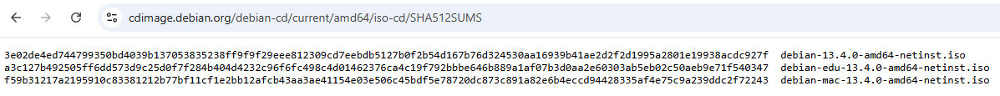

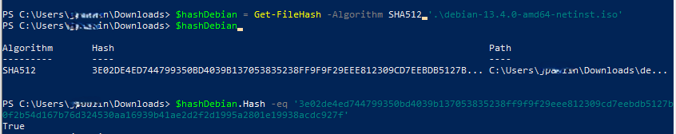

Cette étape est importante car elle permet de s’assurer que l’image utilisée est fiable avant même de lancer l’installation.

### Mise à jour du système

Une fois Debian installée, j’ai mis à jour les paquets du système afin de partir sur un environnement propre et à jour.

```bash
sudo apt update && sudo apt upgrade -y && sudo apt autoremove -y
```

- `apt update` met à jour la liste des paquets disponibles.
- `apt upgrade -y` installe les versions les plus récentes des paquets déjà présents.
- `apt autoremove -y` supprime les paquets devenus inutiles.

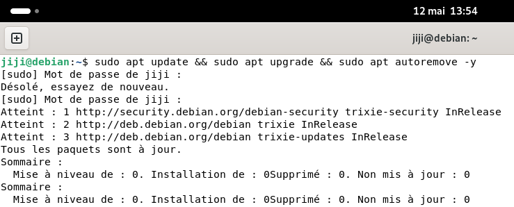

Cette étape permet d’éviter de travailler sur une base obsolète, ce qui limite les problèmes de compatibilité.

## 2. Installation des dépendances

Avant d’installer les outils d’audit, plusieurs paquets ont été ajoutés à Debian.

### Python3 et pip

Python3 est le langage sur lequel reposent certains outils ou composants d’administration.  
pip3 est le gestionnaire de paquets Python qui permet d’installer des modules ou applications Python.

```bash
sudo apt install python3-pip
```

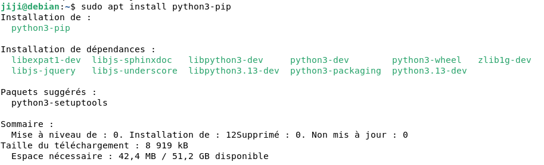

Cette installation est indispensable pour pouvoir ensuite utiliser certains outils Python plus facilement.

### pipx

pipx est un outil qui permet d’installer des applications Python dans un environnement isolé. Cela évite les conflits entre différentes versions de bibliothèques.

```bash
sudo apt install pipx
pipx ensurepath
source ~/.bashrc
pipx --version
```

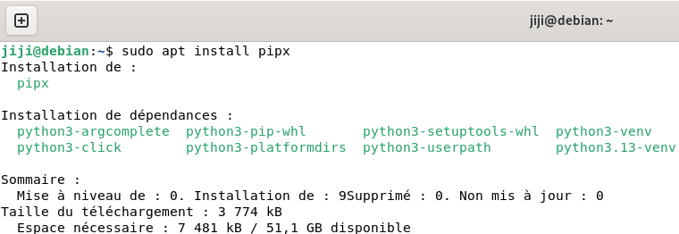

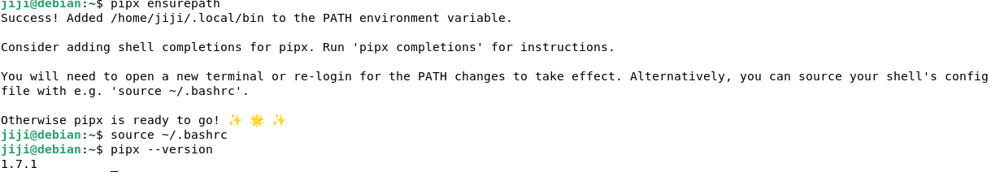

- `pipx ensurepath` ajoute le répertoire local des exécutables au `PATH`.
- `source ~/.bashrc` recharge la configuration du shell pour rendre la modification active.

### Git

Git est un outil de gestion de versions utilisé ici pour récupérer certains projets directement depuis GitHub.

```bash
sudo apt install git
git --version
```

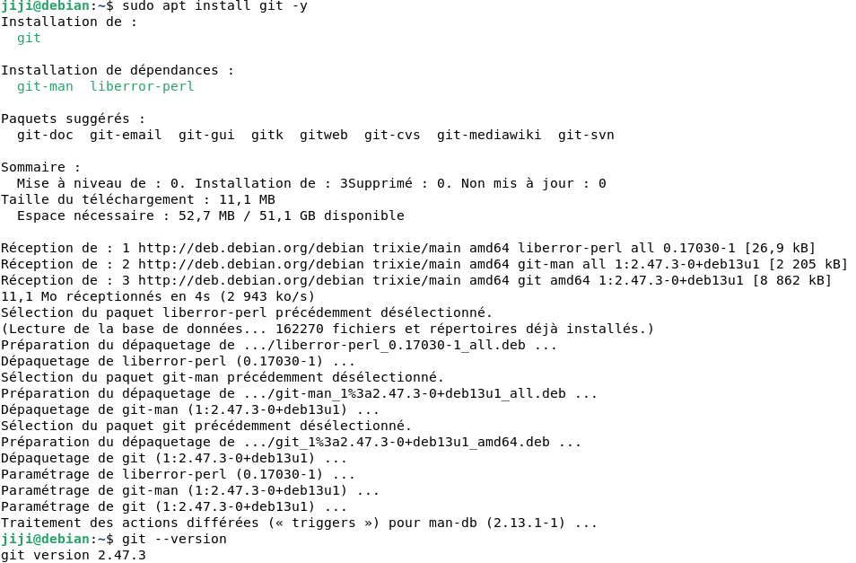

Sans Git, il serait plus compliqué de récupérer proprement les sources des outils ou de gérer les mises à jour.

## 3. Installation d’AD Miner

AD Miner est un outil d’audit Active Directory qui s’appuie sur les données exportées par BloodHound pour produire un rapport HTML.

Son intérêt est de compléter BloodHound :

- BloodHound sert surtout à la visualisation et à l’exploration du graphe ;
- AD Miner sert davantage à résumer les faiblesses détectées et à générer un rapport exploitable.

### Installation

L’installation a été réalisée via pipx afin de garder l’environnement propre.

```bash
pipx install git+https://github.com/Mazars-Tech/AD_Miner.git
AD-miner --version
```

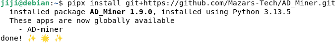

### Préparation du binaire

Le binaire a ensuite été copié dans un dossier temporaire afin de pouvoir l’archiver ou le transférer plus facilement si besoin.

```bash
cp ~/.local/bin/AD-miner /tmp/AD-miner
zip /tmp/ad-miner.zip /tmp/AD-miner
```

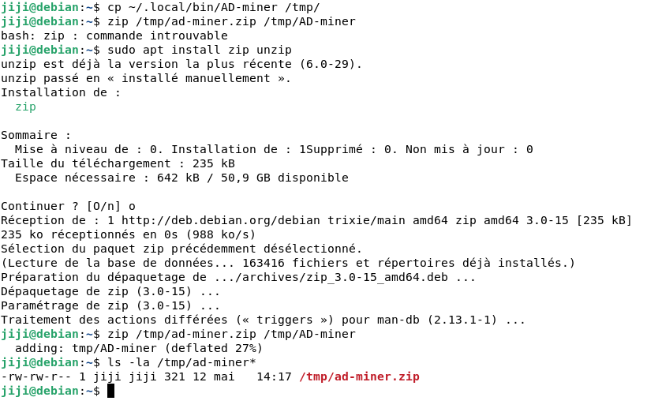

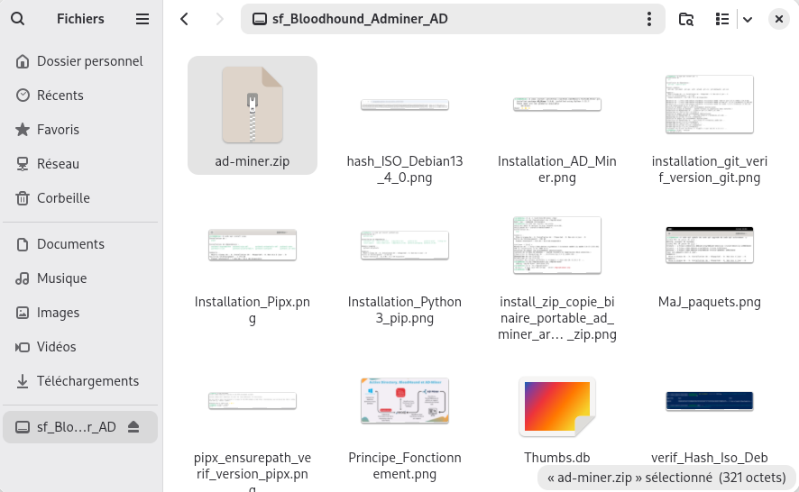

### Lancement du rapport

AD Miner a ensuite été lancé afin d’analyser les données d’Active Directory et produire un rapport de sécurité.

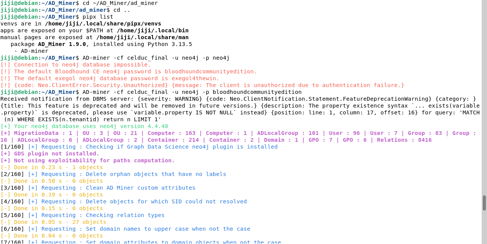

## 4. Mise en place de Neo4j

Neo4j est une base de données orientée graphe. Contrairement à une base classique qui stocke des lignes et des colonnes, Neo4j stocke des nœuds et des relations.  
Dans le contexte d’Active Directory, c’est particulièrement adapté, car les utilisateurs, groupes, machines et permissions sont liés les uns aux autres par des relations qu’il faut pouvoir explorer rapidement.

### Ajout du dépôt officiel

Avant d’installer Neo4j, j’ai ajouté le dépôt officiel et sa clé GPG.

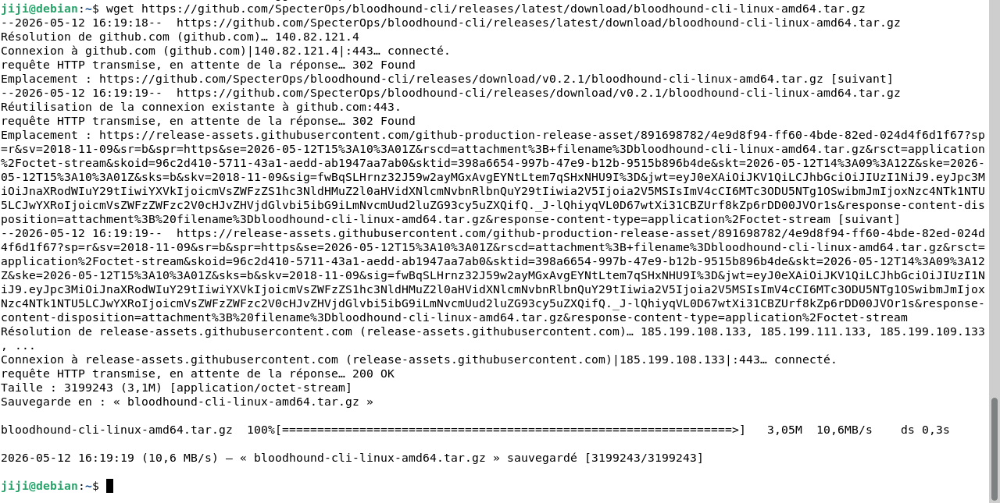

```bash
wget -O - https://debian.neo4j.com/neotechnology.gpg.key | sudo gpg --dearmor -o /usr/share/keyrings/neo4j.gpg
echo 'deb [signed-by=/usr/share/keyrings/neo4j.gpg] https://debian.neo4j.com stable latest' | sudo tee /etc/apt/sources.list.d/neo4j.list
```


La clé GPG permet de vérifier que le dépôt utilisé est bien officiel.

### Installation et configuration

```bash
sudo apt update
sudo apt install neo4j
sudo systemctl start neo4j
sudo systemctl enable neo4j
sudo neo4j-admin dbms set-initial-password bloodhound
```


Le mot de passe initial `bloodhound` est ici utilisé uniquement pour la mise en place du labo.

### Connexion et état du service

Neo4j dispose d’une interface web qui permet de vérifier que le service fonctionne correctement.

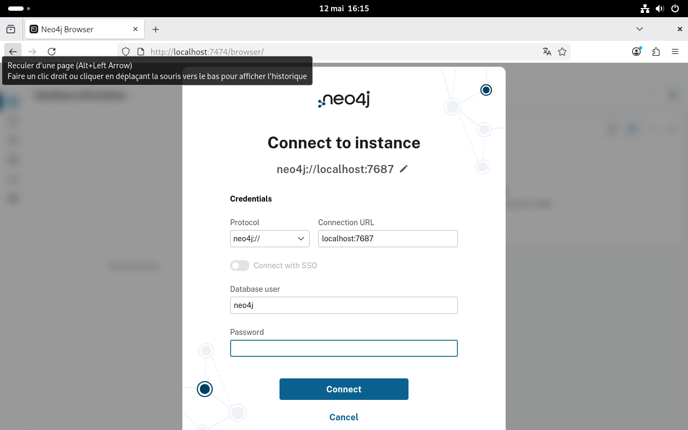

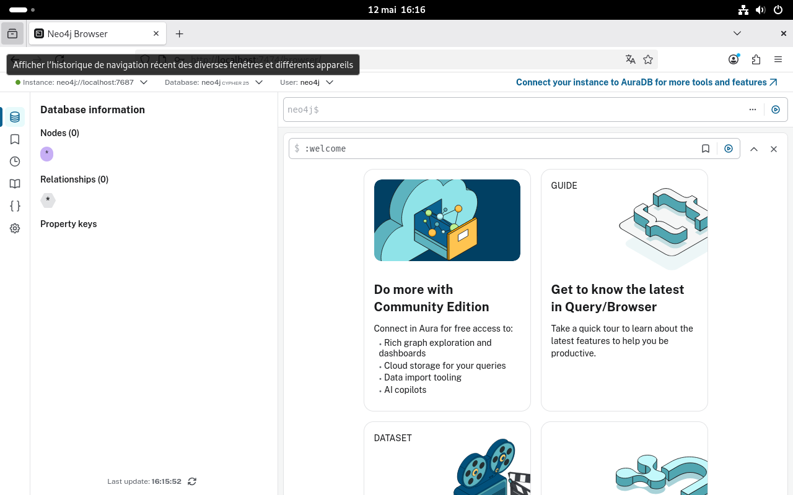

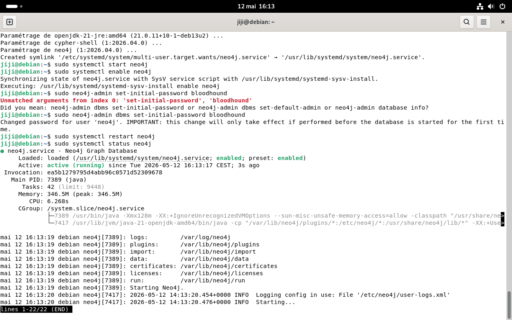

Le tableau de bord permet de confirmer que la base est prête avant l’import des données.

## 5. Installation de BloodHound

BloodHound est l’outil de visualisation utilisé pour explorer le graphe Active Directory. C’est l’interface qui permet d’identifier les chemins d’attaque possibles, les relations de confiance, les appartenances aux groupes et les privilèges cumulés.

### Installation

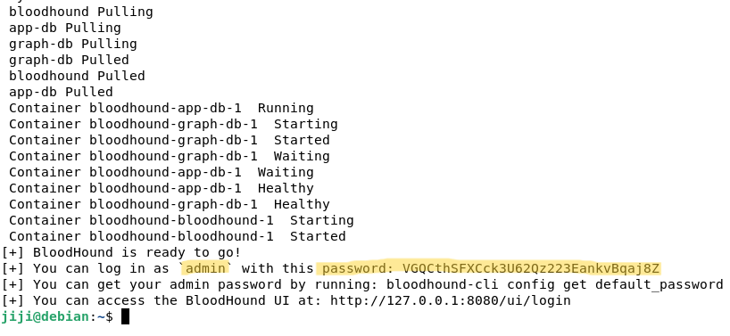

### Connexion à l’interface

Une fois installé, BloodHound permet de se connecter à la base Neo4j et d’accéder au graphe.

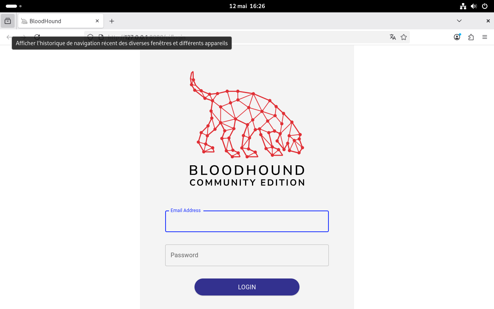

### Principe de fonctionnement

BloodHound fonctionne en plusieurs étapes :

1. collecter les données avec SharpHound ;
2. importer les données dans Neo4j ;
3. visualiser le graphe dans BloodHound ;
4. rechercher les chemins de compromission.

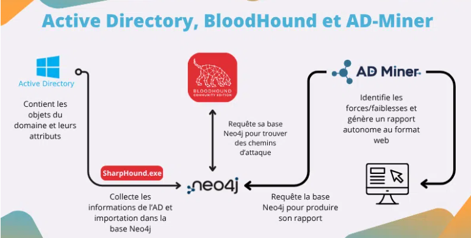

C’est cette logique qui rend l’outil très intéressant pour un audit défensif : il montre les relations de privilèges de façon visuelle, ce qui permet de repérer rapidement certains risques.

### Exemples de graphe

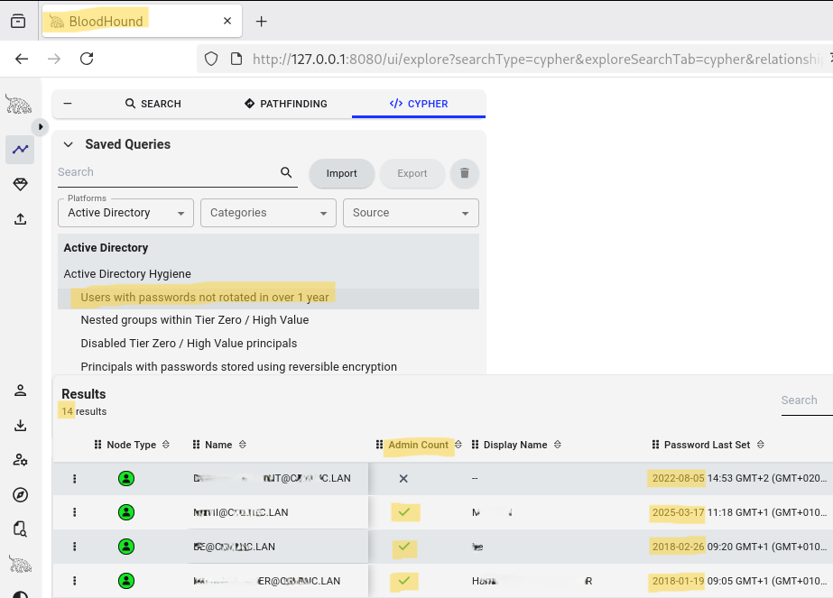

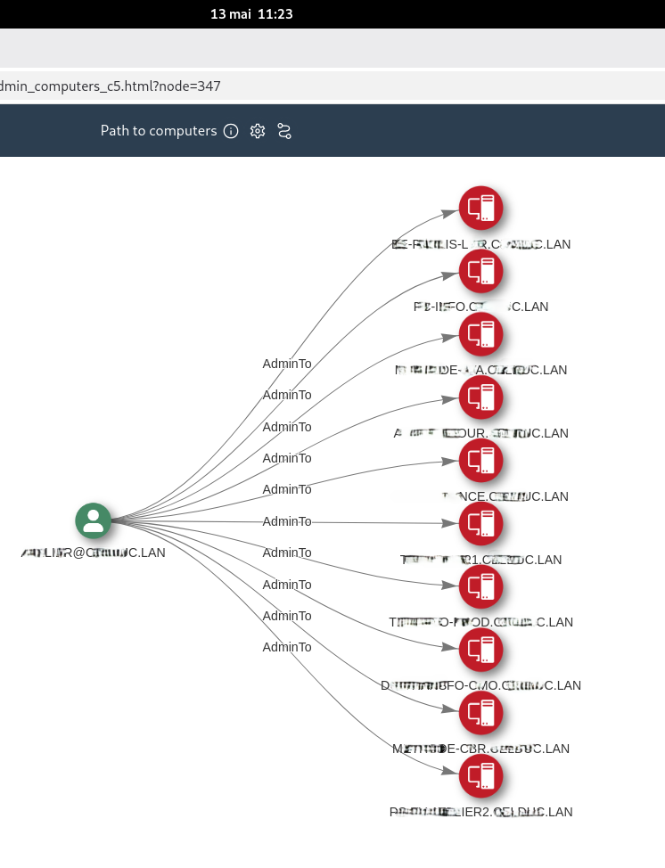

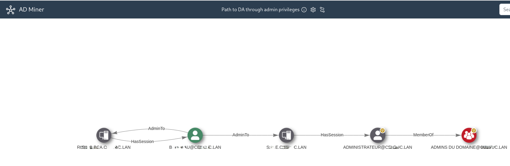

Ces captures montrent comment un compte peut potentiellement se retrouver relié à d’autres machines ou à des privilèges plus élevés via des droits mal configurés.

## 6. Collecte avec SharpHound

SharpHound est le collecteur côté Windows. Son rôle est d’interroger Active Directory et de récupérer les informations nécessaires à l’analyse dans BloodHound.

En pratique, SharpHound collecte :

- les utilisateurs ;
- les groupes ;
- les machines ;
- les sessions ;
- les appartenances ;
- certaines permissions et relations utiles à l’audit.

### Décompression de l’archive

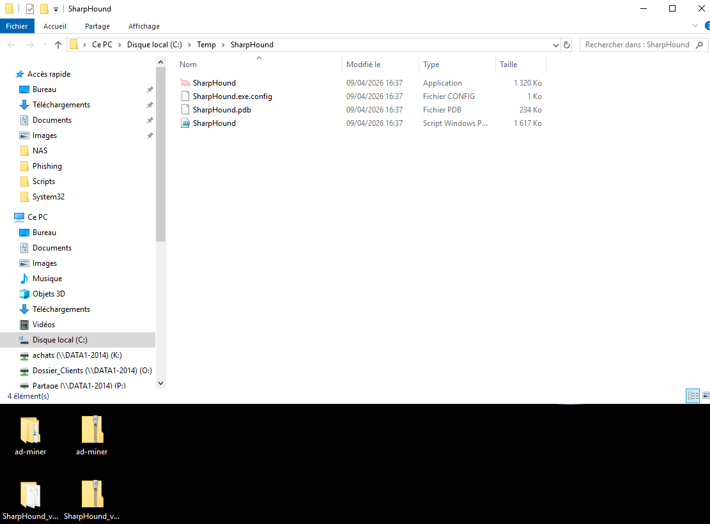

### Exécution sur PowerShell administrateur

SharpHound a été lancé depuis un terminal PowerShell administrateur afin de disposer des droits suffisants pour collecter les données nécessaires.

```powershell
.\SharpHound.exe --CollectionMethods All --Domain celduc.lan --ZipFileName celduc_data.zip
```

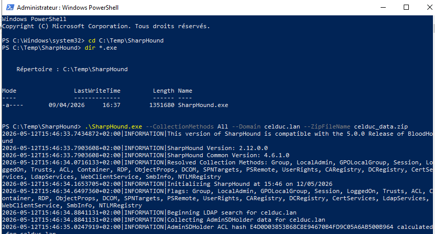

- `--CollectionMethods All` demande la collecte de tous les types de données disponibles.
- `--Domain celduc.lan` précise le domaine ciblé.
- `--ZipFileName celduc_data.zip` définit le nom du fichier de sortie.

### Génération de l’archive

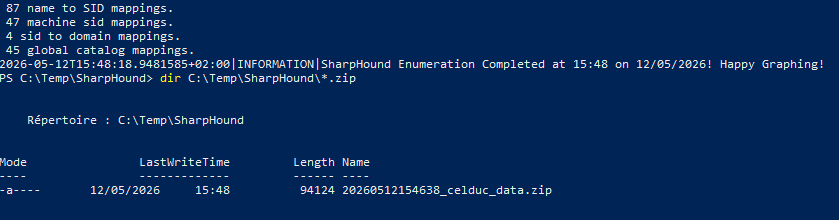

Cette archive ZIP sera ensuite importée dans BloodHound.

### Nettoyage

Une fois la collecte terminée, j’ai procédé au nettoyage de l’environnement SharpHound.

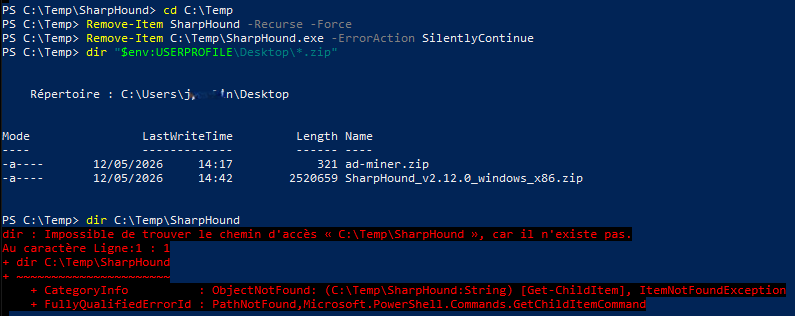

## 7. Résultats et analyse

Une fois les données importées dans BloodHound, il est possible d’explorer les chemins d’attaque et les relations sensibles présentes dans l’annuaire.

L’analyse peut faire ressortir plusieurs types de problèmes :

- des droits d’administration trop larges ;
- des comptes membres de groupes sensibles sans réelle justification ;
- des relations permettant une escalade de privilèges ;
- des machines servant de point d’entrée vers d’autres ressources ;
- des chemins de compromission menant à des comptes de forte valeur.

### Exemples de situations observées

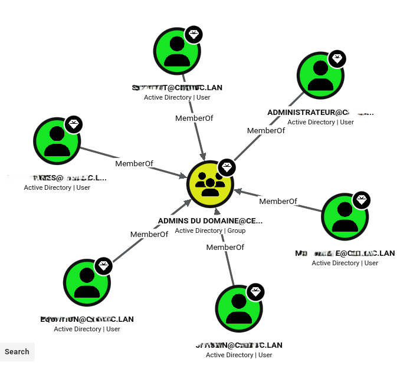

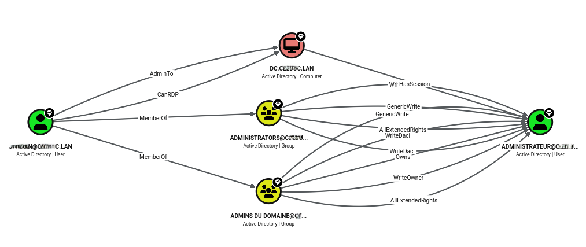

### Cartographie de l’Active Directory

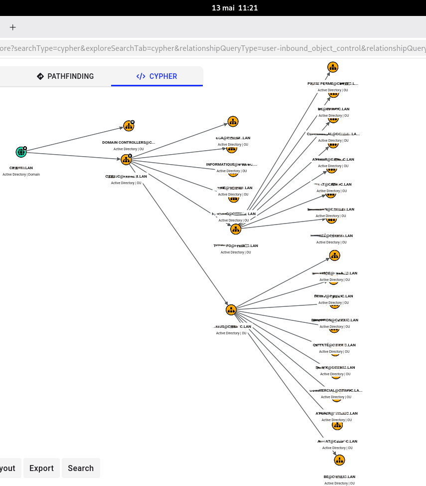

Cette capture permet de visualiser l’organisation des unités d’organisation et des objets de l’annuaire.

### Contexte de test

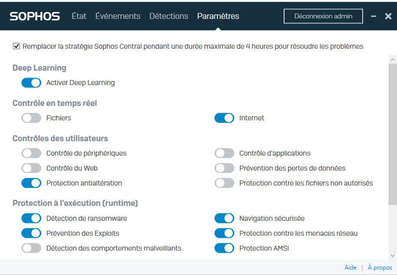

Dans un environnement de test, certaines protections peuvent bloquer les collectes ou les exécutions. Cette étape doit rester encadrée et temporaire.

## 8. Recommandations

À partir de l’analyse, plusieurs recommandations peuvent être formulées :

- réduire les droits d’administration au strict nécessaire ;
- revoir régulièrement les appartenances aux groupes sensibles ;
- éviter les délégations inutiles ;
- surveiller les comptes à privilèges ;
- limiter les accès locaux sur les machines ;
- réaliser des audits réguliers avec BloodHound et AD Miner.

Ces recommandations permettent de réduire la surface d’attaque et de mieux contrôler les chemins de compromission potentiels.

## 9. Nettoyage final

Une fois l’audit terminé, les outils et fichiers temporaires ont été arrêtés ou supprimés afin de conserver un environnement propre.

Le nettoyage fait partie intégrante d’un projet d’audit, car il permet d’éviter de laisser des données sensibles ou des services inutiles actifs après les tests.

## Captures d’écran

Toutes les captures utilisées pour documenter le projet sont stockées dans le dossier `Images/`.

## Conclusion

Cet audit Active Directory a permis de mettre en évidence l’intérêt d’une analyse orientée graphe pour comprendre les relations entre les objets du domaine.  
BloodHound a servi à visualiser les chemins d’attaque, SharpHound à collecter les données et AD Miner à produire un rapport plus orienté sécurité.

Ce type de démarche permet d’identifier des faiblesses de configuration, de repérer des privilèges excessifs et de proposer des remédiations concrètes pour améliorer la sécurité globale de l’annuaire.
