# Sauvegarde AD/DC → NAS 192.168.1.2

Documentation complète de la sauvegarde Active Directory vers le NAS `\\192.168.1.2\SauvegardeAD`,  
avec évolution du script PowerShell :

- version **basique** : `AD-Backup-Rotate.ps1` (vérification manuelle),  
- version **évoluée** : `AD-Backup-Rotate2.ps1` (rotation 2 versions + automatisation).

---

# Sauvegarde AD/DC → NAS 192.168.1.2

Documentation complète de la sauvegarde Active Directory vers le NAS `\\192.168.1.2\SauvegardeAD`,  
avec évolution du script PowerShell :

- version **basique** : `AD-Backup-Rotate.ps1` (vérification manuelle),  
- version **évoluée** : `AD-Backup-Rotate2.ps1` (rotation 2 versions + automatisation).

---

## Sommaire

- [1. Présentation](#1-présentation)
  - [1.1. Qu’est‑ce que `wbadmin` ?](#11-questce-que-wbadmin-)
- [2. Préparation du NAS](#2-préparation-du-nas)
  - [2.1. Réseau et partage](#21-réseau-et-partage)
  - [2.2. Montage du partage sur le DC](#22-montage-du-partage-sur-le-dc)
  - [2.3. Test d’écriture sur le NAS](#23-test-décriture-sur-le-nas)
- [3. Version 1 : Script `AD-Backup-Rotate.ps1` (basique)](#3-version-1--script-ad-backup-rotateps1--basique)
  - [3.1. But](#31-but)
  - [3.2. Création du script](#32-création-du-script)
  - [3.3. Lancement manuel et résultat](#33-lancement-manuel-et-résultat)
  - [3.4. Vérification sur le NAS](#34-vérification-sur-le-nas)
- [4. Version 2 : Script `AD-Backup-Rotate2.ps1` (évoluée)](#4-version-2--script-ad-backup-rotate2ps1--évoluée)
  - [4.1. Problème de la version 1](#41-problème-de-la-version-1)
  - [4.2. Contenu du script évolué](#42-contenu-du-script-évolué)
  - [4.3. Lancement et rotation](#43-lancement-et-rotation)
- [5. Automatisation via la tâche planifiée](#5-automatisation-via-la-tâche-planifiée)
  - [5.1. Pourquoi automatiser](#51-pourquoi-automatiser)
  - [5.2. Vérification des exécutions](#52-vérification-des-exécutions)
  - [5.3. Vérification générale](#53-vérification-générale)
- [6. Restauration via WinRE (clé bootable)](#6-restauration-via-winre-clé-bootable)
  - [6.1. Qu’est‑ce que WinRE](#61-questce-que-winre)
  - [6.2. À quoi sert la clé bootable](#62-à-quoi-sert-la-clé-bootable)
  - [6.3. Création de la clé bootable](#63-création-de-la-clé-bootable)
  - [6.4. Comment restaurer avec WinRE](#64-comment-restaurer-avec-winre)
- [7. Pourquoi cette méthode est robuste](#7-pourquoi-cette-méthode-est-robuste)
- [8. License / Auteur](#8-license--auteur)

---

## 1. Présentation

- **Serveur** : Windows Server 2019 (DC).  
- **Sauvegarde** : état système / AD via `wbadmin` (sauvegarde de l’**état système**).  
- **Cible** : NAS `\\192.168.1.2\SauvegardeAD` (partage SMB).  
- **Objectif** :  
  - Vérifier que la sauvegarde AD fonctionne en manuel,  
  - puis automatiser avec rotation 2 versions,  
  - et montrer **comment restaurer complètement le DC** en cas de crash via une clé WinRE.

### 1.1. Qu’est‑ce que `wbadmin` ?

`wbadmin` est l’outil de **Windows Server Backup** intégré à Windows Server.  
Il permet de :

- sauvegarder l’**état système** (AD, registre, boot, fichiers système),  
- gérer automatiquement le format des images,  
- lister/ouvrir les versions disponibles,  
- et restaurer un serveur **en entier** (OS + AD) via une restauration système.

Dans ce projet, nous utilisons surtout :

```text
wbadmin start systemstatebackup -backupTarget:... -quiet
```

pour sauvegarder **l’état du système du DC** vers le NAS, sans gérer soi‑même les fichiers NTDS.dit, etc.

---

## 2. Préparation du NAS

Le NAS est le **coffre‑fort** où les sauvegardes AD/DC vont être stockées.  
Tout doit être nettoyé, propre, et bien identifiable.

### 2.1. Réseau et partage

- **NAS** : `192.168.1.2`  
  - Volume RAID 5 créé pour la redondance et la sécurité des données.
  - Partage nommé `SauvegardeAD` pour distinguer les sauvegardes AD des autres.  
  - Compte `admin` avec droits de **lecture/écriture** pour le DC.
 
Qu’est‑ce que le RAID 5 ?

Le **RAID 5** est un niveau de stockage qui utilise **au moins 3 disques durs**.  
Les données sont **réparties en blocs** sur tous les disques, et une **information de parité** est aussi distribuée sur les disques.

En cas de **panne d’un seul disque**, le volume continue de fonctionner car la parité permet de **reconstruire les données manquantes** lorsqu’on remplace le disque défectueux.  
La capacité utile est en gros :  

Dans ce projet, le NAS est configuré en **RAID 5** pour offrir un **bon équilibre entre performance, capacité de stockage et sécurité** des sauvegardes AD. 


- **Test réseau depuis le DC** :

```powershell
ping 192.168.1.2
net view \\192.168.1.2
```

Ces commandes montrent que le DC “voit” le NAS et que le partage `SauvegardeAD` est accessible.

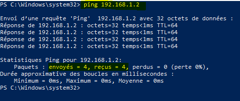

### 2.2. Montage du partage sur le DC

Pour simplifier l’accès, on monte le NAS en lecteur `Z:` persistant :

```powershell
net use Z: \\192.168.1.2\SauvegardeAD /user:USER "PASSWORD" /persistent:yes
```

Ainsi, même après redémarrage, le DC “retrouve” le NAS automatiquement.

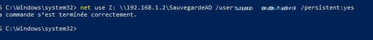

### 2.3. Test d’écriture sur le NAS

```powershell
New-Item -Path "\\192.168.1.2\SauvegardeAD\test.txt" -ItemType File -Value "test"
```

Si le fichier `test.txt` est créé, les droits sont corrects.

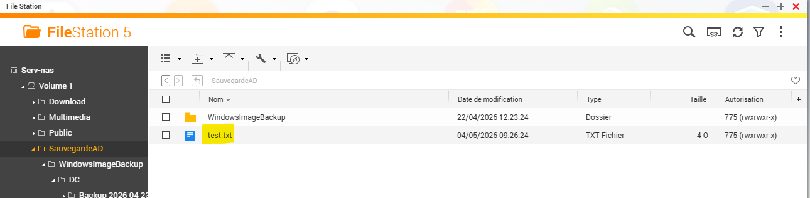

---

## 3. Version 1 : Script `AD-Backup-Rotate.ps1` (basique)

### 3.1. But

Cette version est **juste une preuve de concept** :

- Vérifier que `wbadmin` peut sauvegarder l’état système vers le NAS.  
- Vérifier que le NAS reçoit bien les fichiers.  
- Avoir un script propre pour lancer manuellement, avant de passer à l’automatisation.

### 3.2. Création du script

Sur le DC, dans `C:\Scripts\BackupAD\` :

```powershell
$backupPath = "\\192.168.1.2\SauvegardeAD"
$password   = "PASSWORD"

Write-Host "=== SAUVEGARDE AD/DC - $(Get-Date) ==="

wbadmin start backup -backupTarget:$backupPath -user:USER -password:$password -systemState -quiet

Write-Host "TERMINE: $(Get-Date)"
```

Ce script utilise le **mot de passe en clair** pour simplifier le test.  
En production, on travaillera avec des comptes Windows + droits réseau, pas de mot de passe dans le script.

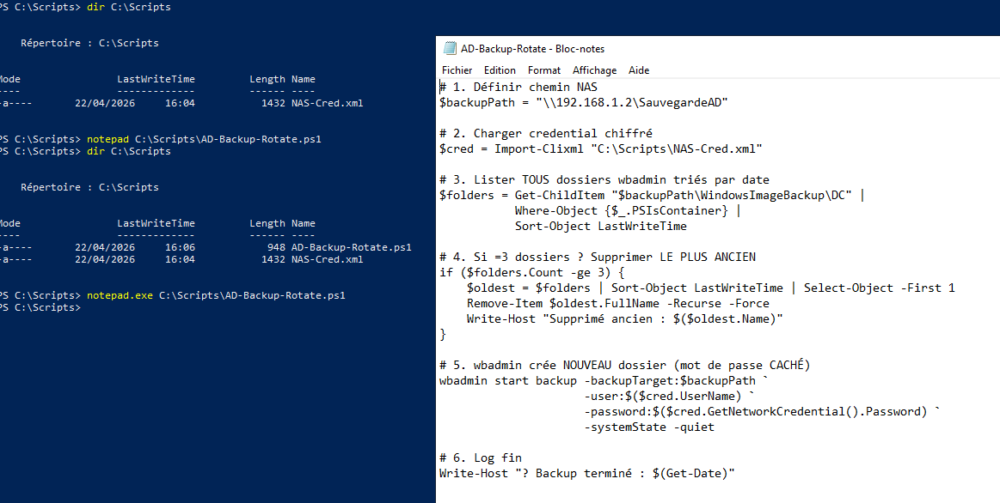

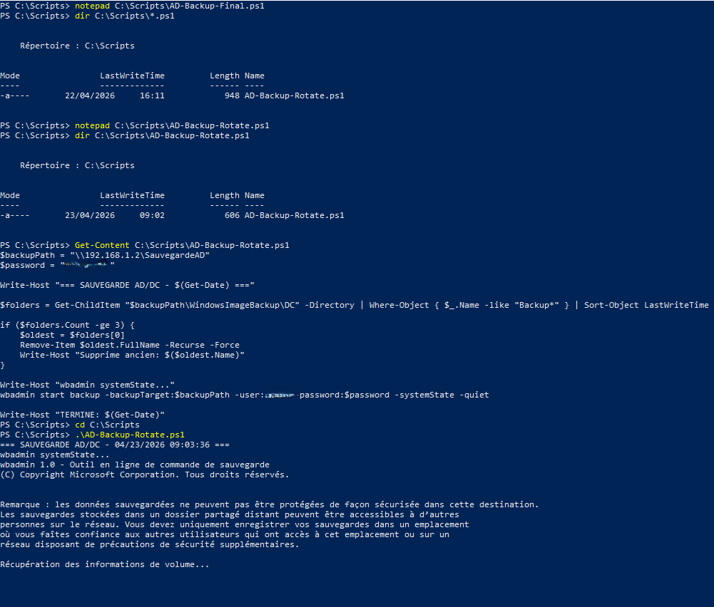

### 3.3. Lancement manuel et résultat

Depuis le DC :

```powershell
cd C:\Scripts\BackupAD
.\AD-Backup-Rotate.ps1
```

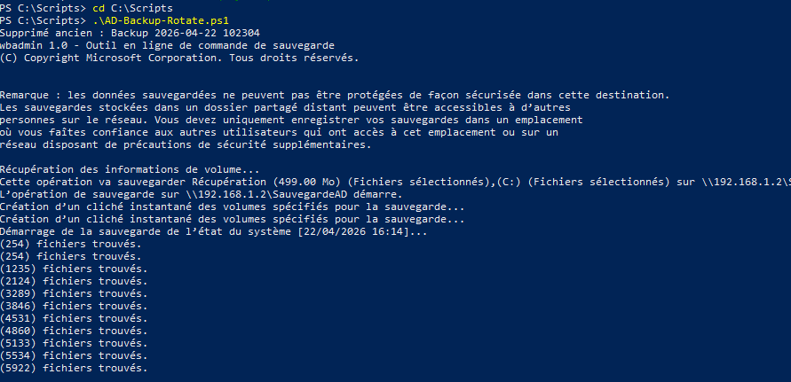

### 3.4. Vérification sur le NAS

```powershell
Get-ChildItem "\\192.168.1.2\SauvegardeAD\WindowsImageBackup\DC"
```
ou 

```powershell
Get-ChildItem "\\192.168.1.2\SauvegardeAD" | Where-Object { $_.Name -like "Backup_*" }
```

On voit apparaître un dossier `Backup YYYY-MM-DD HHMMSS` → la sauvegarde est bien là.

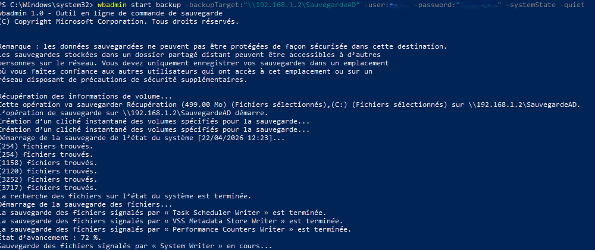

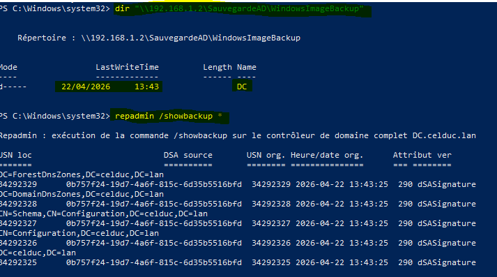

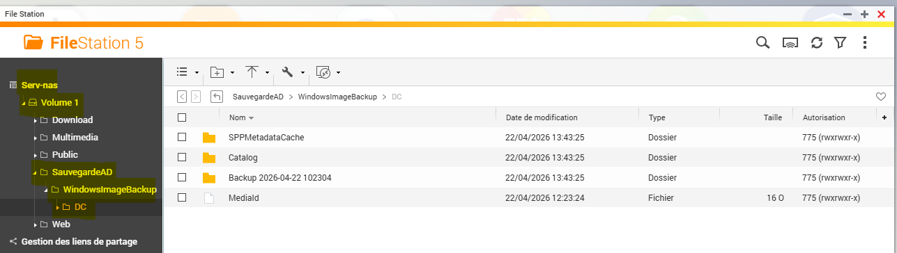


---

## 4. Version 2 : Script `AD-Backup-Rotate2.ps1` (évoluée)

### 4.1. Problème de la version 1

- Le script `AD-Backup-Rotate.ps1` remplace toujours la **même sauvegarde**.  
- En cas de ransomware/réinstallation, on risque de perdre l’**historique** des backups.

Solution :  
créer un **dossier daté par exécution** et garder **2 versions max**.

### 4.2. Contenu du script évolué

```powershell
$backupPath      = "\\192.168.1.2\SauvegardeAD"
$maxVersions     = 2
$backupTarget    = $backupPath

$DateFolder      = "Backup_$(Get-Date -Format 'yyyy-MM-dd_HH-mm')"
$TargetFolder    = "$backupPath\$DateFolder"

New-Item -Path $TargetFolder -ItemType Directory -Force
Write-Host "Créé cible : $TargetFolder" -ForegroundColor Green

Write-Host "=== SAUVEGARDE AD/DC - $(Get-Date) ===" -ForegroundColor Cyan

$Folders = Get-ChildItem $backupTarget -Directory | Where-Object { $_.Name -like "Backup_*" } | Sort-Object Name

if ($Folders.Count -ge $maxVersions) {
    $Oldest = $Folders
    Remove-Item $Oldest.FullName -Recurse -Force
    Write-Host "Supprime ancien: $($Oldest.Name)" -ForegroundColor Yellow
}

Write-Host "wbadmin systemStatebackup vers $TargetFolder..." -ForegroundColor Green
$Result = wbadmin start systemstatebackup -backupTarget:$TargetFolder -quiet

Write-Host "wbadmin exit code: $LASTEXITCODE"

if ($LASTEXITCODE -eq 0) {
    Write-Host "Backup AD réussi." -ForegroundColor Green
} else {
    Write-Host "Backup AD échoué (code $LASTEXITCODE)." -ForegroundColor Red
}

Write-Host "TERMINE: $(Get-Date)" -ForegroundColor Cyan
```

- Crée un dossier unique : `Backup_2026-05-05_13-29`.  
- Garde **2 versions max** (rotation 2).  
- Supprime automatiquement le plus ancien si nécessaire.

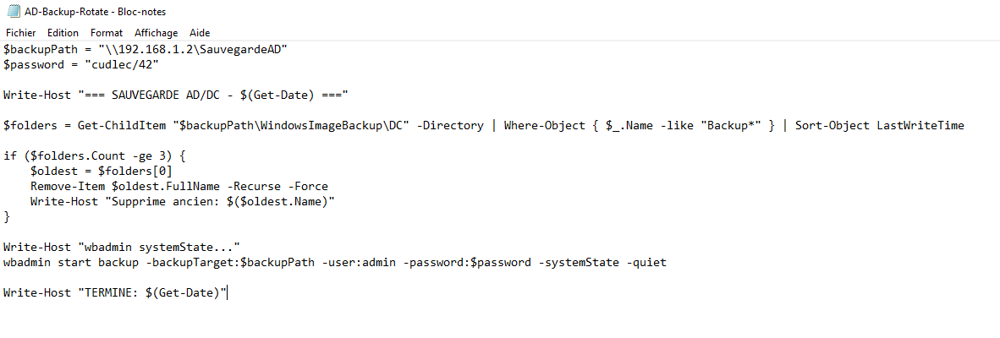

### 4.3. Lancement et rotation

```powershell
cd C:\Scripts\BackupAD
.\AD-Backup-Rotate2.ps1
```

Puis vérification :

```powershell
Get-ChildItem "\\192.168.1.2\SauvegardeAD" | Where-Object { $_.Name -like "Backup_*" }
```


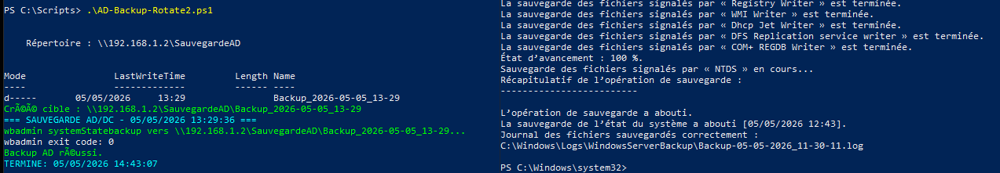

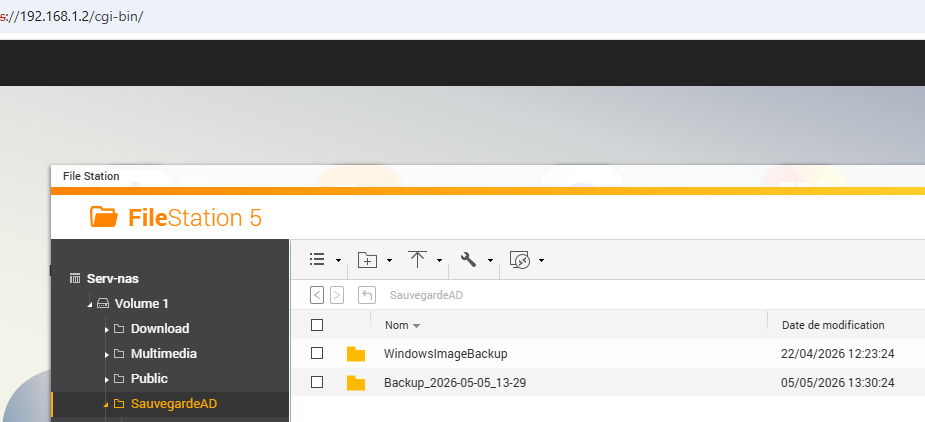

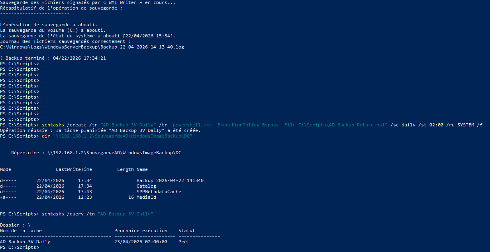

---

## 5. Automatisation via la tâche planifiée

### 5.1. Pourquoi automatiser

Lancer une sauvegarde **tous les jours à 2h00** réduit le risque de :

- oublier la sauvegarde,  
- perdre un backup à jour en cas de crash.

La tâche est configurée sous le compte `tplanifié`, qui a les droits sur le NAS.

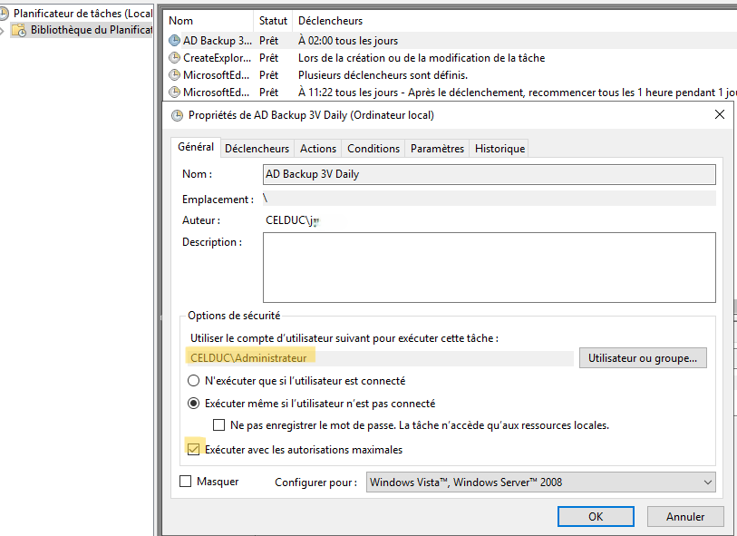
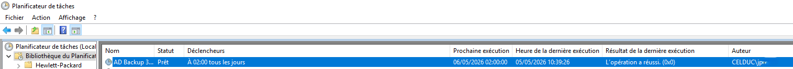

### 5.2. Vérification des exécutions

```powershell
Get-ChildItem "\\192.168.1.2\SauvegardeAD" -Directory | Sort-Object LastWriteTime
schtasks /query /tn "AD Backup 3V Daily" /v /fo LIST | findstr "Last Run"
```

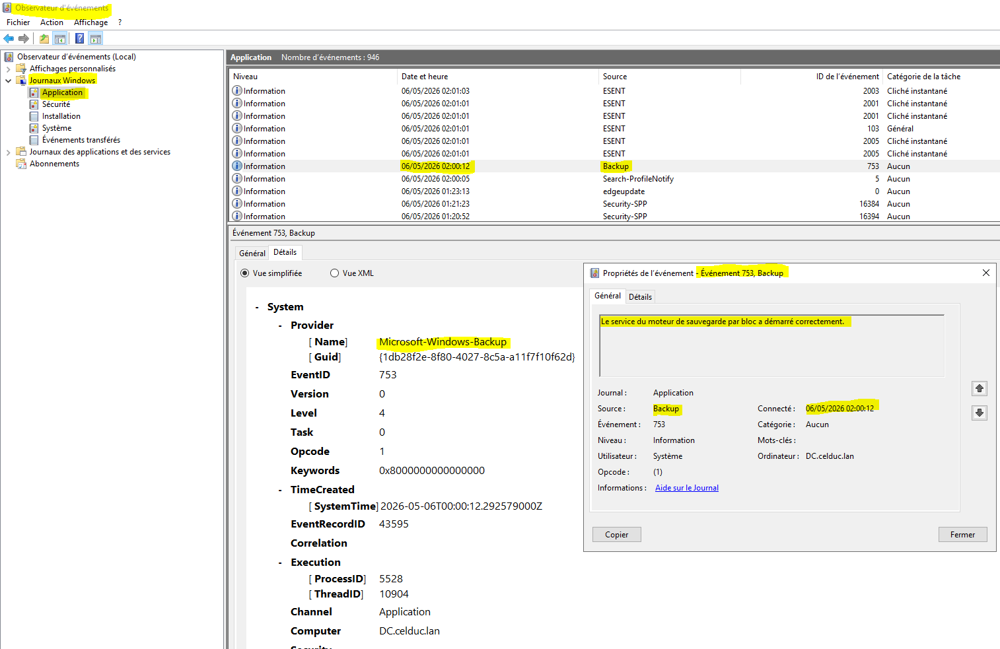
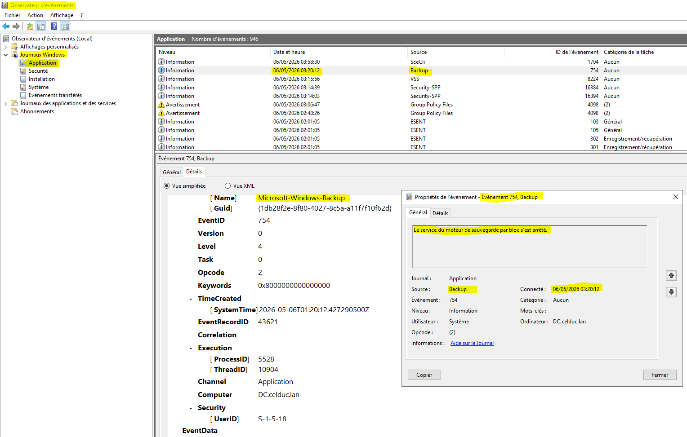
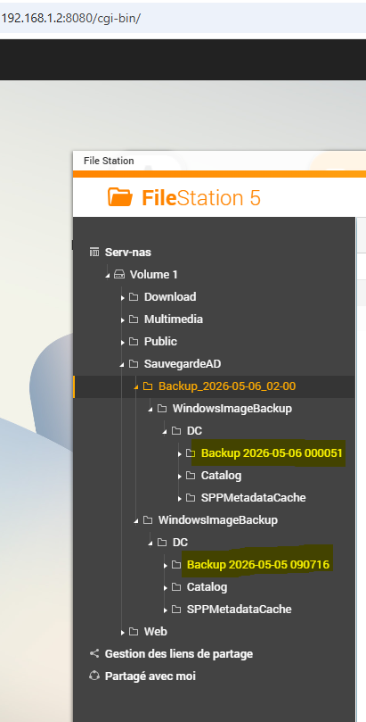

### 5.3. Vérification générale

Tout le flux de travail est vérifié ensemble :

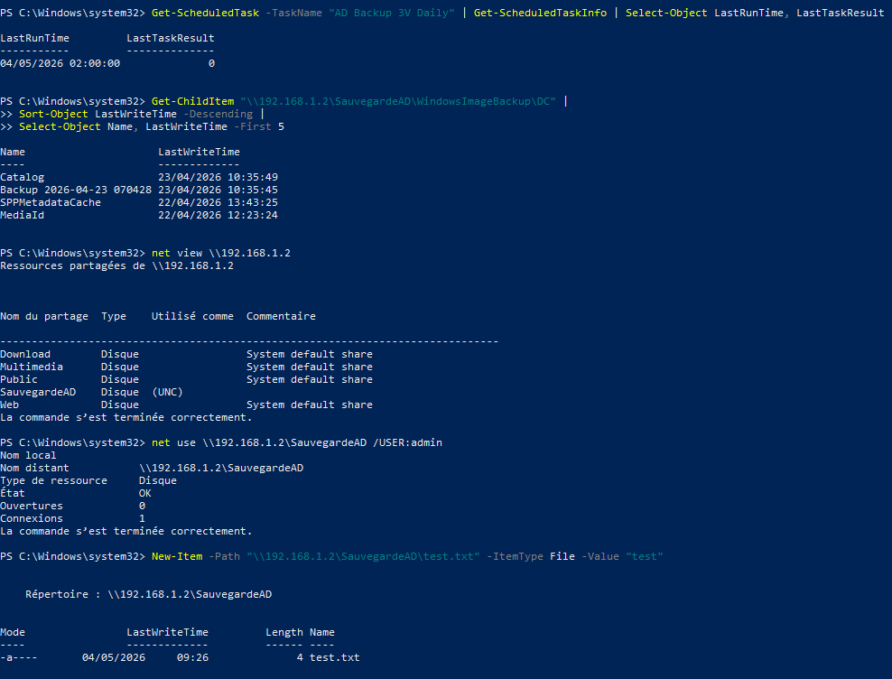

---

## 6. Restauration via WinRE (clé bootable)

### 6.1. Qu’est‑ce que WinRE

**Windows Recovery Environment (WinRE)** est un environnement de récupération Windows qui permet de :

- réparer Windows,  
- restaurer une image système,  
- lancer des outils de diagnostic.

Dans notre cas, on l’utilise pour **restaurer l’image complète d’un DC** stockée sur le NAS.

### 6.2. À quoi sert la clé bootable

La **clé USB bootable** sert à :

- **démarrer le serveur** (physique ou virtualisé) sur un **environnement Windows de récupération indépendant** du système corrompu,  
- accéder au **réseau** (NAS, partage, credentials),  
- lancer **“Récupération image système”** → restaurer le backup AD/DC depuis `\\192.168.1.2\SauvegardeAD`.

Sans cette clé, tu ne peux pas **restaurer** proprement un DC crashé.

### 6.3. Création de la clé bootable

- ISO Windows Server 2019 téléchargée officiellement.  
- Vérification du hash pour garantir l’intégrité :

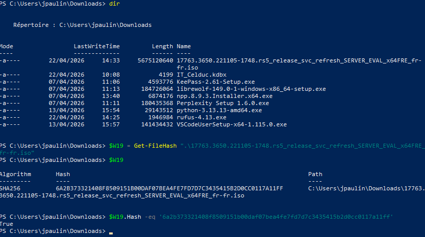

- Création de la clé via **Rufus** (ou autre outil) :

```text
1. Sélectionner l’ISO.  
2. Cibler la clé USB.  
3. Valider la création de la clé bootable.
```

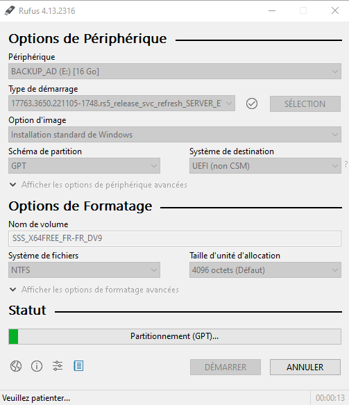

### 6.4. Comment restaurer avec WinRE

Sur le serveur (physique ou VM) :

1. **Booter sur la clé USB** (F11/F12 dans le BIOS).  
2. Choisir **“Réparer l’ordinateur”** → **“Dépannage”** → **“Récupération image système”**.  
3. Choisir **“Rechercher l’image sur le réseau”**.  
4. Entrer :  
   ```text
   \\192.168.1.2\SauvegardeAD
   ```  
5. Compte : `USER` / `PASSWORD`.  
6. Choisir le dossier `Backup_2026-05-05_13-29` (ou autre version propre).  
7. Valider la restauration → formatage des disques et redémarrage.

À la fin, le DC est **exactement dans l’état de la sauvegarde** (AD, GPO, services, boot, etc.).


---

## 7. Pourquoi cette méthode est robuste

- **Backup journalier** → risque d’oubli réduit.  
- **Rotation 2 versions** → historique tout en gardant l’espace limité.  
- **Restauration via WinRE** → restitution **complète** du DC, pas seulement des données AD.  
- **`wbadmin`** utilisé de façon **simple et standard** (outil Microsoft natif).  
- **Documentation complète** → tu peux **refaire tout le parcours depuis zéro** avec ce `README.md`.

---

## 8. License / Auteur

- **Auteur** : JiJiJuve  
- **Projet** : `TP-Perso / BACKUP_AD`  
- **License** : Propriétaire (TP personnel).
