# Installation de GLPI 11 sur Debian

Ce guide décrit l’installation de GLPI 11 sur une VM Debian (serveur web Apache, PHP‑FPM et base MariaDB), ainsi que la mise en place de la configuration minimale pour accéder à l’interface web et commencer à gérer le parc informatique.

Il est pensé pour un lab pédagogique reproduisant une petite infrastructure d’entreprise (gestion de parc, tickets, demandes utilisateurs).

📄 Fiche synthèse : [GLPI – Installation et configuration](./GLPI_installation_detaillee.md)


# TP – Déploiement de GLPI 11 sur Debian

## 1. Contexte

Dans le cadre de ma formation en administration systèmes et réseaux, ce TP a pour objectif de déployer une solution de gestion de parc et de helpdesk basée sur GLPI 11 sur une distribution Debian récente.  
GLPI servira d’**application centrale de gestion du parc et des tickets** (inventaire des postes, suivi des pannes et des demandes utilisateurs).

> La fiche technique d’installation détaillée (commandes pas à pas + captures d’écran) est disponible dans le fichier :  
> **`GLPI_installation_detaillee.md`**.

---

## 2. Objectifs pédagogiques

- Installer et configurer un **serveur web complet** (Apache, PHP‑FPM, MariaDB – souvent appelé “stack LAMP”) adapté à GLPI 11.  
- Déployer GLPI de manière **sécurisée** (DocumentRoot sur `glpi/public`, droits fichiers, suppression du dossier `install`).  
- Mettre en place un **VirtualHost Apache** dédié à GLPI avec PHP‑FPM.  
- Configurer la base de données MariaDB pour GLPI (base, utilisateur, droits).  
- Finaliser l’installation via l’interface web et vérifier l’accès à l’application.

---

## 3. Prérequis

### 3.1. Matériel / VM

- 1 VM Debian 13 (ou Debian 12), 2 vCPU, 2–4 Go de RAM, 20 Go de disque.  
- Accès réseau (IP fixe ou réservation DHCP) et accès Internet pour télécharger les paquets.  
- Poste client sur le même réseau (navigateur web + client SSH).

### 3.2. Logiciel / Compétences

- Savoir utiliser le terminal Linux (sudo, apt, systemctl).  
- Notions de base sur les services **Apache**, **PHP**, **MariaDB/MySQL**.  
- Connaissances de base en **réseau** (adressage IP, ping, SSH).

---

## 4. Sommaire

1. Vérification de l’intégrité des ISO (hash)  
2. Préparation : utilisateur sudo et SSH  
3. Installation des paquets nécessaires (LAMP + PHP‑FPM)  
4. Préparation de la base de données MariaDB  
5. Téléchargement et installation de GLPI  
6. Configuration d’Apache et de PHP‑FPM (VirtualHost GLPI)  
7. Installation de GLPI via l’interface web  
8. Sécurisation rapide de l’instance  

Les commandes détaillées et captures d’écran sont regroupées dans :  
**`GLPI_installation_detaillee.md`**.

---

## 5. Étapes de réalisation (vue synthétique)

### 5.1. Vérification de l’intégrité des ISO (hash)

Objectif : vérifier l’authenticité des ISO utilisées (Debian, Windows Server) avant installation.

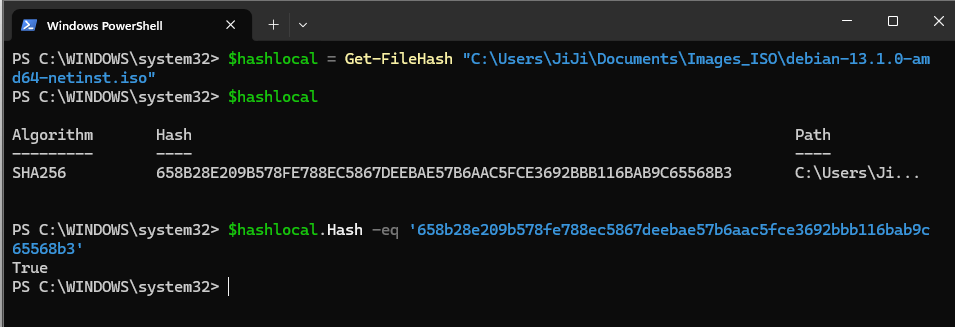  
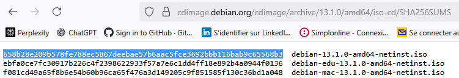  

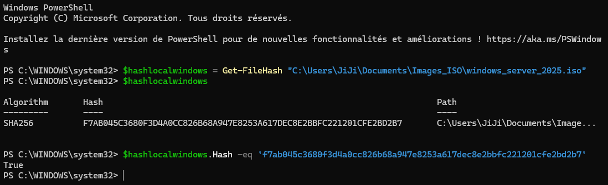  
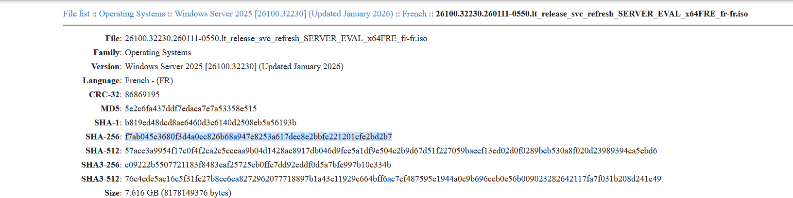  

---

### 5.2. Préparation : utilisateur sudo et SSH

Objectif : ne pas travailler en root et pouvoir administrer la VM à distance.

Principales actions :

- Installation de `sudo` et ajout de l’utilisateur au groupe `sudo`.  
- Installation et activation du serveur SSH (`openssh-server`).  
- Vérification de l’accès SSH et des droits sudo.

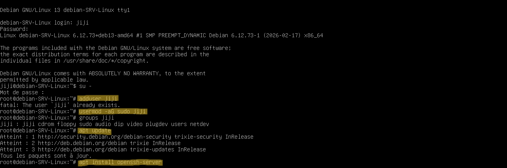  
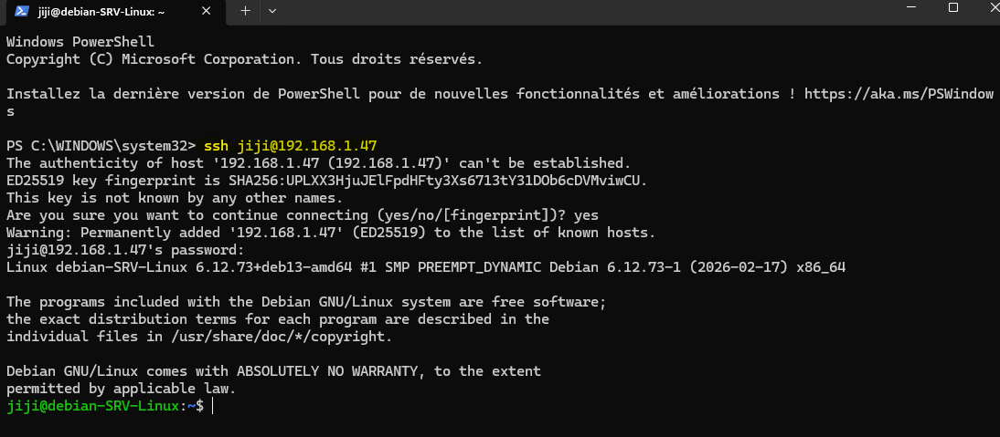  
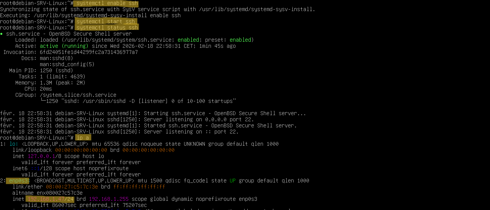  

---

### 5.3. Installation des paquets nécessaires (LAMP + PHP-FPM)

Objectif : installer le serveur web Apache, la base MariaDB, PHP, PHP‑FPM et les extensions utiles à GLPI.

- Mise à jour du système (`apt update && apt upgrade`).  
- Installation d’Apache, MariaDB et PHP de base.  
- Installation de PHP‑FPM et des modules PHP requis par GLPI.

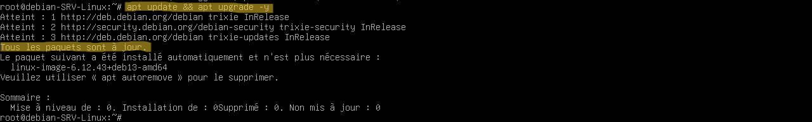  
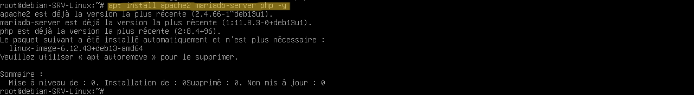  
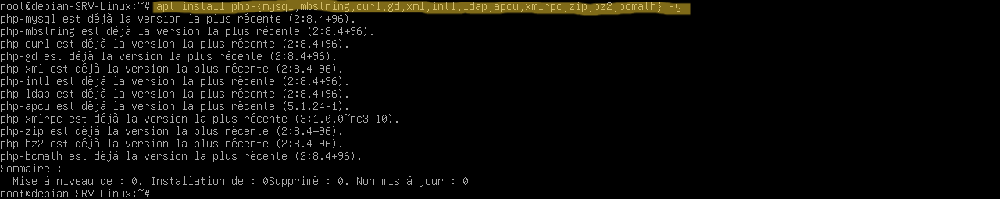  
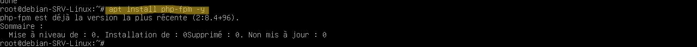  

---

### 5.4. Préparation de la base de données

Objectif : créer une base dédiée à GLPI + un utilisateur SQL avec les droits dessus.

- Création de la base `glpi_npt`.  
- Création de l’utilisateur SQL `neptunet_glpi` avec un mot de passe dédié.  
- Attribution de tous les privilèges sur la base GLPI.

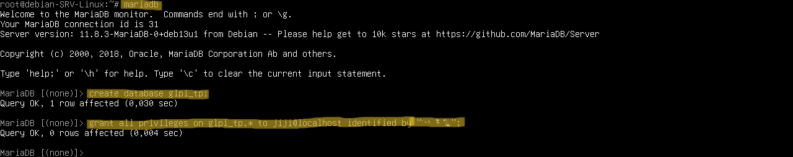  

---

### 5.5. Téléchargement et installation de GLPI

Objectif : télécharger l’archive GLPI, la décompresser dans `/var/www/html` et mettre les bons droits.

- Téléchargement de l’archive GLPI (ex. 11.0.5) dans `/tmp`.  
- Décompression vers `/var/www/html`.  
- Changement de propriétaire sur `/var/www/html/glpi` vers `www-data`.

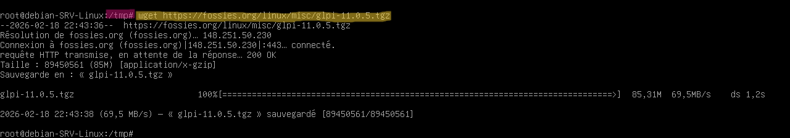  
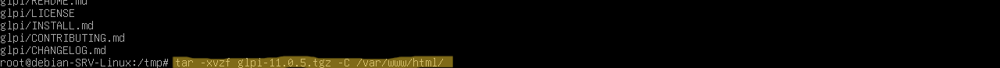  
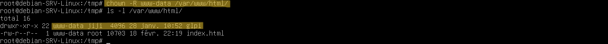  

---

### 5.6. Configuration d’Apache et de PHP‑FPM (VirtualHost GLPI)

Objectif : créer un VirtualHost propre pour GLPI, lier Apache à PHP‑FPM, et activer les bons modules.

- Vérification de la version PHP (`php -v`) pour identifier le socket PHP‑FPM.  
- Création du fichier `/etc/apache2/sites-available/glpi.conf` avec `DocumentRoot /var/www/html/glpi/public`.  
- Activation des modules nécessaires (`proxy_fcgi`, `rewrite`), de la conf PHP‑FPM et du vhost GLPI.

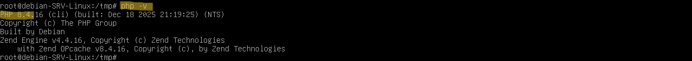  
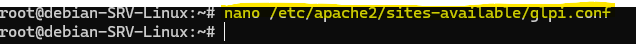  
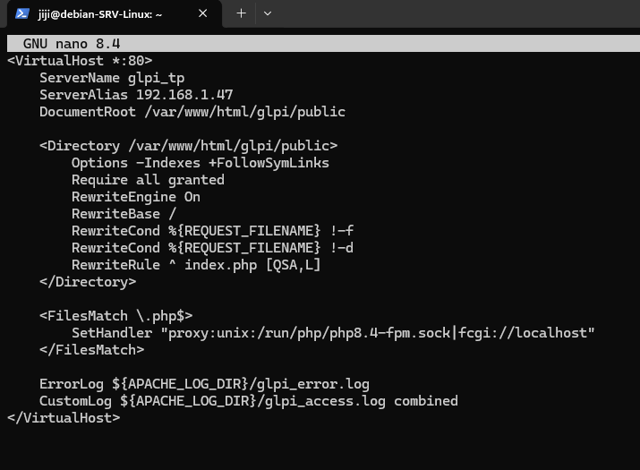  
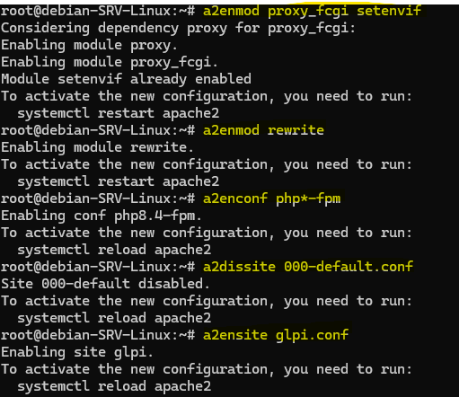  

---

### 5.7. Installation de GLPI via l’interface web

Objectif : finaliser l’installation avec le navigateur (tests prérequis, connexion DB, création des tables).

- Accès à `http://192.168.1.47/` ou `http://glpi_tp/`.  
- Vérification des prérequis PHP/permissions.  
- Saisie des informations de base de données (serveur `localhost`, base `glpi_npt`, utilisateur `neptunet_glpi`).  
- Création des tables et première connexion avec le compte `glpi/glpi`.

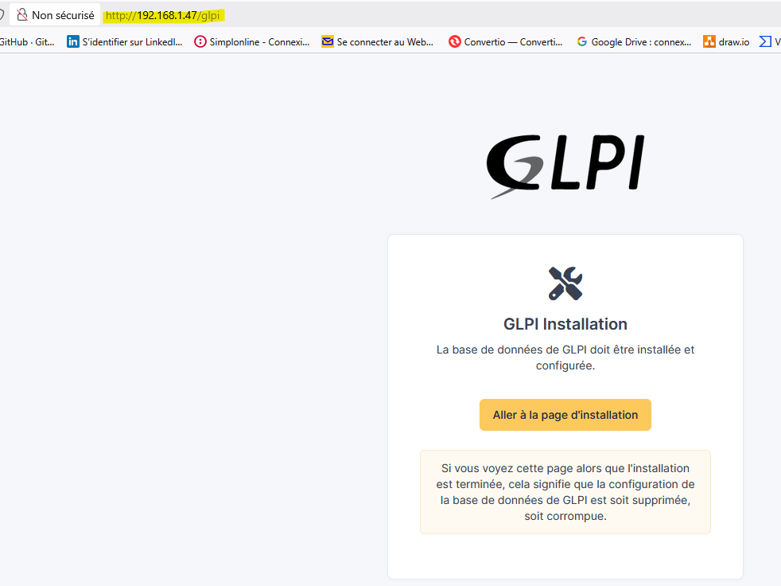  
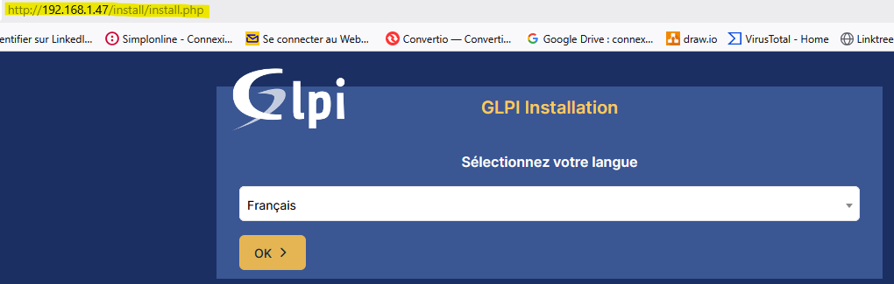  
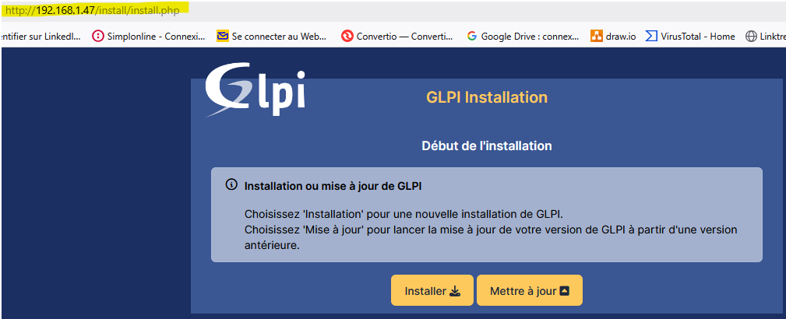  
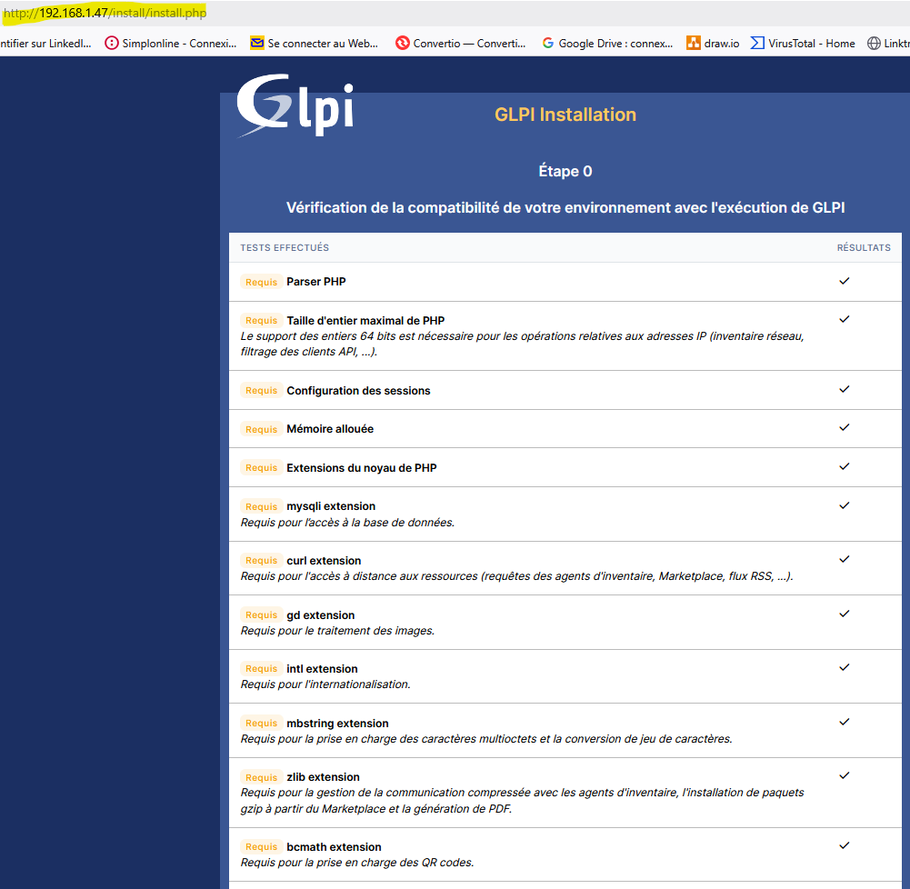  
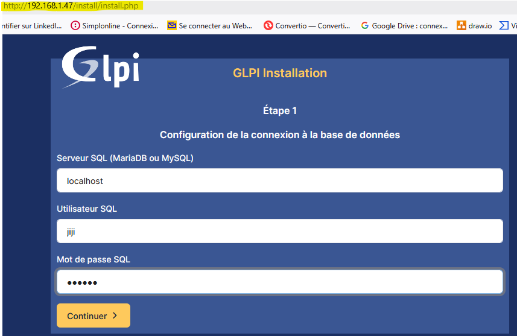  
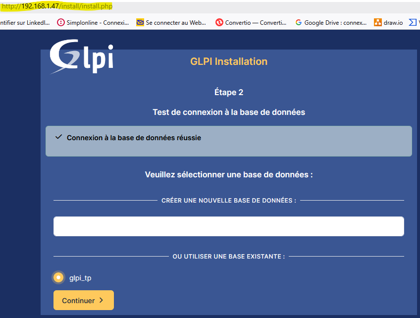  
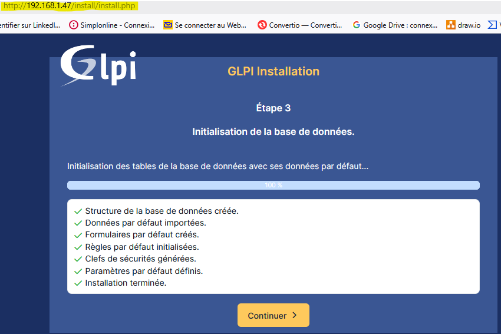  

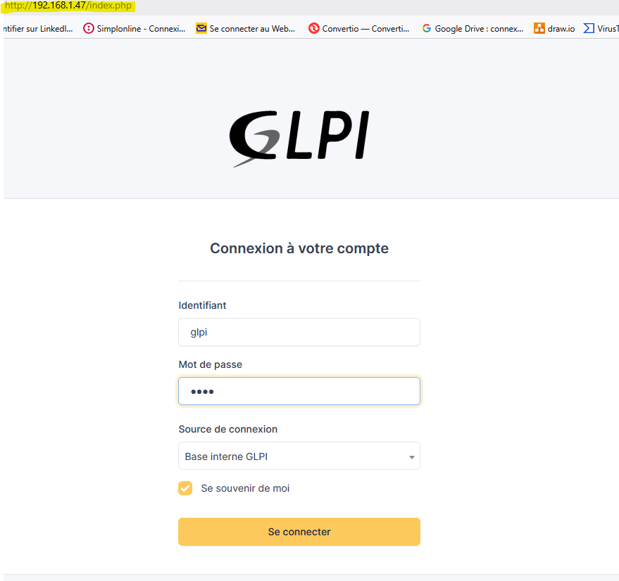  
  

---

## 6. Sécurisation rapide de l’instance

Après l’installation :

- Changer les mots de passe des comptes par défaut (`glpi`, `tech`, `normal`, `post-only`).  
- Supprimer le répertoire d’installation :  
  ```bash
  sudo rm -rf /var/www/html/glpi/install
