# Campagne Phishing Entreprise

Ce dépôt documente une simulation de phishing interne basée sur une VM Kali, GoPhish, un serveur Python pour la page de sensibilisation, et l’import d’utilisateurs AD depuis un CSV.

## Sommaire

- [Objectif](#objectif)
- [Prérequis](#prérequis)
- [1. Création de la VM Kali](#1-création-de-la-vm-kali)
- [2. Extraction des utilisateurs AD](#2-extraction-des-utilisateurs-ad)
- [3. Installation et configuration de GoPhish](#3-installation-et-configuration-de-gophish)
- [4. Serveur Python et page de sensibilisation](#4-serveur-python-et-page-de-sensibilisation)
- [5. Configuration de la campagne](#5-configuration-de-la-campagne)
- [6. Flux utilisateur complet](#6-flux-utilisateur-complet)
- [7. Commandes de secours](#7-commandes-de-secours)
- [8. Nettoyage](#8-nettoyage)
- [Captures d’écran](#captures-décran)

## Objectif

Mettre en place un environnement de test pour simuler une campagne de phishing interne, servir une page de sensibilisation, et suivre les interactions dans GoPhish.

## Prérequis

- Une installation de VirtualBox.
- Une image ISO officielle de Kali Linux.
- Un accès réseau sur le même LAN que le serveur ou les postes cibles.
- Un compte administrateur sur le contrôleur de domaine pour exporter les utilisateurs.
- GoPhish.
- Python 3.

## 1. Création de la VM Kali

### VirtualBox
J’ai utilisé VirtualBox comme hyperviseur pour créer la machine virtuelle Kali Linux.  
VirtualBox permet d’exécuter un système invité dans un environnement isolé, sans modifier la machine hôte.

Avant installation, j’ai téléchargé VirtualBox depuis le site officiel d’Oracle, puis j’ai vérifié le hash du fichier d’installation.  
Cette vérification permet de contrôler l’intégrité du fichier et de s’assurer qu’il provient bien de la version publiée officiellement.

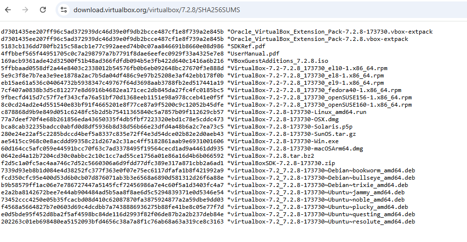

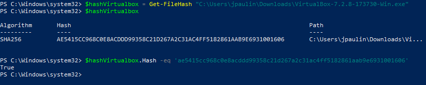

### Téléchargement de l’ISO Kali
J’ai ensuite téléchargé l’image ISO officielle de Kali Linux depuis le site officiel de Kali.  
Le but était d’utiliser une image propre, fiable et identique à celle publiée par l’éditeur.

Avant installation, j’ai vérifié le hash SHA-256 de l’ISO Kali.  
Cette étape permet de vérifier l’intégrité du fichier et son authenticité.

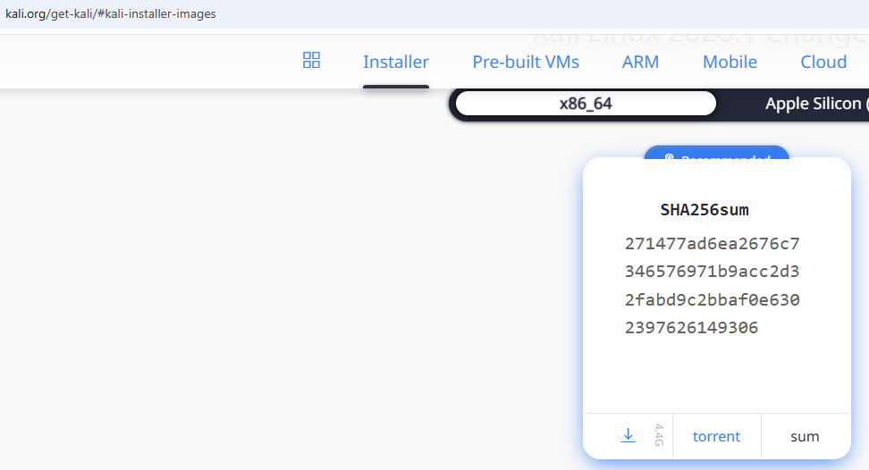

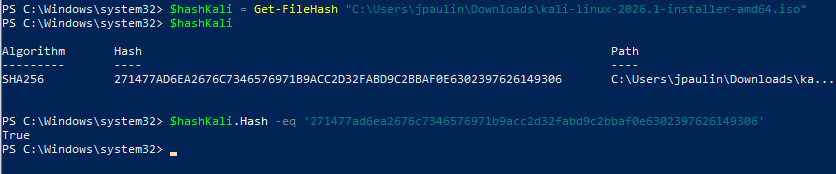

### Installation
J’ai créé une nouvelle machine virtuelle dans VirtualBox, puis j’ai monté l’ISO Kali dans le lecteur virtuel.  
J’ai alloué suffisamment de mémoire, de processeurs et d’espace disque pour que la VM soit confortable à utiliser.

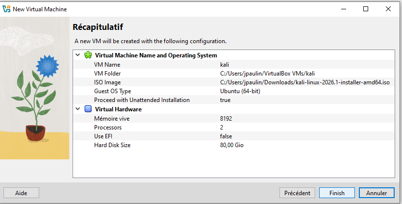

### Vérification réseau
Une fois Kali démarré, j’ai vérifié l’adresse IP de la VM avec :

```bash
ip addr show eth0
```

Puis j’ai testé la connectivité avec :

```bash
ping 192.168.1.10
```

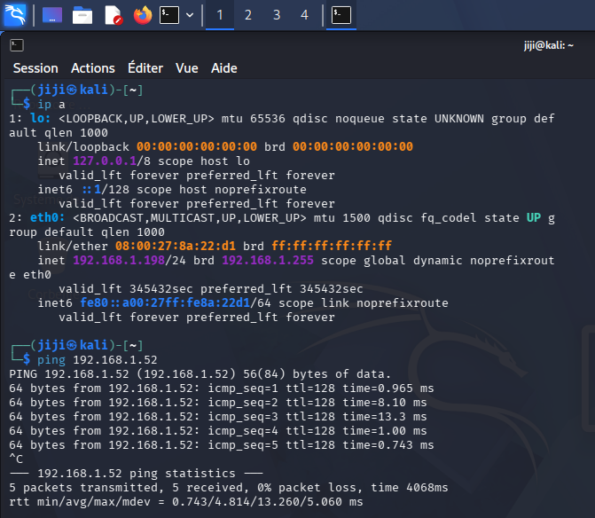

### Mise à jour des paquets Kali
Avant de continuer, j’ai mis à jour les paquets du système afin de partir sur un environnement propre et à jour.

```bash
sudo apt update
sudo apt upgrade -y
sudo apt autoremove -y
```

Cette étape permet de mettre à jour la liste des paquets, d’appliquer les correctifs disponibles et de supprimer les paquets devenus inutiles.

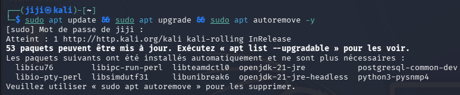

## 2. Extraction des utilisateurs AD

Sur le contrôleur de domaine, j’ai exporté les utilisateurs dans un CSV compatible GoPhish.

```powershell
"First Name,Last Name,Email,Position`n" | Out-File "$env:USERPROFILE\Desktop\Gophish_CELDUC.csv" -Encoding UTF8
Get-ADUser -Filter "givenName -like '*' -and sn -like '*'" -Properties givenName,sn,Department |
Select-Object @{n='First Name';e={$_.givenName}},@{n='Last Name';e={$_.sn}},@{n='Email';e={"$($_.SAMAccountName)@celduc.com"}},@{n='Position';e={$_.Department}} |
Export-Csv -Path "$env:USERPROFILE\Desktop\temp.csv" -NoTypeInformation -Encoding UTF8
Get-Content "$env:USERPROFILE\Desktop\temp.csv" | Select-Object -Skip 1 | Add-Content "$env:USERPROFILE\Desktop\Gophish_CELDUC.csv"
Remove-Item "$env:USERPROFILE\Desktop\temp.csv"
```

Le fichier obtenu contient les utilisateurs du domaine dans un format directement réutilisable dans GoPhish.

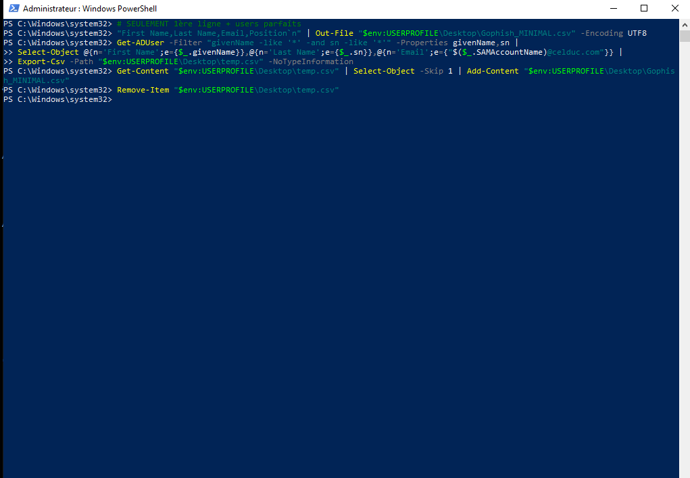

## 3. Installation et configuration de GoPhish

J’ai téléchargé et décompressé la version Linux de GoPhish dans `/opt`.

```bash
cd /opt
sudo wget https://github.com/gophish/gophish/releases/download/v0.12.1/gophish-v0.12.1-linux-64bit.zip
sudo unzip gophish-v0.12.1-linux-64bit.zip
cd gophish
sudo chmod +x gophish
sudo ./gophish
```

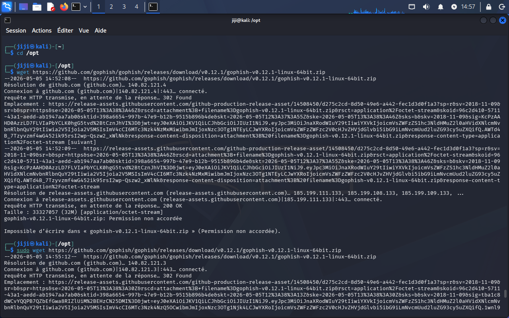

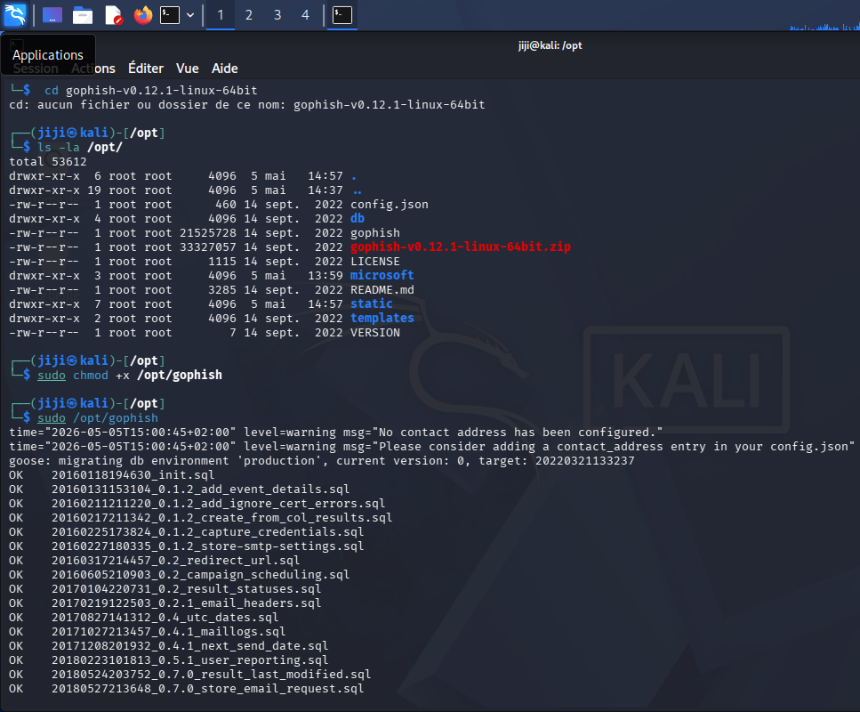

### Premier lancement de GoPhish
J’ai lancé GoPhish pour la première fois afin de récupérer les identifiants initiaux de l’interface d’administration.

```bash
sudo ./gophish
```

GoPhish affiche alors les informations de connexion de départ.  
J’ai ensuite modifié le mot de passe administrateur pour sécuriser l’accès à l’interface.

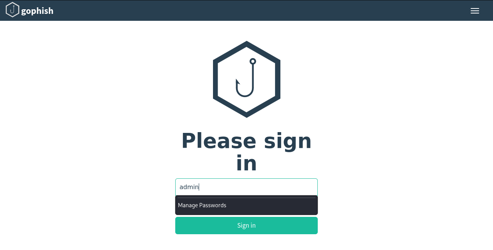

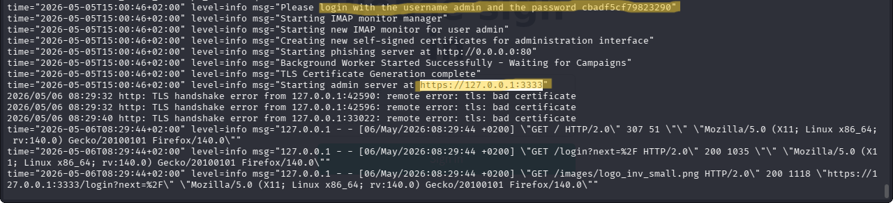

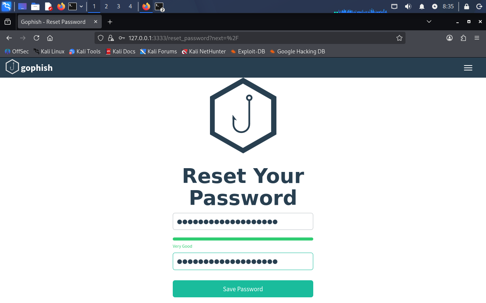

### Configuration du compte Gmail pour l’envoi des emails
Avant de configurer le profil SMTP dans GoPhish, j’ai préparé un compte Gmail dédié à l’envoi des emails de campagne.

Ce compte servait de compte expéditeur pour le `Sending Profile` de GoPhish.

#### Activation de la vérification en deux étapes
J’ai d’abord activé la vérification en deux étapes sur le compte Gmail afin de sécuriser l’accès et de pouvoir générer un mot de passe d’application.

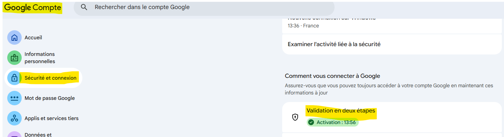

#### Génération du mot de passe d’application
Une fois la vérification en deux étapes activée, j’ai créé un mot de passe d’application spécifique pour GoPhish.

J’ai donné un nom explicite à l’application pour identifier facilement ce mot de passe dans la configuration Gmail.

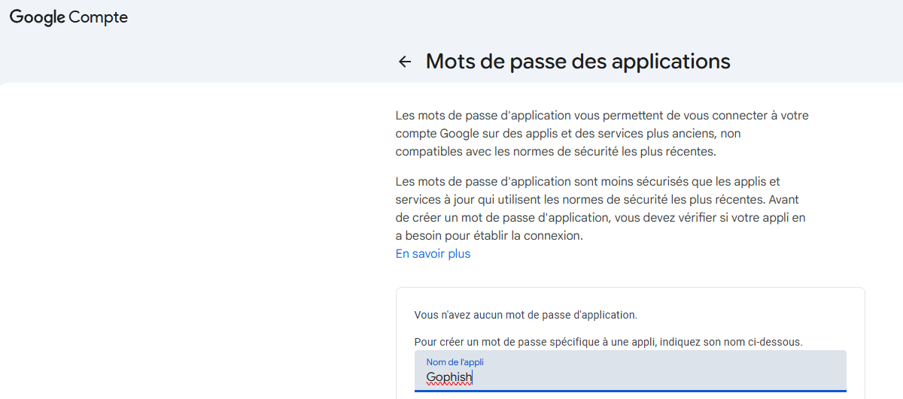

Gmail a ensuite généré un mot de passe d’application que j’ai utilisé dans la configuration SMTP de GoPhish.

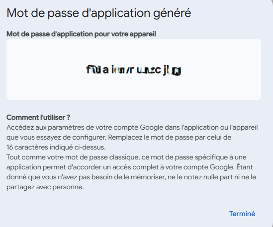

### Configuration réseau
J’ai ouvert le fichier `config.json` situé dans `/etc/gophish/`, puis j’ai modifié les paramètres d’écoute de GoPhish pour l’adapter à mon réseau local.

Pour cela, j’ai utilisé l’éditeur `nano` :

```bash
sudo nano /etc/gophish/config.json
```

J’ai ensuite :
- configuré l’interface d’administration sur `0.0.0.0:3333` afin de pouvoir y accéder depuis le réseau local ;
- conservé l’interface d’administration en TLS pour sécuriser l’accès ;
- configuré le serveur de phishing sur `0.0.0.0:80` pour le rendre accessible depuis les postes cibles ;
- laissé la base de données en SQLite avec le chemin par défaut de GoPhish.

Le fichier de configuration utilisé est le suivant :

```json
{
  "admin_server": {
    "listen_url": "0.0.0.0:3333",
    "use_tls": true,
    "cert_path": "/var/lib/gophish/gophish_admin.crt",
    "key_path": "/var/lib/gophish/gophish_admin.key",
    "trusted_origins": []
  },
  "phish_server": {
    "listen_url": "0.0.0.0:80",
    "use_tls": false
  },
  "db_name": "sqlite3",
  "db_path": "/var/lib/gophish/gophish.db"
}
```

Le choix de `0.0.0.0` permet à GoPhish d’écouter sur toutes les interfaces réseau de la machine Kali, ce qui rend l’interface d’administration et le serveur de phishing accessibles depuis le LAN.

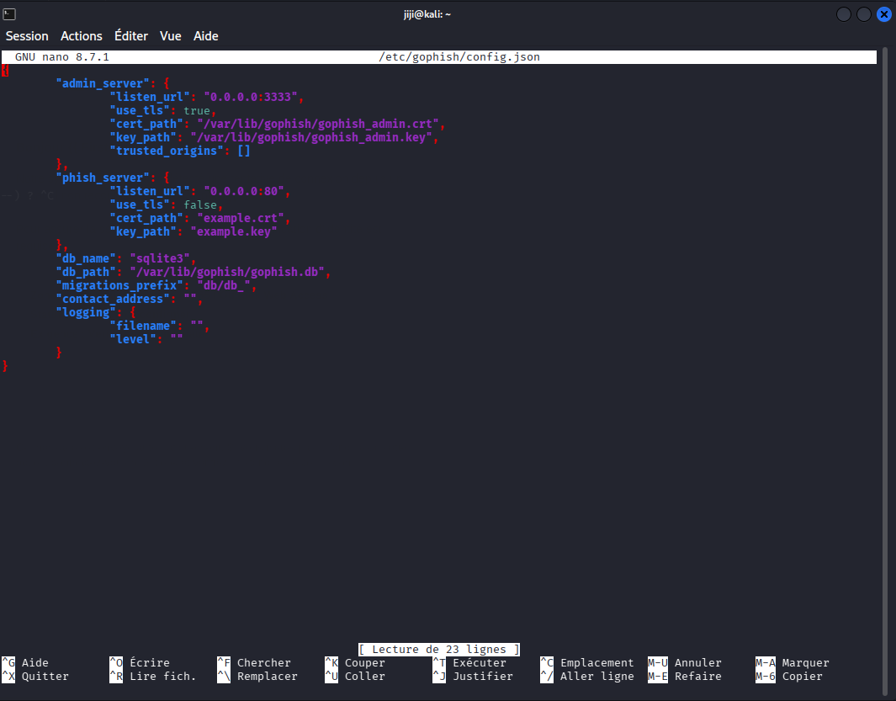

Après cette modification, j’ai redémarré GoPhish puis vérifié que les ports 3333 et 80 étaient bien en écoute.

```bash
sudo systemctl restart gophish
sudo netstat -tlnp | grep -E "3333|80"
```

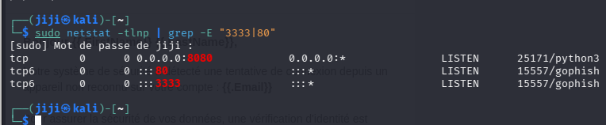

## 4. Serveur Python et page de sensibilisation

J’ai placé le fichier `sensibilisation.html` dans mon dossier de travail, puis j’ai lancé un serveur HTTP simple avec Python.

```bash
cd /home/jiji
sudo python3 -m http.server 8080 --bind 0.0.0.0
```

Le paramètre `--bind 0.0.0.0` permet d’écouter sur toutes les interfaces réseau.  
Cela rend la page accessible depuis le réseau local, et pas seulement depuis la machine Kali elle-même.

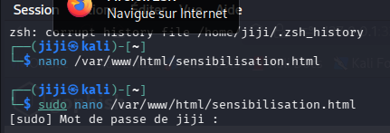

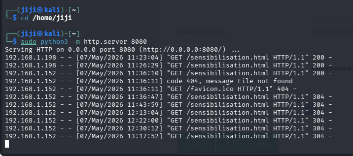

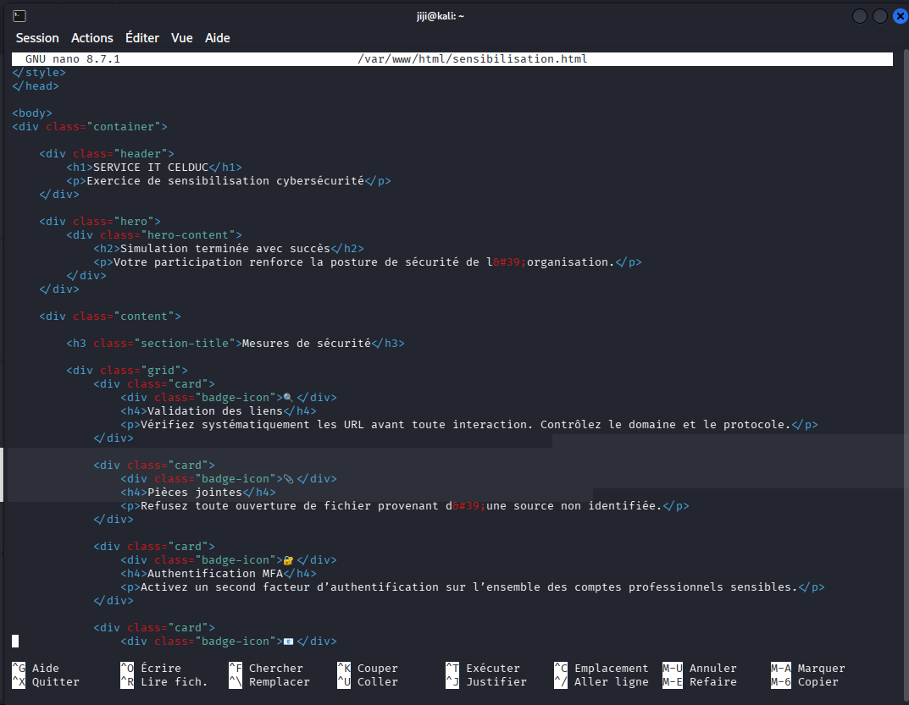

L’URL utilisée pour la page de sensibilisation est la suivante :

```text
http://192.168.1.198:8080/sensibilisation.html
```

## 5. Configuration de la campagne

Dans GoPhish, j’ai créé une landing page qui enregistre l’interaction de l’utilisateur avant de le rediriger vers la page de sensibilisation.

J’ai ensuite :
- importé le CSV des utilisateurs au format attendu par GoPhish ;
- sélectionné le profil SMTP ;
- sélectionné le template email ;
- choisi la landing page ;
- lancé d’abord un test, puis la campagne complète.

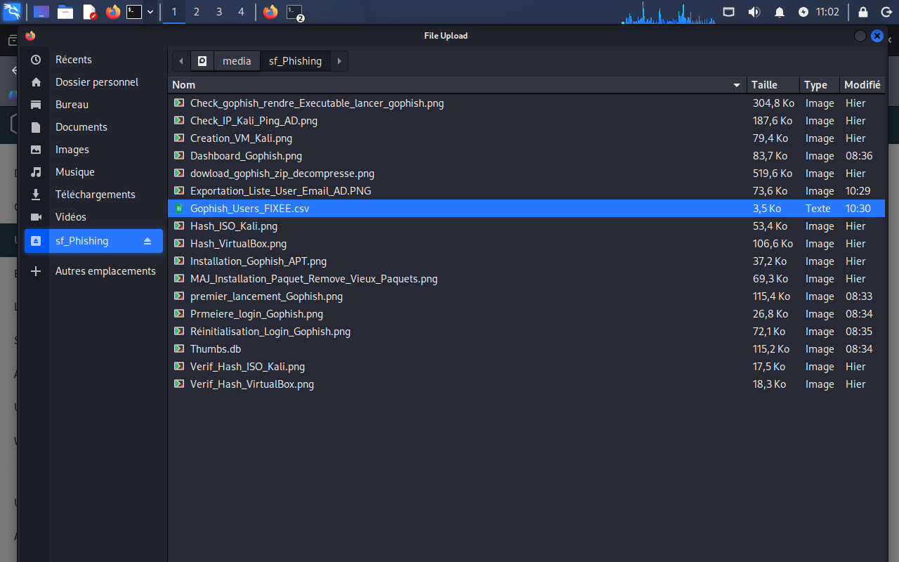

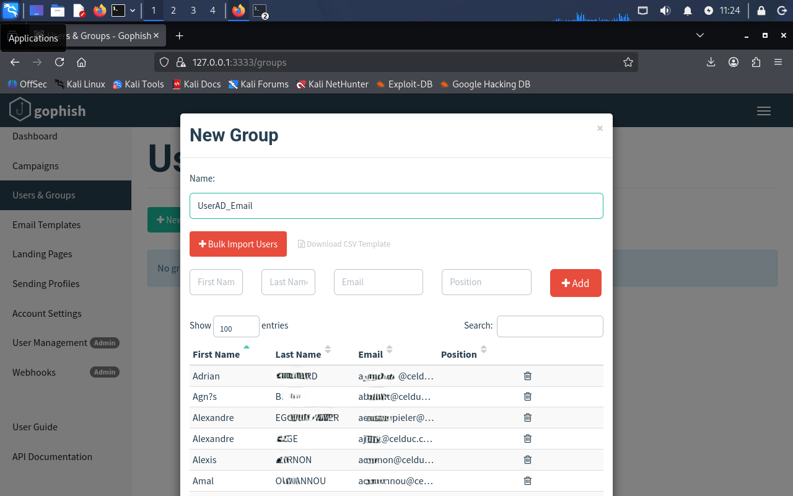

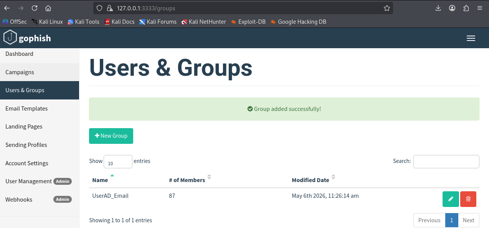

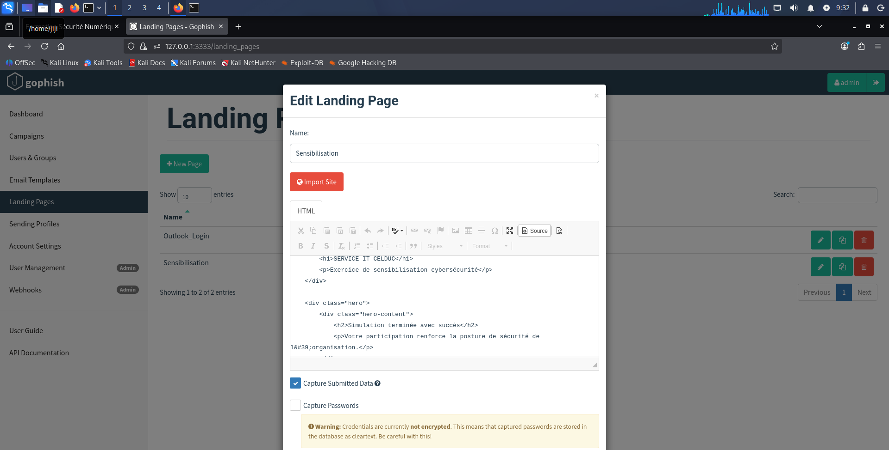

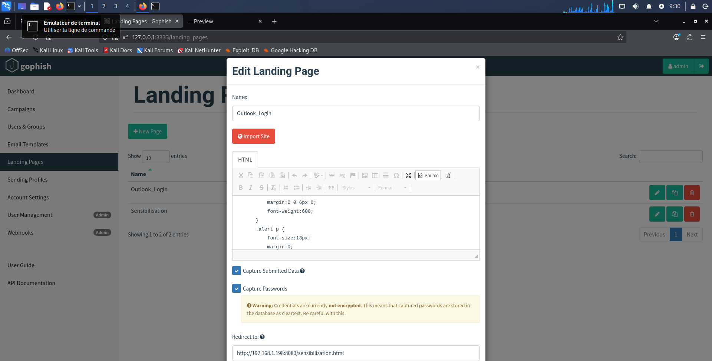

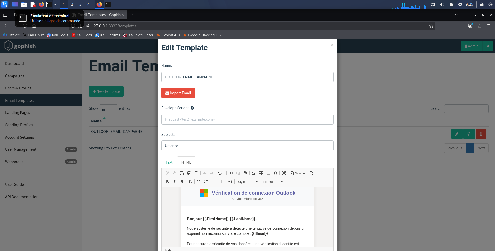

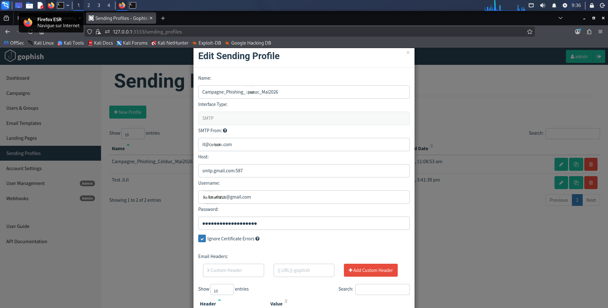

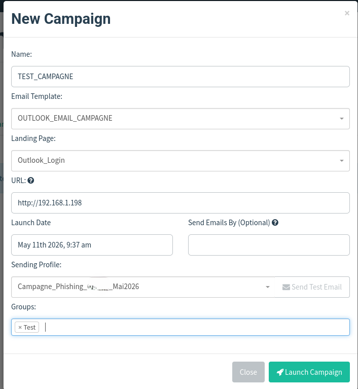

## 6. Flux utilisateur complet

1. L’utilisateur reçoit l’email.
2. Il clique sur le lien GoPhish.
3. Il arrive sur la fausse page de connexion.
4. GoPhish capture la saisie.
5. L’utilisateur est redirigé vers la page de sensibilisation.

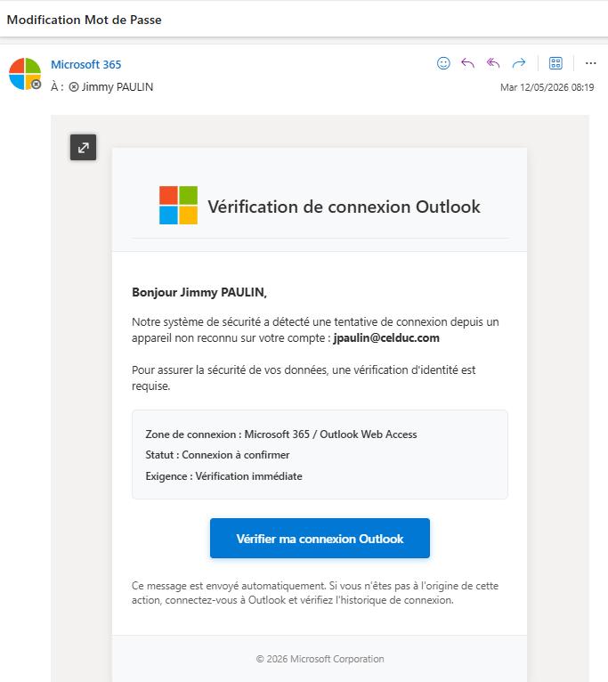

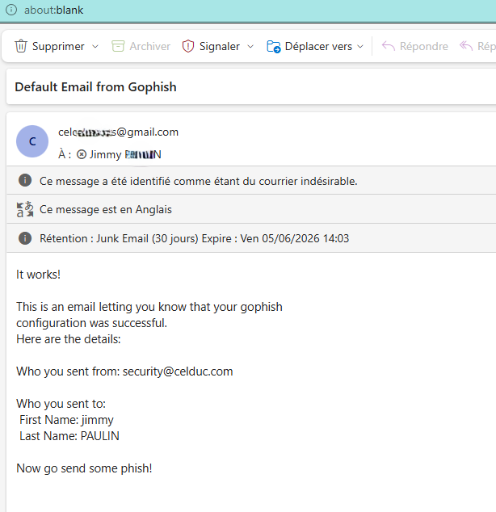

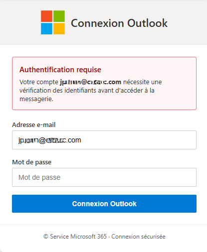

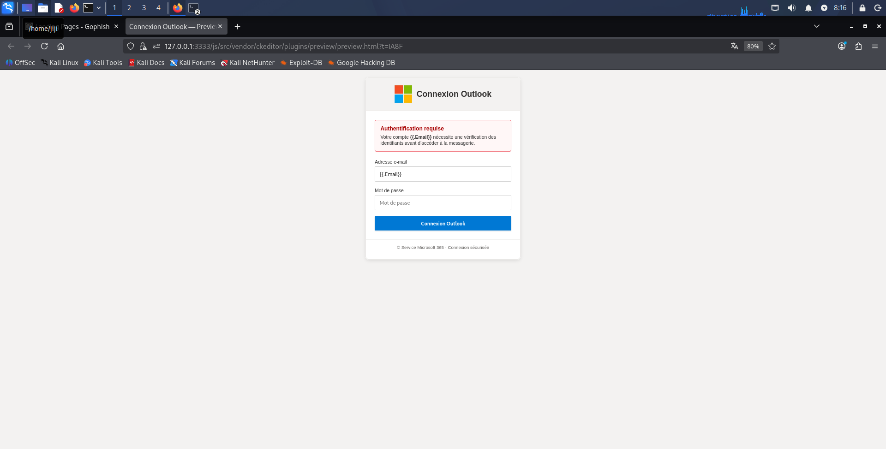


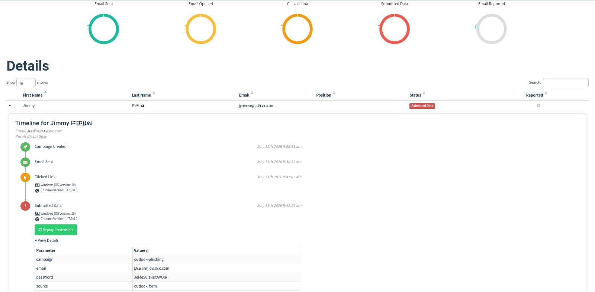

## 7. Commandes de secours

Si un service ne répond plus, j’utilise les commandes suivantes :

```bash
sudo systemctl restart gophish
sudo pkill python3
cd /home/jiji && sudo python3 -m http.server 8080 --bind 0.0.0.0
```

## 8. Nettoyage

Après la campagne, j’arrête les services et j’archive les résultats.

```bash
sudo systemctl stop gophish
sudo pkill python3
```

## Captures d’écran

Le dossier `Phishing/` contient toutes les captures utilisées pour documenter chaque étape :
- vérification des hashes,
- installation de Kali,
- installation de GoPhish,
- configuration des landing pages,
- import CSV,
- envoi des emails,
- page de sensibilisation,
- tableau de bord et résultats.
```
