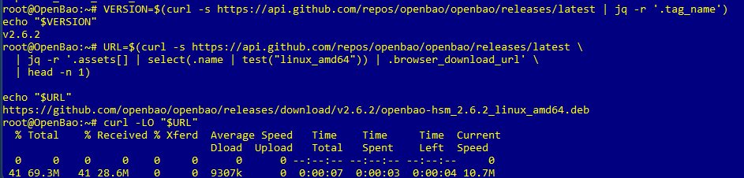
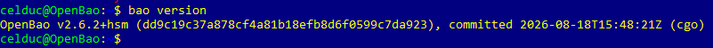
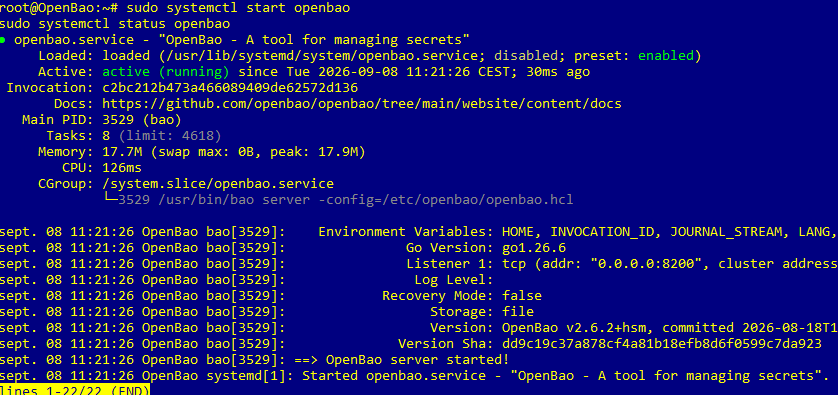

# Fiche 1 — Coffre et secrets

Cette fiche explique comment installer OpenBao, initialiser le coffre, l’ouvrir avec les clés d’unseal, activer le moteur KV v2, puis stocker et relire des secrets liés à plusieurs équipements réseau.

## Sommaire
- [Préparer la VM](#préparer-la-vm)
- [Installer OpenBao](#installer-openbao)
- [Démarrer OpenBao](#démarrer-openbao)
- [Initialiser le coffre](#initialiser-le-coffre)
- [Déverrouiller le coffre](#déverrouiller-le-coffre)
- [Authentifier le client](#authentifier-le-client)
- [Activer le moteur KV](#activer-le-moteur-kv)
- [Créer les dossiers](#créer-les-dossiers)
- [Copier les fichiers](#copier-les-fichiers)
- [Stocker les fichiers](#stocker-les-fichiers)
- [Relire et supprimer](#relire-et-supprimer)
- [Sauvegarde complémentaire](#sauvegarde-complémentaire)
- [Captures](#captures)

## Préparer la VM
La première étape consiste à installer une VM Debian qui servira de serveur OpenBao.

Une fois la VM démarrée, il faut mettre le système à jour et installer les outils de base :

```bash
sudo apt update
sudo apt upgrade -y
sudo apt install -y curl jq unzip
```

Si besoin, on peut aussi donner un nom d’hôte simple à la machine :

```bash
hostnamectl set-hostname OpenBao
```

## Installer OpenBao
On vérifie d’abord si la commande `bao` existe déjà sur la VM.

```bash
command -v bao
```

Si OpenBao n’est pas encore installé, on récupère la dernière version disponible sur GitHub puis on télécharge le bon fichier Linux amd64.

```bash
VERSION=$(curl -s [https://api.github.com/repos/openbao/openbao/releases/latest](https://api.github.com/repos/openbao/openbao/releases/latest) | jq -r '.tag_name')
echo "$VERSION"
```

```bash
URL=$(curl -s [https://api.github.com/repos/openbao/openbao/releases/latest](https://api.github.com/repos/openbao/openbao/releases/latest) | jq -r '.assets[] | select(.name | test("linux_amd64")) | .browser_download_url' | head -n 1)
echo "$URL"
```

Puis on télécharge le fichier :

```bash
curl -LO "$URL"
```



Si c’est un `.deb` :

```bash
sudo dpkg -i *.deb
sudo apt -f install -y
```

Si c’est un `.tar.gz` :

```bash
tar -xzf *.tar.gz
sudo install -m 0755 bao /usr/local/bin/bao
```

On termine avec :

```bash
bao version
```



## Démarrer OpenBao
On lance le service OpenBao puis on vérifie qu’il démarre correctement.

```bash
sudo systemctl start openbao
sudo systemctl enable openbao
sudo systemctl status openbao
```



Pour tester la communication locale :

```bash
export BAO_ADDR=[https://127.0.0.1:8200](https://127.0.0.1:8200)
export BAO_SKIP_VERIFY=true
bao status
```

`BAO_ADDR` indique au client l’adresse d’OpenBao.  
`BAO_SKIP_VERIFY=true` désactive la vérification TLS temporairement pendant les premiers tests.

## Initialiser le coffre
Une fois OpenBao lancé, on initialise le coffre.

```bash
bao operator init
```

Cette commande crée :
- 5 clés d’unseal.
- 1 root token.

Ces informations doivent être sauvegardées immédiatement.  
Après cette étape, le coffre reste verrouillé.

## Déverrouiller le coffre
Pour ouvrir le coffre, il faut utiliser 3 clés d’unseal différentes.

```bash
bao operator unseal
```

Il faut répéter la commande 3 fois avec 3 clés valides.  
Quand c’est terminé, `bao status` doit indiquer que le coffre n’est plus scellé.

## Authentifier le client
Après l’unseal, il faut s’authentifier pour pouvoir administrer OpenBao.

Le plus simple est d’utiliser le root token avec la variable d’environnement :

```bash
export BAO_TOKEN="ton_root_token"
```

On peut aussi utiliser `bao login`, mais dans notre cas le token root suffit pour les opérations d’administration.

## Activer le moteur KV
On active ensuite le moteur de secrets KV version 2 sur le chemin `secret`.

```bash
bao secrets enable --version=2 -path=secret kv
```

Ce moteur permettra de stocker :
- clés privées,
- CSR,
- certificats,
- chaînes PEM,
- informations d’équipement.

`secret` n’est pas un dossier Linux classique, mais le nom du point de montage du moteur de secrets.

## Créer les dossiers
On crée un dossier de travail sur la VM pour regrouper les fichiers à importer dans OpenBao.

```bash
mkdir -p ~/Certs
mkdir -p ~/Certs/pki/switch/Netgear
```

Puis on vérifie que le dossier existe bien :

```bash
ls
```

ou :

```bash
dir
```

## Copier les fichiers
Depuis le PC hôte, on copie les fichiers vers la VM avec `scp`.

Exemple :

```bash
scp Switch-Info2.cer celduc@192.168.1.44:~/Certs/
```

Ou avec plusieurs fichiers :

```bash
scp Switch-Info2.cer Switch-Info2.csr switch_info2_distribution.key Switch-Info2.pem celduc@192.168.1.44:~/Certs/
```

Une fois la copie terminée, les fichiers sont disponibles dans `~/Certs`.

## Stocker les fichiers
On vérifie d’abord leur présence :

```bash
cd ~/Certs
ls -l
find . -maxdepth 1 -type f | wc -l
```

Puis on stocke les fichiers dans OpenBao avec `bao kv put`.  
Le symbole `@` indique que la valeur doit être lue depuis un fichier.

### Exemple : Switch-Methodes
```bash
bao kv put secret/pki/switch/Netgear/Switch-Methodes \
  key=@switch_info2_distribution.key \
  csr=@Switch-Info2.csr \
  cert=@Switch-Info2.cer \
  chain=@Switch-Info2.pem \
  info="Switch-Methodes.celduc.lan"
```

### Exemple : Switch-BE
```bash
bao kv put secret/pki/switch/Netgear/Switch-BE \
  key=@Switch-BE.key \
  csr=@Switch-BE.csr \
  cert=@Switch-BE.cer \
  chain=@Switch-BE.pem \
  info="Switch-BE.celduc.lan"
```

### Exemple : switch_info2_distribution
```bash
bao kv put secret/pki/switch/Netgear/switch_info2_distribution \
  key=@switch_info2_distribution.key \
  csr=@switch_info2_distribution.csr \
  cert=@switch_info2_distribution.celduc.lan.cer \
  info="switch_info2_distribution.celduc.lan"
```

Chaque équipement a son propre chemin pour éviter d’écraser les données des autres.

## Relire et supprimer
Pour afficher les entrées stockées :

```bash
bao kv list secret/pki/switch/Netgear/
```

Pour relire une entrée précise :

```bash
bao kv get secret/pki/switch/Netgear/Switch-Methodes
```

Pour lire un champ particulier :

```bash
bao kv get -field=key secret/pki/switch/Netgear/Switch-Methodes
bao kv get -field=csr secret/pki/switch/Netgear/Switch-Methodes
bao kv get -field=cert secret/pki/switch/Netgear/Switch-Methodes
bao kv get -field=chain secret/pki/switch/Netgear/Switch-Methodes
bao kv get -field=info secret/pki/switch/Netgear/Switch-Methodes
```

Pour supprimer une entrée :

```bash
bao kv delete secret/pki/switch/Netgear/Switch-Methodes
```

## Sauvegarde complémentaire
En plus d’OpenBao, il est possible de garder une copie de sauvegarde sur une clé USB chiffrée avec VeraCrypt.

Le plus propre est :
- copier les fichiers de secours sur la clé USB,
- chiffrer le support ou le conteneur,
- garder le mot de passe en lieu sûr,
- démonter le volume après usage.

## Captures


