# Fiche 2 — TLS et déploiement

Cette fiche explique comment générer un certificat TLS pour OpenBao, faire signer la CSR par la PKI, installer le certificat sur la VM, configurer le service, puis tester l’accès sécurisé au coffre.

## Sommaire
- [Choisir le nom d’hôte](#choisir-le-nom-dhôte)
- [Préparer OpenSSL](#préparer-openssl)
- [Générer la clé privée](#générer-la-clé-privée)
- [Générer la CSR](#générer-la-csr)
- [Faire signer la CSR](#faire-signer-la-csr)
- [Vérifier le certificat](#vérifier-le-certificat)
- [Installer le certificat](#installer-le-certificat)
- [Configurer OpenBao](#configurer-openbao)
- [Redémarrer le service](#redémarrer-le-service)
- [Tester le TLS](#tester-le-tls)
- [Captures](#captures)

## Choisir le nom d’hôte

On commence par choisir le nom DNS de la VM OpenBao.

Exemple :

```text
openbao.celduc.lan
```

Ce nom doit être présent dans le DNS interne, sinon le certificat TLS ne correspondra pas au serveur.

Une fois l’enregistrement A créé dans le DNS, on vérifie que le nom résout bien vers la bonne IP.

Depuis un poste client (ou la VM elle-même) :

```bash
nslookup openbao.celduc.lan
```

On doit voir l’IP de la VM OpenBao dans la réponse.

Puis on teste la connectivité :

```bash
ping openbao.celduc.lan
```

Si le ping passe, c’est que :
- le nom est bien enregistré dans le DNS,
- et qu’il pointe vers la bonne machine.


## Préparer OpenSSL
On crée un fichier de configuration OpenSSL avec les SAN nécessaires.  
Les SAN doivent contenir le nom DNS de la VM, et éventuellement son IP et `127.0.0.1` pour les tests locaux.

Exemple :

```ini
[ req ]
default_bits       = 4096
prompt             = no
default_md         = sha256
distinguished_name = dn
req_extensions     = req_ext

[ dn ]
commonName = openbao.celduc.lan
organizationName = Celduc
organizationalUnitName = IT
localityName = Sorbiers
stateOrProvinceName = Auvergne-Rhône-Alpes
countryName = FR

[ req_ext ]
subjectAltName = @alt_names

[ alt_names ]
DNS.1 = openbao.celduc.lan
IP.1  = 127.0.0.1
IP.2  = 192.168.1.44
```
Enregistrer ce fichier dans le même dossier que la clé privée et la CSR.

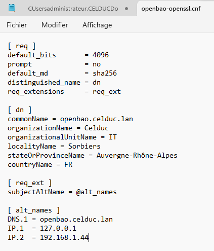

## Générer la clé privée
Sur le PC hôte, on génère la clé privée du serveur TLS.

```bash
openssl genrsa -out openbao.key 4096
```

Cette clé privée doit rester secrète.

## Générer la CSR

On génère ensuite la CSR à partir de la clé privée et du fichier de configuration OpenSSL créé précédemment.

```bash
openssl req -new -key openbao.key -out openbao.csr -config openbao-openssl.cnf
```

La CSR sera envoyée à la PKI interne.  
La clé privée, elle, ne doit jamais être transmise.

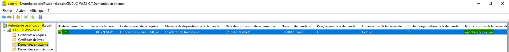


## Faire signer la CSR
On envoie uniquement `openbao.csr` à la PKI interne.  
La PKI renvoie ensuite un certificat signé, par exemple :
- `openbao.crt`
- ou `openbao.cer`

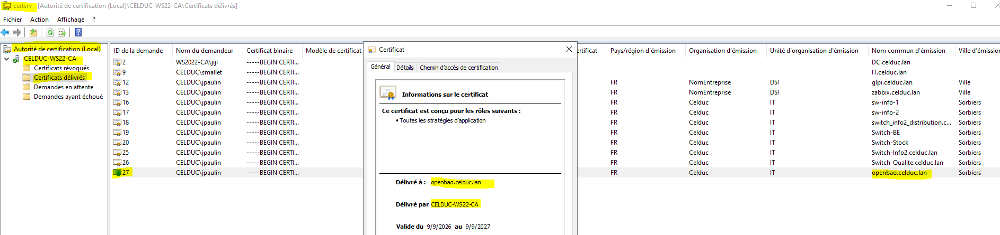

## Vérifier le certificat
Avant de l’installer, il est important de vérifier le contenu du certificat.

```bash
openssl x509 -in openbao.crt -text -noout
```

Si la PKI fournit un fichier `.cer` au format DER, on peut le vérifier avec :

```bash
openssl x509 -inform der -in openbao.cer -text -noout
```

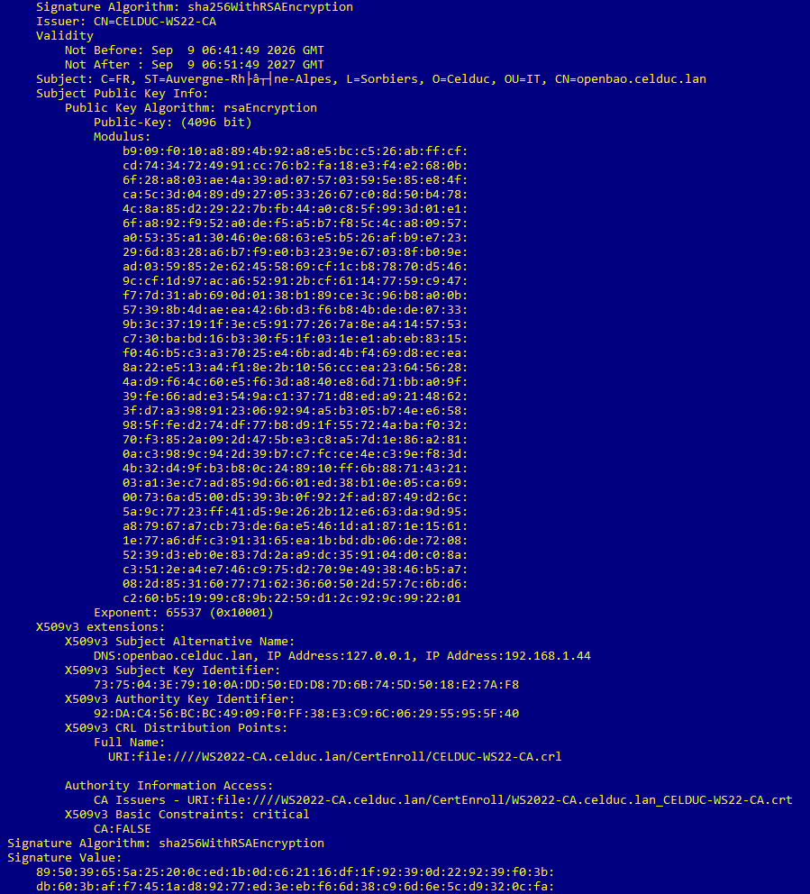

## Installer le certificat

Les fichiers générés sur le PC hôte (clé privée, CSR, certificat, fichier `.cnf`, CA, etc.) sont stockés dans un dossier dédié, par exemple le dossier TFTP dans mon cas.

On va d’abord les copier sur la VM OpenBao, puis les placer dans le bon répertoire et sécuriser les droits.

### 1. Copier les fichiers du PC hôte vers la VM (SCP)

Depuis le PC hôte, dans le dossier où se trouvent tes fichiers de certificat (par exemple le dossier TFTP), on utilise `scp` pour envoyer le certificat et la clé privée sur la VM.

Exemple :

```powershell
scp .\openbao.cer celduc@192.168.1.44:/tmp
scp .\openbao.key celduc@192.168.1.44:/tmp
```

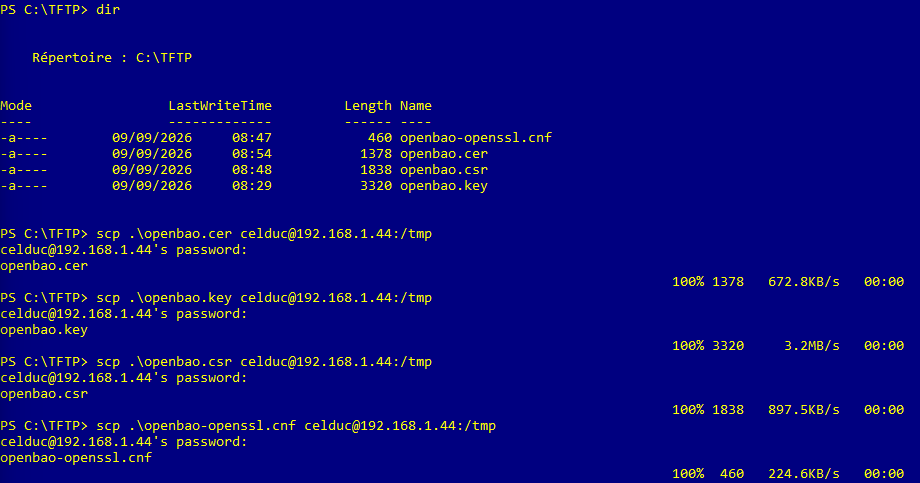

Remplace :

- `openbao.cer` / `openbao.key` par les noms réels de tes fichiers,
- `celduc` par ton utilisateur sur la VM,
- `192.168.1.44` par l’IP de ta VM OpenBao.

À la première connexion, SCP peut te demander de confirmer l’empreinte de la machine et de saisir le mot de passe de l’utilisateur `celduc`.

À ce stade, les fichiers sont présents sur la VM dans `/tmp`.

### 2. Se connecter à la VM et vérifier les fichiers

On se connecte en SSH à la VM :

```bash
ssh celduc@192.168.1.44
```

Puis on vérifie que les fichiers sont bien dans `/tmp` :

```bash
ls /tmp
```

Tu dois voir apparaître `openbao.cer`, `openbao.key` (et éventuellement d’autres fichiers si tu en as copié d’autres).

### 3. Créer le dossier TLS et déplacer les fichiers

On crée le dossier qui contiendra les fichiers TLS pour OpenBao :

```bash
sudo mkdir -p /etc/openbao/tls
```

Ensuite, on déplace le certificat et la clé privée depuis `/tmp` vers ce dossier :

```bash
sudo mv /tmp/openbao.cer /etc/openbao/tls/openbao.cer
sudo mv /tmp/openbao.key /etc/openbao/tls/openbao.key
```

Si tu as aussi copié la CA (par exemple `ca.pem`), tu peux la mettre au même endroit :

```bash
sudo mv /tmp/ca.pem /etc/openbao/tls/ca.pem
```

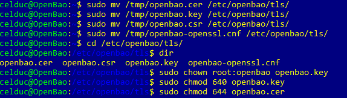


### 4. Vérifier la présence des fichiers dans `/etc/openbao/tls`

On se place dans le dossier TLS :

```bash
cd /etc/openbao/tls
```

Et on liste son contenu :

```bash
ls
```

Tu dois voir au moins :

- `openbao.cer` (certificat serveur)
- `openbao.key` (clé privée serveur)
- `ca.pem` (certificat de la CA interne, si copié)

Cela permet de s’assurer que les fichiers sont bien au bon endroit avant de régler les permissions.

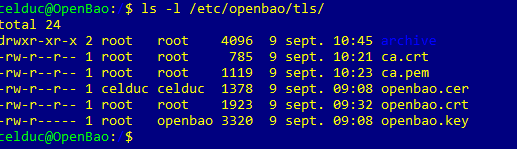

### 5. Sécuriser les droits sur la clé privée et le certificat

La clé privée doit être protégée : seul `root` (et le service OpenBao) doit pouvoir la lire.

On change le propriétaire de la clé pour que ce soit `root:openbao` :

```bash
sudo chown root:openbao openbao.key
```

Puis on restreint ses permissions :

```bash
sudo chmod 640 openbao.key
```

Cela donne :

- `root` : lecture + écriture
- groupe `openbao` : lecture seule
- les autres : aucun accès

Le certificat serveur (`openbao.cer`) est public, on peut le laisser en lecture pour tous :

```bash
sudo chmod 644 openbao.cer
```

Si tu as aussi un fichier `ca.pem`, tu peux appliquer la même logique :

```bash
sudo chown root:openbao ca.pem
sudo chmod 644 ca.pem
```

À ce stade :

- les fichiers sont au bon endroit (`/etc/openbao/tls`),
- la clé privée est protégée,
- le certificat et la CA sont lisibles par le service OpenBao.

On peut maintenant passer à la configuration du listener TLS dans `openbao.hcl`.

## Configurer OpenBao

Une fois le certificat et la clé privée en place dans `/etc/openbao/tls`, on configure OpenBao pour qu’il utilise TLS.

Le fichier de configuration principal est `/etc/openbao/openbao.hcl`.  
On l’édite avec `nano` (ou un autre éditeur) :

```bash
sudo nano /etc/openbao/openbao.hcl
```

Voici un exemple de configuration cohérent :

```hcl
ui = true #Active l’interface web d’OpenBao (accessible via un navigateur)

storage "file" {
  path = "/opt/openbao/data"
}

listener "tcp" {
  address       = "0.0.0.0:8200"
  tls_cert_file = "/etc/openbao/tls/openbao.crt" #chemin vers le certificat serveur (celui qu’on a copié dans `/etc/openbao/tls`)
  tls_key_file  = "/etc/openbao/tls/openbao.key" #chemin vers la clé privée associée
}

api_addr = "[https://openbao.celduc.lan:8200](https://openbao.celduc.lan:8200)" #adresse que les clients vont utiliser pour parler à OpenBao
```

Si on veut tester aussi avec `127.0.0.1`, il faut que cette adresse figure dans les SAN.
Si tu as inclus l’adresse IP `192.168.1.44` dans les SAN du certificat, tu peux aussi utiliser directement l’IP dans `api_addr`, par exemple :

```hcl
api_addr = "https://192.168.1.44:8200"
```

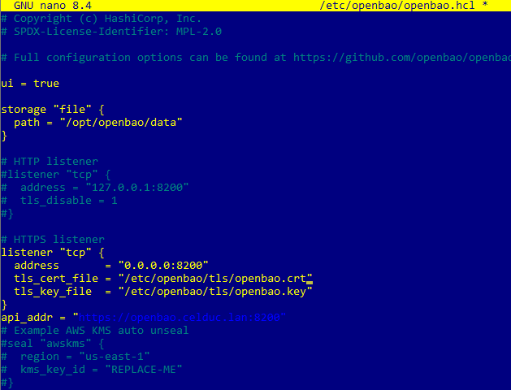

## Redémarrer le service
Après modification de la configuration, on redémarre OpenBao.

```bash
sudo systemctl restart openbao.service
sudo systemctl status openbao.service -l --no-pager
```

## Tester le TLS
Depuis la VM, on définit l’adresse du serveur et la CA à utiliser :

```bash
export BAO_ADDR=[https://openbao.celduc.lan:8200](https://openbao.celduc.lan:8200)
export BAO_CACERT=/etc/openbao/tls/ca.pem
bao status
```

Ou en local :

```bash
export BAO_ADDR=[https://127.0.0.1:8200](https://127.0.0.1:8200)
export BAO_CACERT=/etc/openbao/tls/ca.pem
bao status
```

Si tout est bon, `bao status` doit répondre sans erreur TLS.

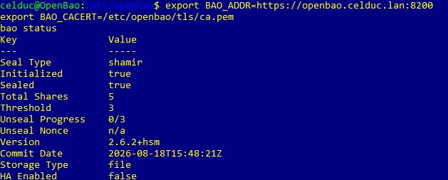

## Accéder à l’interface web et vérifier les secrets

Grâce à la configuration du fichier `openbao.hcl`, et en particulier à la ligne :

```hcl
api_addr = "[https://openbao.celduc.lan:8200](https://openbao.celduc.lan:8200)"
```

OpenBao est accessible via un navigateur, en HTTPS, avec le nom DNS de la VM.

### 1. Ouvrir l’interface web

Dans un navigateur, ouvre :

```text
[https://openbao.celduc.lan:8200](https://openbao.celduc.lan:8200)
```

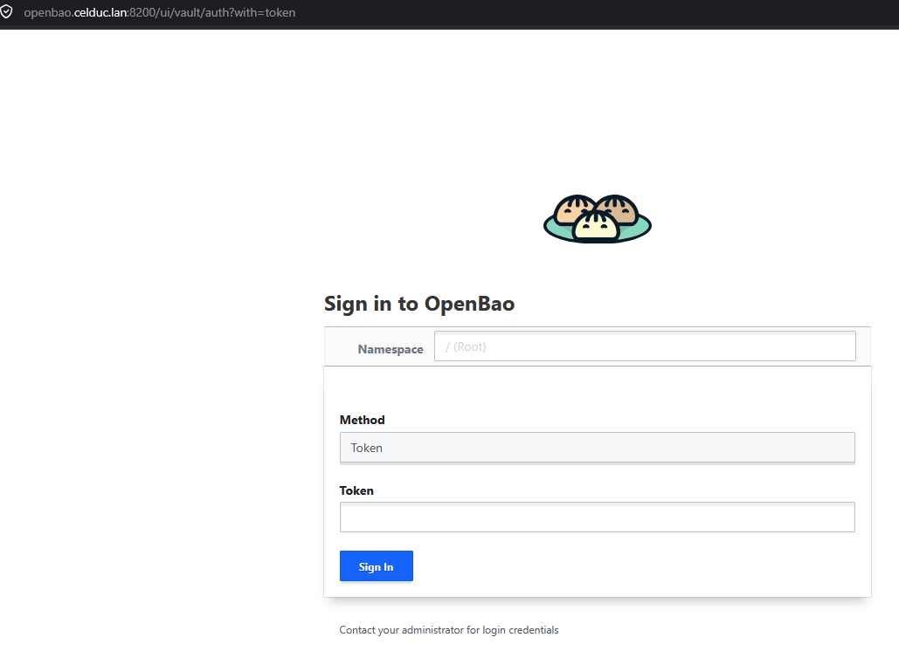

Si ton certificat est bien configuré et que le nom DNS est valide, tu ne dois pas avoir d’erreur TLS (ou seulement un avertissement lié à la CA interne, que tu peux accepter).

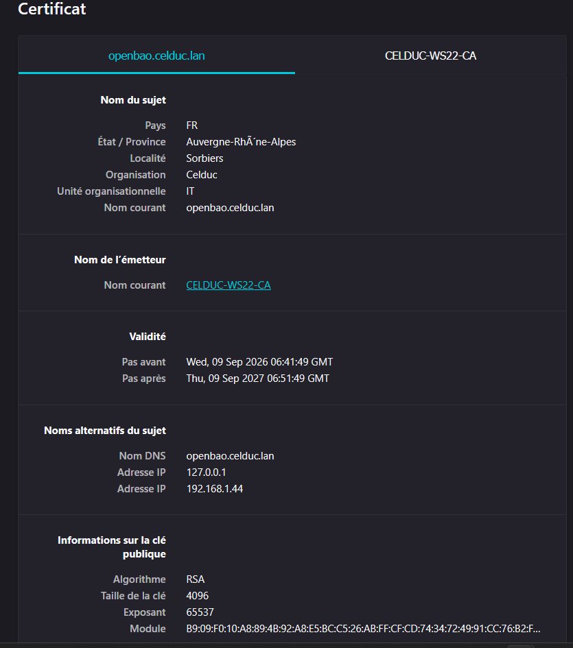

### 2. Se connecter avec un token

Sur l’écran de connexion :

- **Method** : `token`
- **Token** : colle un token valide (par exemple le token root ou un token que tu as créé en CLI)
- **Namespace** : laisse vide (si tu n’utilises pas de namespaces)

Valide pour entrer dans l’interface.

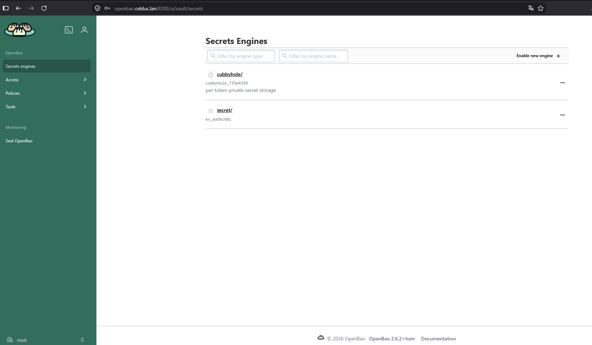

### 3. Vérifier les secrets créés en CLI

Une fois connecté :

- Navigue dans l’arborescence des secrets (par exemple `secret/` si tu utilises le moteur KV par défaut).
- Tu dois y retrouver les secrets que tu as créés précédemment en ligne de commande avec `bao kv put ...`.

Cela confirme que :

- la configuration TLS est correcte,
- l’`api_addr` pointe vers la bonne URL,
- et que l’interface web utilise bien le même backend de stockage que la CLI.

Tu peux désormais gérer tes secrets soit en CLI, soit via l’interface graphique, selon ce qui est le plus pratique.

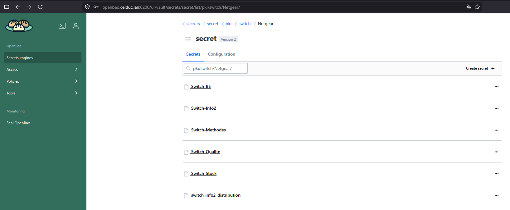
