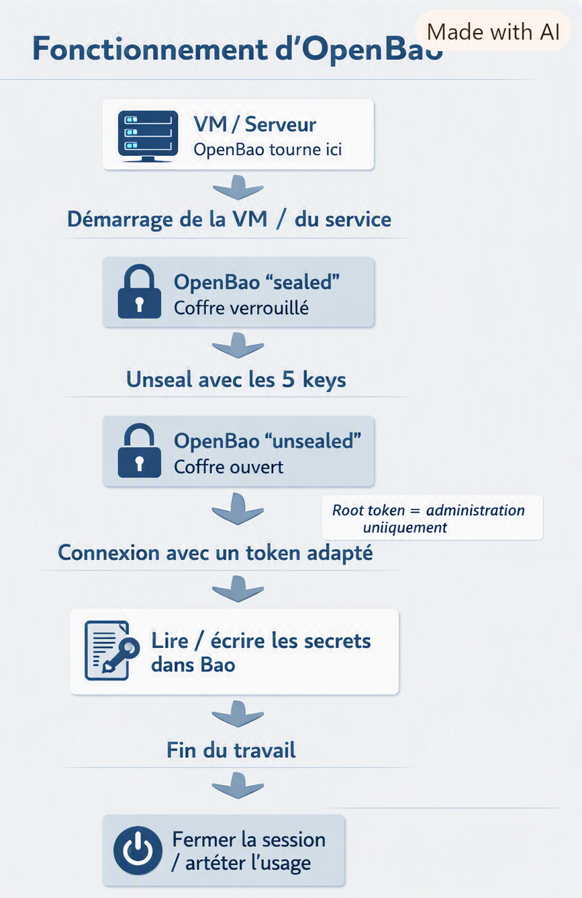

# OpenBao

Ce projet présente la mise en place d’un serveur OpenBao sur une VM Debian, avec TLS, ouverture du coffre, authentification root et stockage de secrets dans un moteur KV v2.



## Sommaire
- [Présentation](#présentation)
- [Arborescence](#arborescence)
- [Fiche 1 — Coffre et secrets](#fiche-1--coffre-et-secrets)
- [Fiche 2 — TLS et déploiement](#fiche-2--tls-et-déploiement)

## Présentation
L’objectif du projet est de centraliser et sécuriser des fichiers liés à plusieurs équipements réseau dans un coffre OpenBao.

Le projet est découpé en deux parties :
- la fiche 1 pour la gestion du coffre et des secrets ;
- la fiche 2 pour la configuration TLS et l’accès sécurisé au serveur.

## Arborescence
```text
OpenBao/
├── README.md
├── fiche1/
│   ├── Installation_&_Configuration.md
│   ├── Fiche1_OpenBao_côté_coffre_&_gestion_des_secrets.pdf
└── fiche2/
    ├── Installation_&_Configuration.md
    ├── Fiche2_OpenBao_TLS_identité_du_serveur_accès_sécurisé.pdf
```

## Fiche 1 — Coffre et secrets
Cette fiche détaille :
- l’installation d’OpenBao,
- l’initialisation du coffre,
- l’unseal,
- l’authentification avec le root token,
- l’activation du moteur KV v2,
- le stockage, la lecture et la suppression des secrets.

[Fiche 1 — Coffre et gestion des secrets](Fiche1/fiche1_OpenBao_côté_coffre_&_gestion_des_secrets.pdf)

## Fiche 2 — TLS et déploiement
Cette fiche détaille :
- la génération du certificat TLS,
- la création de la CSR,
- la signature par la PKI,
- l’installation du certificat sur la VM,
- la configuration du service OpenBao,
- les tests d’accès au coffre.

[Fiche 2 — TLS et identité du serveur](Fiche2/Fiche2_OpenBao_TLS_identité_du_serveur_accès_sécurisé.pdf)

