# Installation et configuration d’OpenVAS / Greenbone

## Sommaire
- [Introduction](#introduction)
- [Préparation de la VM](#préparation-de-la-vm)
- [Installation et activation de SSH](#installation-et-activation-de-ssh)
- [Connexion SSH et changement de VM](#connexion-ssh-et-changement-de-vm)
- [Configuration d’une IP fixe](#configuration-dune-ip-fixe)
- [Installation de GVM / OpenVAS](#installation-de-gvm--openvas)
- [Vérification des services](#vérification-des-services)
- [Synchronisation des feeds](#synchronisation-des-feeds)
- [Accès à l’interface web](#accès-à-linterface-web)
- [Accès LAN à l’interface Greenbone](#accès-lan-à-linterface-greenbone)
- [Premier scan](#premier-scan)
- [Exploitation des résultats](#exploitation-des-résultats)
- [CVE et CVSS](#cve-et-cvss)
- [Plan de remédiation](#plan-de-remédiation)
- [Transfert des rapports](#transfert-des-rapports)
- [Schéma de principe](#schéma-de-principe)
- [Conclusion](#conclusion)

## Introduction

Ce document présente l’installation et la configuration de **Greenbone Vulnerability Management (GVM) / OpenVAS** sur une machine Kali Linux. L’objectif est de mettre en place un environnement de scan de vulnérabilités, de vérifier son fonctionnement, d’interpréter les résultats obtenus et de préparer un plan de correction adapté.

OpenVAS est le moteur de scan de l’écosystème Greenbone. Il s’appuie sur des feeds de vulnérabilités pour détecter des failles connues sur des machines du réseau .

## Préparation de la VM

Avant de commencer, il est important de s’assurer que la VM est correctement préparée, avec un utilisateur administrateur, un accès réseau fonctionnel et une structure de travail claire.


### Vérification des droits administrateur

Après l’installation de Kali, vérifier que l’utilisateur possède bien les droits nécessaires :

```bash
sudo whoami
sudo -i
sudo passwd root
```

Si la commande `sudo whoami` répond `root`, les droits sont corrects. Sur Kali récent, l’usage recommandé reste celui d’un utilisateur standard avec `sudo`.

### Installation et activation de SSH

Si SSH n’a pas été installé pendant la mise en place de la VM, il peut être ajouté ensuite :

```bash
sudo apt update
sudo apt install openssh-server -y
sudo systemctl enable --now ssh
sudo systemctl status ssh
```

Le service doit apparaître en `active (running)` et `enabled`.

Pour se connecter depuis un autre poste :

```bash
ssh ton_user@IP_DE_LA_VM
```

## Connexion SSH et changement de VM

Si une VM est recréée avec la même adresse IP, le client SSH peut détecter une différence de clé d’hôte. Dans ce cas, il faut supprimer l’ancienne entrée connue pour cette IP.

```bash
ssh-keygen -R 192.168.1.129
ssh celduc@192.168.1.129
```

Une autre méthode consiste à supprimer manuellement la ligne correspondante dans le fichier `known_hosts` du poste client.

## Configuration d’une IP fixe

Pour une VM, il est pratique d’utiliser une IP fixe afin de retrouver facilement la machine en SSH et pour l’accès à l’interface web.

### Méthode graphique

- Ouvrir les paramètres réseau.
- Aller dans l’onglet IPv4.
- Passer de `Automatique (DHCP)` à `Manuel`.
- Renseigner l’adresse IP, le préfixe, la passerelle et les DNS.
- Enregistrer puis redémarrer la connexion.

### Méthode CLI

```bash
nmcli con show
nmcli con mod "NOM_DE_LA_CONNEXION" ipv4.addresses 192.168.1.50/24
nmcli con mod "NOM_DE_LA_CONNEXION" ipv4.gateway 192.168.1.1
nmcli con mod "NOM_DE_LA_CONNEXION" ipv4.dns "1.1.1.1 8.8.8.8"
nmcli con mod "NOM_DE_LA_CONNEXION" ipv4.method manual
nmcli con down "NOM_DE_LA_CONNEXION"
nmcli con up "NOM_DE_LA_CONNEXION"
ip a
ip route
```

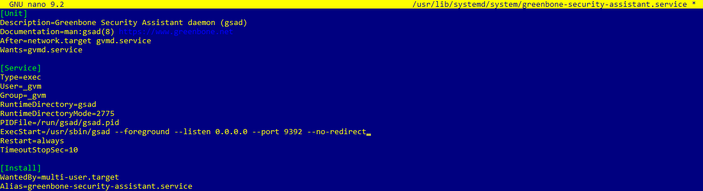

## Installation de GVM / OpenVAS

Une fois la VM prête, installer GVM :

```bash
sudo apt update && sudo apt upgrade -y && sudo apt autoremove -y
sudo apt install gvm -y
sudo gvm-setup
sudo gvm-check-setup
```

Ces commandes installent GVM/OpenVAS, initialisent l’environnement, puis vérifient que tout est correctement configuré.


## Vérification des services

Après l’installation, il faut vérifier que les services essentiels sont bien démarrés :

```bash
systemctl status redis
systemctl status postgresql
systemctl status gvmd
systemctl status ospd-openvas
systemctl status gsad
```

Les services attendus sont généralement :

- `redis` : `active (running)`
- `gvmd` : `active (running)`
- `ospd-openvas` : `active (running)`
- `gsad` : `active (running)`
- `postgresql` : disponible pour `gvmd`


## Synchronisation des feeds

Lors du premier lancement, il faut laisser le temps au téléchargement et à l’import des feeds de vulnérabilités.

```bash
greenbone-nvt-sync
greenbone-scapdata-sync
greenbone-certdata-sync
greenbone-feed-sync --type GVMD_DATA
```

Ces feeds n’apportent pas tous la même chose :

- **NVT** : tests de vulnérabilité réseau.
- **SCAP** : données de conformité et de vulnérabilités.
- **CERT** : références et alertes de sécurité.
- **GVMD_DATA** : configurations et données de gestion utilisées par `gvmd`.

Pour suivre l’avancement :

```bash
ps ax | grep greenbone
ps ax | grep -E 'gvmd|ospd-openvas|openvas|scap|cert|nvt|postgres'
top
sudo journalctl -u gvmd -f
```

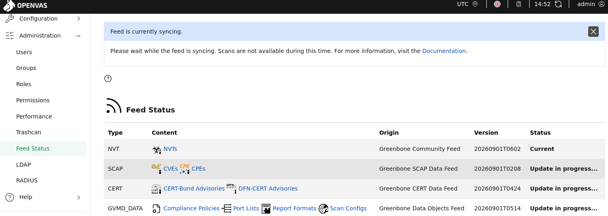


## Accès à l’interface web

Une fois l’installation validée et les services lancés, l’interface web est accessible dans la VM à :

```text
https://127.0.0.1:9392
```

Lors de la connexion :

- Identifiant : `admin`
- Mot de passe : celui généré pendant `gvm-setup`

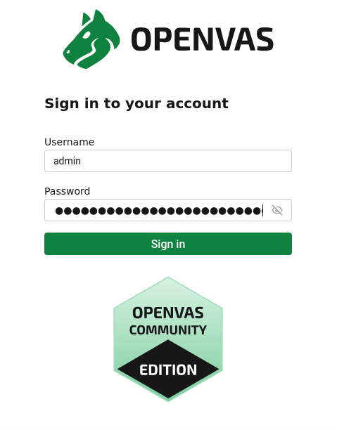

## Accès LAN à l’interface Greenbone

Par défaut, `gsad` écoute en local sur `127.0.0.1`. Pour rendre l’interface accessible depuis le LAN, il faut modifier le service.

### Procédure

1. Créer un snapshot VMware.
2. Ouvrir une session SSH sur la VM.
3. Sauvegarder le fichier de service.
4. Modifier la ligne `ExecStart`.
5. Recharger `systemd`.
6. Redémarrer le service.
7. Vérifier l’état.
8. Tester depuis une autre machine du LAN.

### Fichier de service

```bash
/usr/lib/systemd/system/gsad.service
```

### Sauvegarde

```bash
cp /usr/lib/systemd/system/gsad.service /usr/lib/systemd/system/gsad.service.bak
```

### Modification

```bash
nano /usr/lib/systemd/system/gsad.service
```

Ligne à utiliser :

```ini
ExecStart=/usr/sbin/gsad --foreground --listen 0.0.0.0 --port 9392 --no-redirect
```

### Recharge et redémarrage

```bash
systemctl daemon-reload
systemctl restart greenbone-security-assistant
systemctl status greenbone-security-assistant
```

### Test LAN

Depuis une autre machine du réseau local :

```text
https://192.168.1.129:9392
```

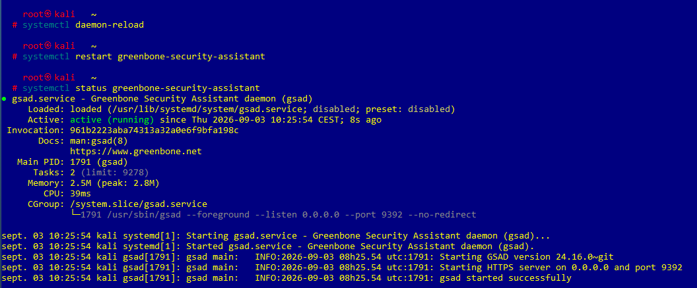

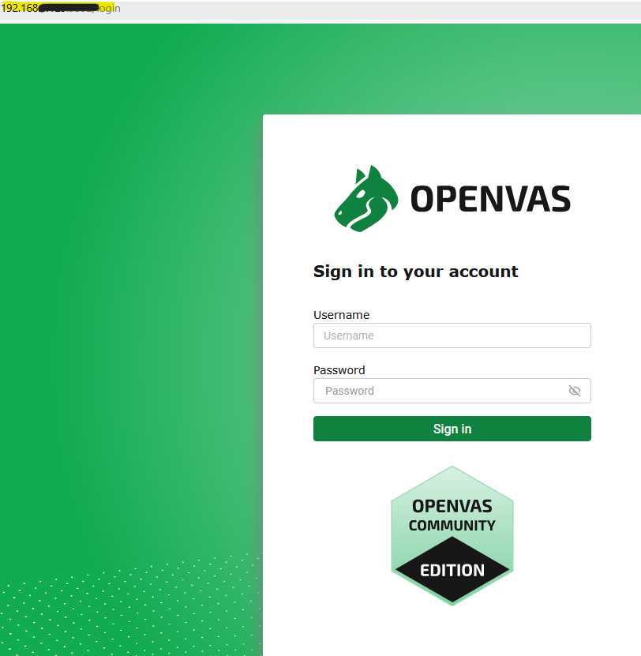

## Premier scan

Une fois l’interface disponible, il est possible de créer une cible, lancer un scan et analyser les premiers résultats.

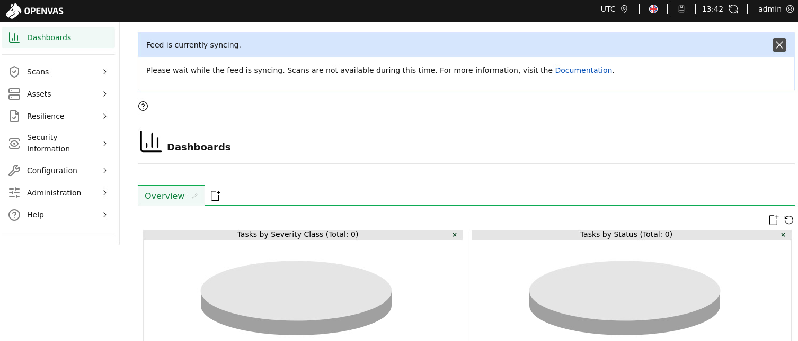

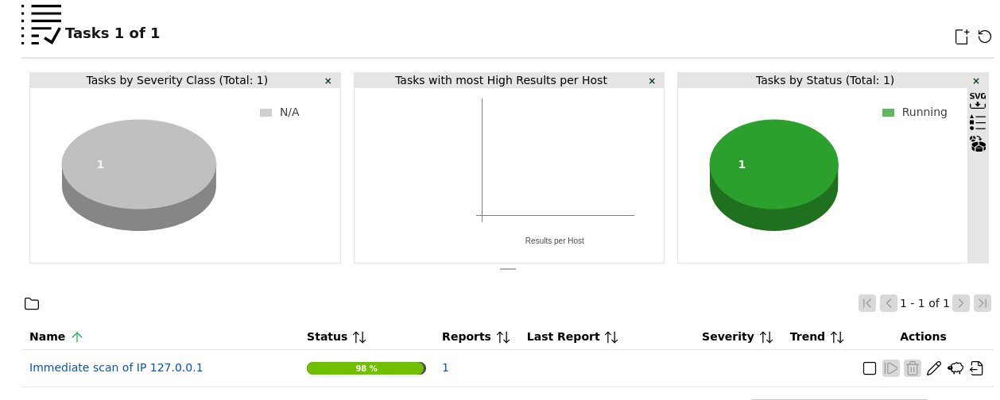

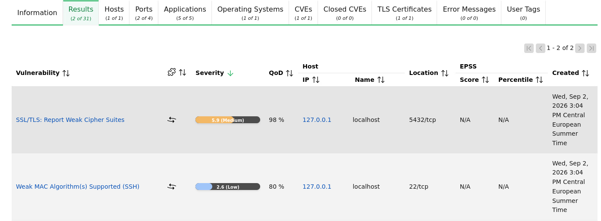

## Exploitation des résultats

Le rapport de scan peut être exporté en PDF ou CSV. Le fichier CSV est particulièrement utile pour trier les vulnérabilités, filtrer les niveaux de gravité et préparer un plan de remédiation.

```bash
scp "celduc@192.168.1.129:/home/celduc/rapport_openvas.csv" "$HOME\Downloads\"
```

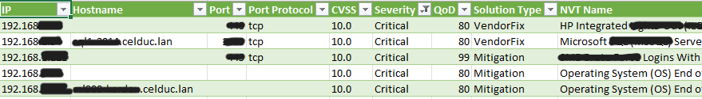

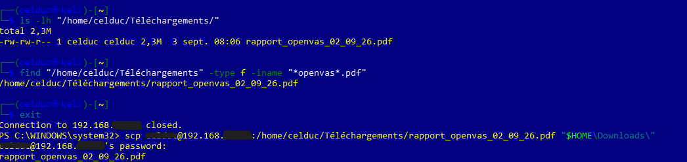

## CVE et CVSS

Une **CVE** est un identifiant standard attribué à une vulnérabilité connue.  
Le **CVSS** mesure sa gravité technique sur une échelle de 0 à 10.

Exemple :

```text
CVE-2024-12345 — CVSS 9,8 — Critique
```

Une vulnérabilité ne doit pas être priorisée uniquement sur son score. Il faut aussi prendre en compte l’exposition du service, l’existence d’un exploit connu et le nombre d’hôtes touchés.

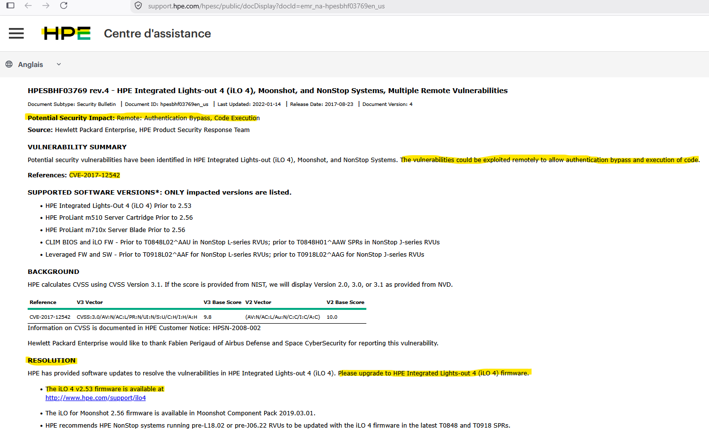


## Plan de remédiation

À partir des résultats du scan, un plan de remédiation peut être construit dans Excel avec des colonnes du type :

- CVE
- Hôte
- Service
- Port
- CVSS
- Priorité
- Exploit connu
- Correctif
- Action
- Responsable
- Échéance
- État

Ce tableau permet de suivre les vulnérabilités détectées et leur correction dans le temps.

## Schéma de principe

Le schéma ci-dessous présente le fonctionnement général d’OpenVAS / Greenbone :

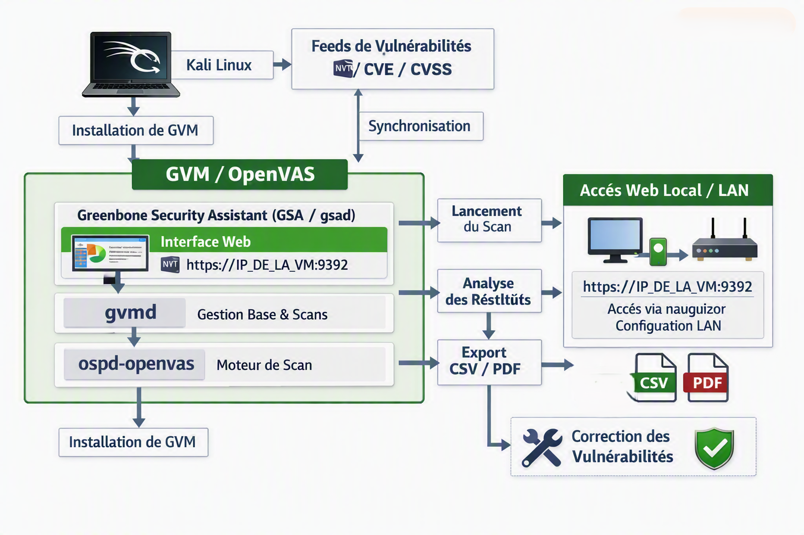

## Transfert des rapports

Les rapports générés par GVM/OpenVAS peuvent être récupérés depuis la VM vers le poste local à l’aide de `scp`.

```bash
scp "celduc@192.168.1.129:/home/celduc/rapport_openvas.pdf" "$HOME\Downloads\"
```

Il est aussi possible de transférer un CSV de la même manière.

## Conclusion

Ce TP a permis de mettre en place un environnement complet de scan de vulnérabilités avec GVM / OpenVAS, de vérifier son bon fonctionnement, d’exécuter un premier audit, puis d’exploiter les résultats pour préparer un plan de correction. L’ensemble de la démarche illustre la logique d’un processus de gestion de vulnérabilités : détection, qualification, priorisation et remédiation.
