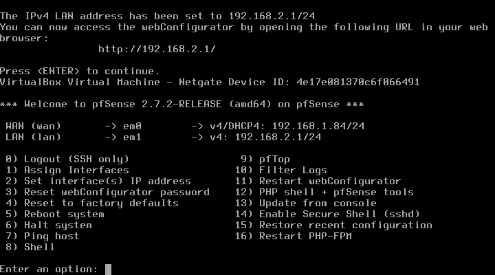
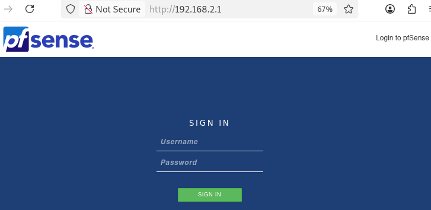
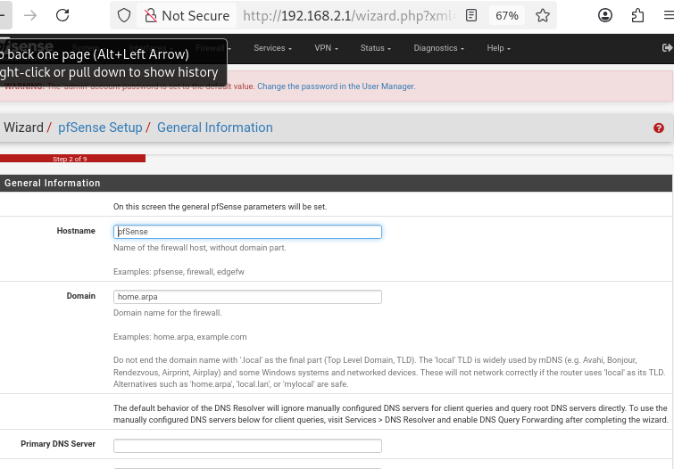
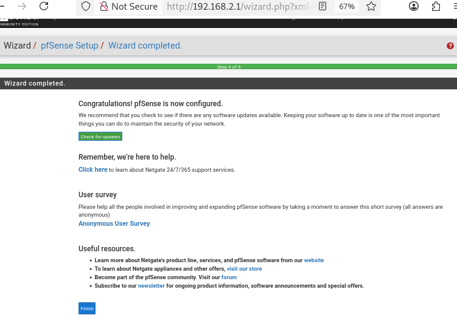
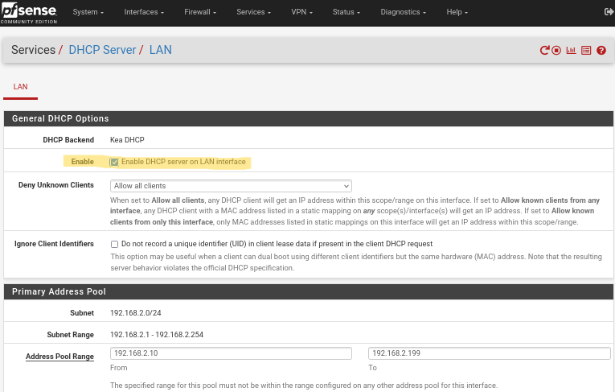
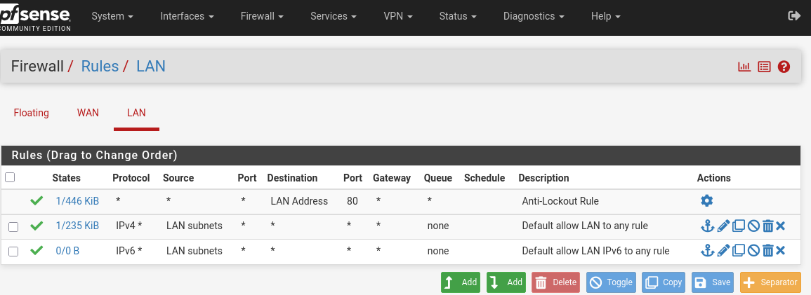
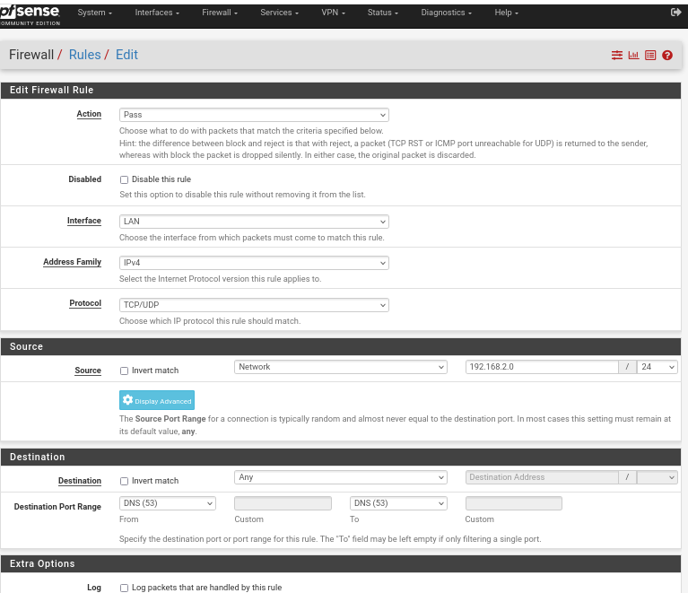
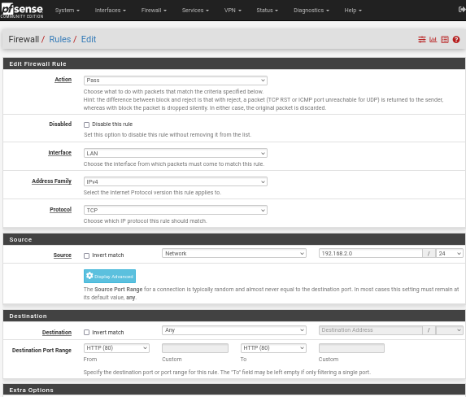

# VPN Client to Site avec pfSense

---

# Sommaire

- [Présentation](#présentation)
- [Qu&#39;est-ce que pfSense?](#quest-ce-que-pfsense)
- [Qu&#39;est-ce qu&#39;OpenVPN?](#quest-ce-quopenvpn)
- [Objectifs pédagogiques](#objectifs-pédagogiques)
- [Étapes principales du TP](#étapes-principales-du-tp)
  - [1. Mise en place du lab virtuel](#1-mise-en-place-du-lab-virtuel)
  - [2. Configuration initiale pfSense](#2-configuration-initiale-pfsense)
  - [3. Régles Firewall pfSense](#3-régles-firewall-pfsense)
  - [4. Création de l’infrastructure de certificats](#4-création-de-linfrastructure-de-certificats)
  - [5. Configuration des régles de firewall du serveur OpenVPN](#5-configuration-des-régles-de-firewall-du-serveur-openvpn)
  - [6. Export et installation du profil client](#6-export-et-installation-du-profil-client)
  - [7. Connexion &amp; tests](#7-connexion--tests)
- [Conclusion](#conclusion)

---

## Présentation

Ce TP explique comment déployer étape par étape un serveur VPN OpenVPN avec pfSense, puis comment accéder au réseau LAN de l’entreprise de façon sécurisée depuis une machine externe (client to site , exemple : télétravail).

### Qu'est-ce que pfSense?

**pfSense** est une distribution open source basée sur FreeBSD qui permet de transformer n’importe quel ordinateur ou VM en  **pare-feu, routeur et passerelle réseau professionnelle.**

Elle dispose d’une interface web très complète pour gérer :

* le routage,
* la sécurité (firewall, NAT),
* les VPN (OpenVPN, IPSec…),
* la gestion des utilisateurs et des certificats,
* la supervision réseau.

### Qu'est-ce qu'OpenVPN?

**OpenVPN** est une solution VPN open source reconnue pour sa robustesse et sa sécurité.
Il permet de créer des tunnels chiffrés entre un client (machine nomade, employé en télétravail) et un serveur (entreprise, datacenter, pfSense…).

**Fonctionnement :**

* Chiffre le trafic entre le client et le site pour protéger les données.
* Utilise des certificats et/ou des clés pour authentifier les parties.
* Peut fonctionner en mode **client-to-site** (nomade → entreprise), ou site-to-site (réseau → réseau).

---

## Objectifs pédagogiques

- **Sécuriser le réseau interne avec un pare-feu pfSense**
- **Créer un serveur VPN professionnel (OpenVPN SSL/TLS)**
- **Authentifier serveur et clients avec une autorité de certification (CA)**
- **Contrôler finement les flux avec des règles firewall dédiées**
- **Automatiser la documentation pour pouvoir reproduire le lab à l’identique**

---

## Étapes principales du TP

### 1. **Mise en place du lab virtuel**

- **Création des VMs (pfSense, VM LAN, VM externe)**
- **Paramétrage des interfaces (WAN/LAN sur pfSense, Internal Network...).**

### 2. **Configuration initiale pfSense**

- **Interface Web pfSense, connexion par défaut avec "admin" & "pfsense"**

- **Configuration de Base pfSense**

- **Finalisation configuration de Base pfSense**

- **Activation du Server DHCP LAN pfSense**

Le serveur DHCP du LAN sur pfSense est activé pour permettre aux machines du réseau interne (VLAN, serveurs, clients) d’**obtenir automatiquement une adresse IP, une passerelle et les informations réseau nécessaires** dès leur connexion.

---

### 3. **Régles Firewall pfSense**

- **Régles par défaut Firewall**

**Par défaut, pfSense autorise tout le trafic sortant sur le LAN** :
Les machines du réseau local peuvent accéder librement à Internet et aux autres réseaux.
Cette règle permet aux VM de fonctionner sans blocage au début, mais il vaut mieux l'adapter pour sécuriser le réseau ensuite.

- **Création nouvelles régles firewall pfSense (DNS, HTTP, HTTPS, ICMP, OpenVPN...)**

**Créer des nouvelles règles (DNS, HTTP, HTTPS, ICMP) permet de contrôler quels services les machines du LAN peuvent utiliser :**

* **DNS** : permet la résolution des noms de domaine
* **HTTP/HTTPS** : donne accès à Internet (sites web)
* **ICMP** : permet de tester la connectivité (ping)

On ajoute ces règles pour autoriser uniquement le trafic nécessaire et renforcer la sécurité du réseau.

- **Bien penser à valider tout changement**

- **Test régles firewall**

  - Régles ICMP & DNS

- Régle HTTPS

- Test des règles de blocage (deny)

---

### 4. **Création de l’infrastructure de certificats**

- **Création Autorité de Certification (CA)**

La création de la CA (Autorité de Certification) permet de signer et d’authentifier les certificats des serveurs et clients, assurant des connexions sécurisées et de confiance dans l’infrastructure VPN.

- **Création de Certificat**

La création d’un certificat permet d’identifier et d’authentifier de façon sécurisée un serveur ou un client, garantissant que seules les machines autorisées accèdent au VPN.

- **Création de l'utilisateur**

La création de l’utilisateur permet d’identifier chaque personne ou machine qui se connecte au VPN et d’attribuer des droits ou certificats personnalisés.

- **Création du Server OpenVPN**

La création du serveur OpenVPN permet d’établir le tunnel sécurisé qui relie les clients externes au réseau interne en passant par pfSense.

### 5. **Configuration des régles de firewall du serveur OpenVPN**

- **Création régle firewall Server OpenVPN WAN**

La création des règles de firewall sur le WAN pour le serveur OpenVPN permet d’autoriser les connexions VPN provenant d’Internet tout en bloquant les accès non désirés.

- **Création régle firewall Server OpenVPN LAN**

La création des règles de firewall sur le LAN pour le serveur OpenVPN permet de contrôler et sécuriser les accès des clients VPN vers les ressources internes du réseau local.

---

### 6. **Export et installation du profil client**

- **Installation du package “openvpn-client-export”**

L’installation du package "OpenVPN Client Export" permet de générer facilement les fichiers de configuration nécessaires pour connecter les clients au VPN.

- **Download & Export du fichier .ovpn + clés**

Le téléchargement et l’export du fichier .ovpn et des clés permet d’équiper le client avec tout ce qu’il faut pour se connecter de façon sécurisée au VPN.

* **Installation et configuration du client OpenVPN sur la VM externe**

L’installation et la configuration du client OpenVPN sur la VM externe permet d’établir la connexion sécurisée au VPN et d’accéder au réseau interne à distance.

* **Organisation des fichiers d’archive OpenVPN dans le projet**

Regrouper tous les fichiers OpenVPN dans un dossier spécifique permet d’assurer qu’aucun fichier important (clé, certificat, config) n’est oublié lors de la connexion VPN, garantissant ainsi une connexion fiable et sécurisée.

---

### 7. **Connexion & tests**

- **Etablissement du tunnel depuis la VM externe**

L’établissement du tunnel depuis la VM externe permet de relier de façon sécurisée la machine distante au réseau interne, comme si elle était physiquement présente sur le LAN.

- **Test réseau LAN depuis vm Client Externe connectée avec le VPN**

- **Connexion à la VM interne LAN depuis la VM Externe avec OpenVPN**

---

Ce TP a permis de mettre en place une infrastructure VPN sécurisée avec pfSense, de la création des certificats à la connexion d’un client externe.
Grâce à l’utilisation des règles firewall et à l’organisation rigoureuse des fichiers, la solution garantit sécurité, contrôle des accès et facilité de gestion pour relier des machines distantes au réseau interne.
