# Projet LDAPS : PKI, Active Directory et FortiGate

## Sommaire
- [Contexte et objectif](#contexte-et-objectif)
- [Préparation de l’environnement](#préparation-de-lenvironnement)
- [Durcissement LDAP sur Active Directory](#durcissement-ldap-sur-active-directory)
- [Mise en place de la PKI / AD CS](#mise-en-place-de-la-pki--ad-cs)
- [Création et émission des certificats](#création-et-émission-des-certificats)
- [Vérification des certificats](#vérification-des-certificats)
- [Configuration LDAPS sur le DC](#configuration-ldaps-sur-le-dc)
- [Configuration FortiGate](#configuration-fortigate)
- [Tests de connexion](#tests-de-connexion)
- [Journalisation et validation](#journalisation-et-validation)
- [Conclusion](#conclusion)

***

## Contexte et objectif

Ce projet s’inscrit dans la continuité d’un audit de sécurité réalisé sur l’environnement Active Directory à l’aide d’outils comme ADMiner, BloodHound et SharpHound. L’analyse a permis d’identifier plusieurs faiblesses, notamment autour de la gestion des comptes administrateurs locaux et de la sécurisation des authentifications LDAP.

En complément de la remédiation initiale sur les comptes administrateurs locaux, qui a conduit à la mise en place de GPO et de LAPS côté Active Directory, un mécanisme qui génère et stocke automatiquement un mot de passe administrateur local unique pour chaque poste dans l’annuaire, le projet s’est ensuite concentré sur la sécurisation des authentifications LDAP via LDAP signing, une PKI interne et LDAPS.

Dans la continuité, le projet s’est orienté vers la sécurisation des échanges entre le FortiGate et l’Active Directory, avec la mise en place de l’infrastructure PKI puis la configuration de LDAPS pour chiffrer les communications avec le contrôleur de domaine.

***

## Préparation de l’environnement

Avant de commencer, une machine Windows Server a été préparée et reliée au domaine afin de servir de base au déploiement de l’infrastructure AD / PKI.

Cette machine a été déployée sous VirtualBox. L’ISO de Windows Server 2022 a été téléchargée puis son hash a été vérifié afin de contrôler l’intégrité du support d’installation avant la mise en service.

 * Vérification de l’ISO avant le hash

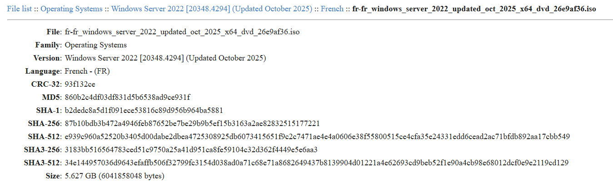

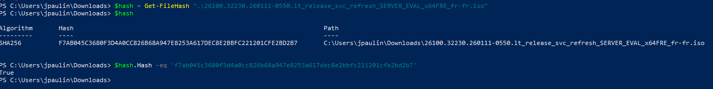

La machine a ensuite été configurée avec une adresse IP fixe adaptée au réseau local et reliée au domaine Active Directory pour pouvoir héberger le rôle de certification.

 * Configuration réseau avant l’image IP fixe

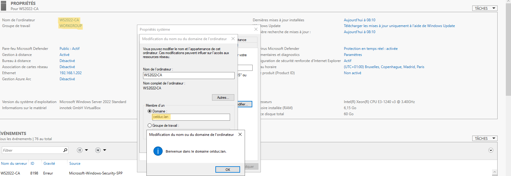

 * Jonction au domaine avant la vérification finale

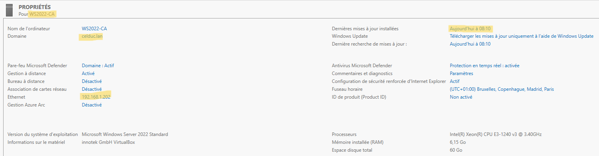

***

## Durcissement LDAP sur Active Directory

La première étape de sécurisation a consisté à activer LDAP signing sur le contrôleur de domaine. Cette configuration permet d’imposer une signature des requêtes LDAP afin de réduire les risques liés aux authentifications non sécurisées et de garantir l’intégrité des échanges.

 * Activation de LDAP signing

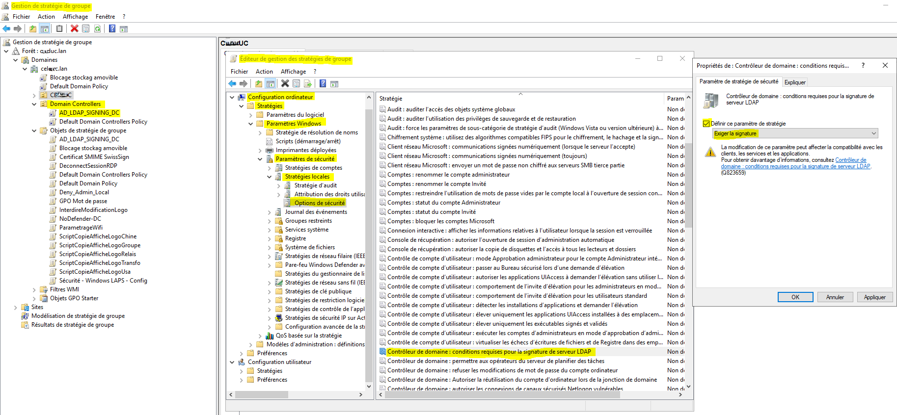

La journalisation LDAP a également été activée afin d’identifier les clients utilisant encore des binds non sécurisés et de pouvoir contrôler les impacts avant généralisation de la configuration. Un bind LDAP correspond à l’étape d’authentification qui permet à un client de se connecter à l’annuaire avec un compte et un mot de passe ; en simple bind, ces identifiants peuvent être envoyés en clair si le canal n’est pas protégé.

 * Vérification de la GPO

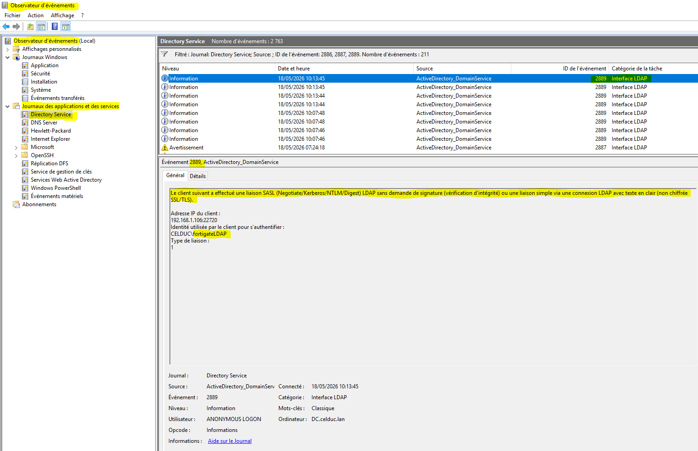

 * Activation de la journalisation LDAP
   

***

## Mise en place de la PKI / AD CS

Pour permettre le fonctionnement de LDAPS, une infrastructure de certificats a été mise en place via le rôle Active Directory Certificate Services.

 * Installation du rôle AD CS

 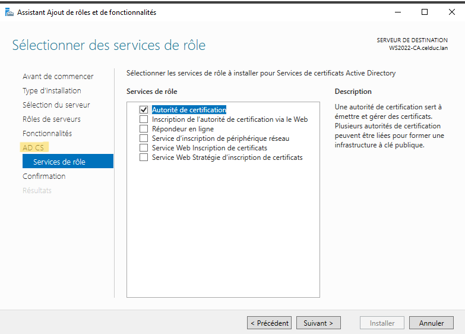

Une PKI, ou infrastructure à clé publique, sert à créer et à gérer des certificats numériques. Elle repose sur une autorité de certification, appelée CA, qui signe les certificats pour établir une chaîne de confiance entre les serveurs et les clients.

Dans ce projet, deux certificats principaux ont été utilisés.

Le certificat racine de la CA permet aux systèmes de faire confiance à l’autorité de certification interne. Il établit la base de la chaîne de confiance et indique que les certificats qu’elle signe peuvent être considérés comme légitimes.

Le certificat serveur du contrôleur de domaine permet au client de vérifier qu’il communique bien avec le bon serveur lors des connexions LDAPS.

La CA racine a ensuite été configurée sur la machine dédiée. Cette étape permet de disposer d’une autorité interne capable d’émettre les certificats nécessaires au contrôleur de domaine.

 * Configuration de la CA

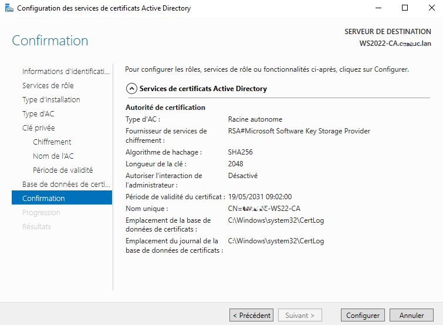

 * Vérification de la CA
   
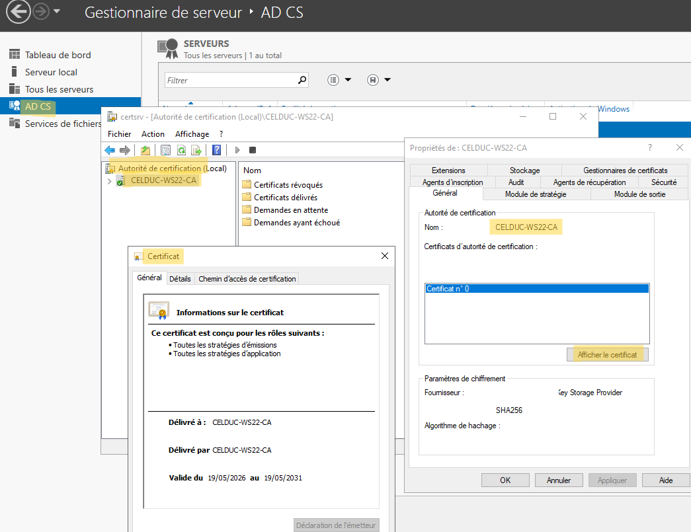

***

## Création et émission des certificats

Une demande de certificat serveur a été préparée pour le service LDAPS du contrôleur de domaine. Cette demande contient les informations nécessaires pour identifier le serveur et préciser l’usage attendu du certificat.

 * Préparation de la demande

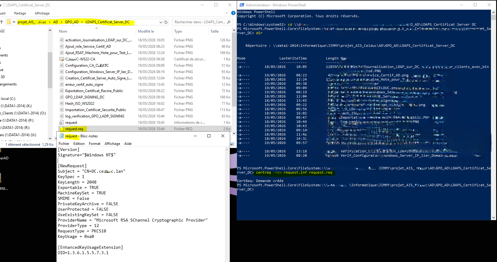

Le fichier de demande a ensuite été généré, puis transmis à l’autorité de certification pour validation. La CA a délivré manuellement le certificat serveur afin qu’il puisse être utilisé par le contrôleur de domaine pour les connexions LDAPS.

 * Envoi de la demande à la CA

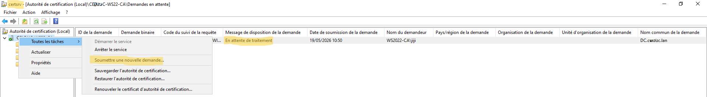

 * Délivrance manuelle

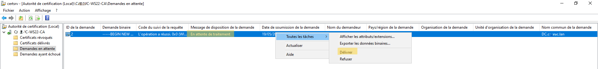

Le certificat serveur émis par la CA a ensuite été récupéré et installé sur le serveur concerné. Le certificat serveur du DC a aussi été exporté, ainsi que le certificat racine public, afin de conserver la chaîne de confiance complète et de préparer les imports nécessaires sur les autres équipements du projet.

 * Export des certificats

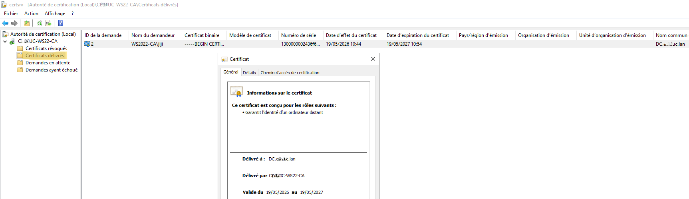

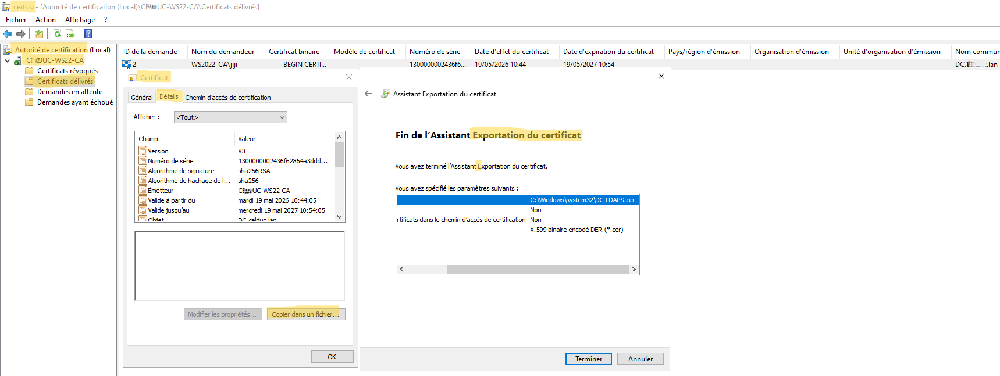

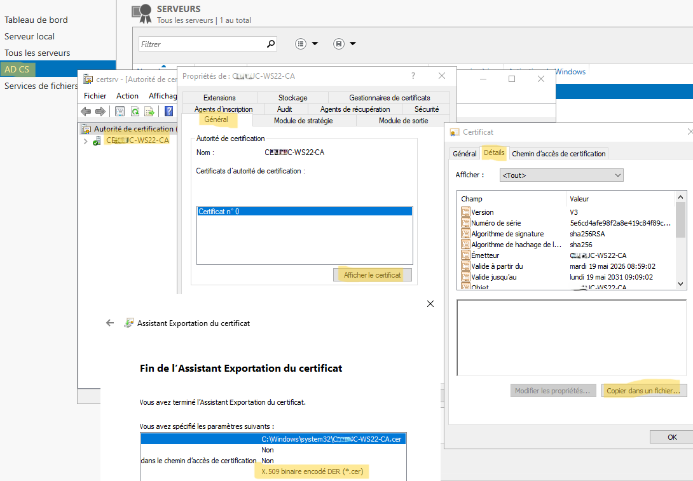

***

## Vérification des certificats

Avant de poursuivre, plusieurs vérifications ont été réalisées pour confirmer que les certificats étaient valides et correctement émis.

Les certificats ont été placés dans les magasins Windows appropriés via `certlm.msc` : le certificat serveur dans le magasin Personnel et le certificat racine dans le magasin des autorités de certification racines de confiance.

Ces contrôles ont permis de confirmer que le contrôleur de domaine pouvait utiliser son certificat pour LDAPS et que les systèmes clients pouvaient faire confiance à l’autorité de certification interne. Le certificat serveur du DC et le certificat racine public de la CA ont ensuite été exportés afin de préparer l’import côté FortiGate.

 * Validation du certificat serveur

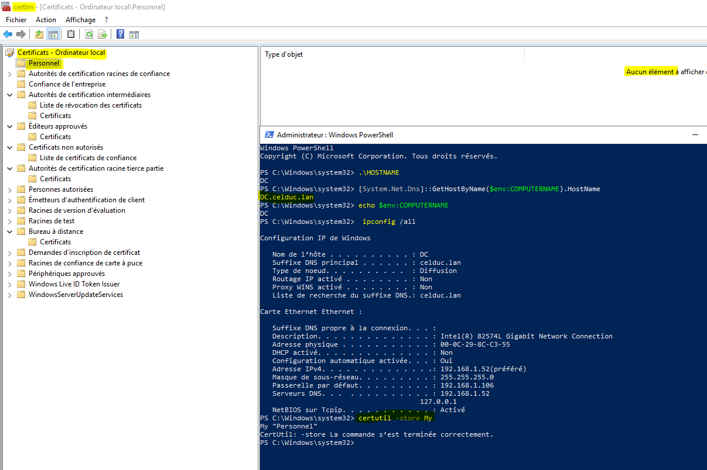

 * Import dans les magasins Windows

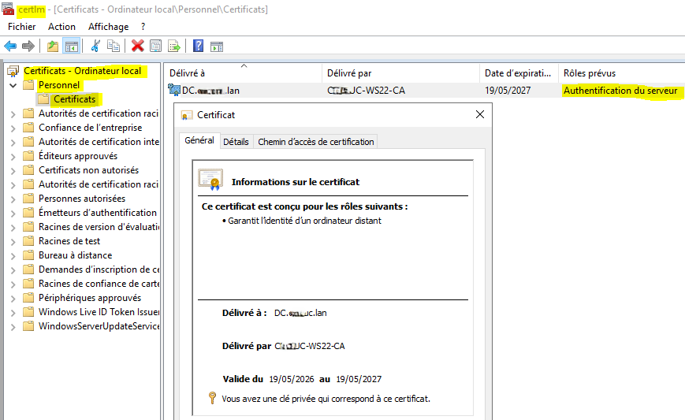

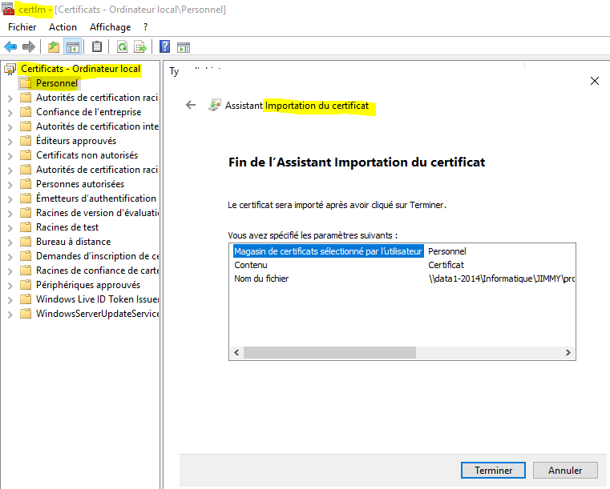

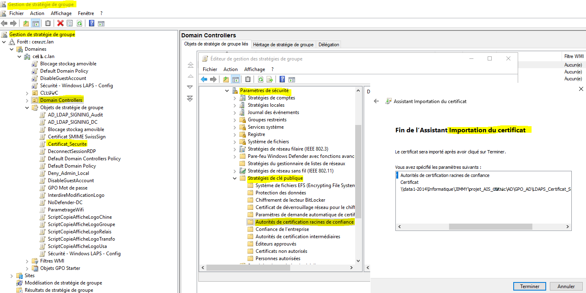

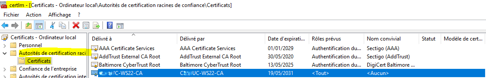

***

## Configuration LDAPS sur le DC

Les certificats requis pour LDAPS ont été installés sur le contrôleur de domaine.

Une fois la CA importée et le certificat serveur en place, le contrôleur de domaine a pu exposer le service LDAP en mode sécurisé.

 * Import du certificat serveur

 * Import du certificat racine

***

## Configuration FortiGate

Les vérifications réalisées lors de l’audit LDAP signing ont montré que le FortiGate utilisait encore LDAP en clair sur le port 389. Il a donc fallu adapter la configuration pour sécuriser les échanges avec l’Active Directory via LDAPS sur le port 636.

Le certificat racine de la CA interne a été importé sur le FortiGate afin qu’il puisse faire confiance au contrôleur de domaine lors des échanges LDAPS. La configuration DNS a également été ajustée pour permettre la résolution du contrôleur de domaine interne.

Un utilisateur a enfin été créé pour tester la connexion VPN SSL avec FortiClient et valider le bon fonctionnement de l’authentification via l’annuaire sécurisé.

   * Importation du certificat racine sur FortiGate
     
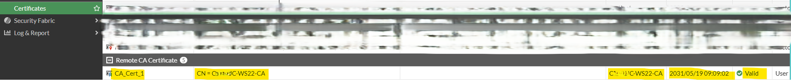

 * Configuration DNS

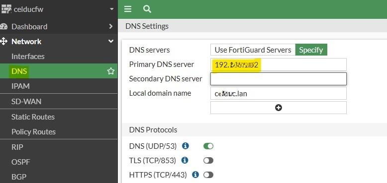

 * Création de l’utilisateur de test
   
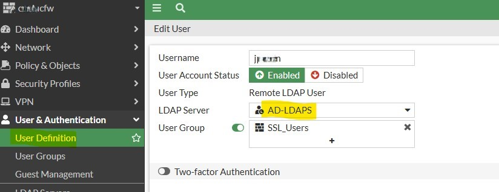

***

## Tests de connexion

Plusieurs tests ont été effectués pour valider le bon fonctionnement de LDAPS et confirmer que la chaîne de confiance était bien opérationnelle.

### Test avec LDP.exe

La connexion LDAPS a d’abord été testée avec l’outil LDP afin de vérifier directement la communication avec le contrôleur de domaine. Ce test permet de confirmer que le service LDAP sécurisé répond bien, que le port 636 est accessible et que le certificat présenté est accepté.

 * Test avec LDP.exe

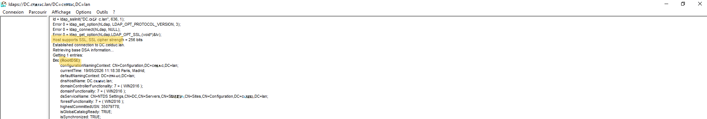

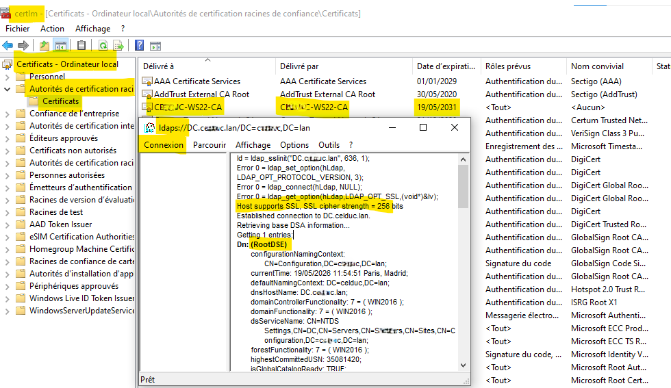

### Test depuis FortiGate

Le test LDAP/LDAPS depuis FortiGate a confirmé le bon fonctionnement de la configuration côté équipement réseau. Il a permis de vérifier que le FortiGate pouvait bien interroger l’Active Directory en s’appuyant sur la CA interne et sur la configuration DNS mise en place.

 * Test depuis FortiGate

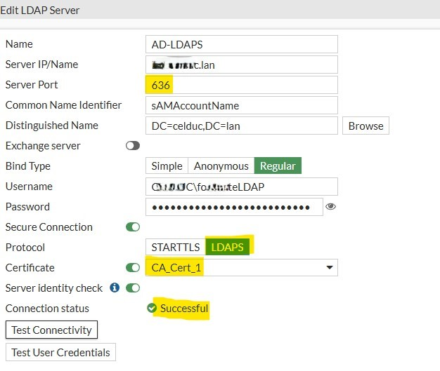

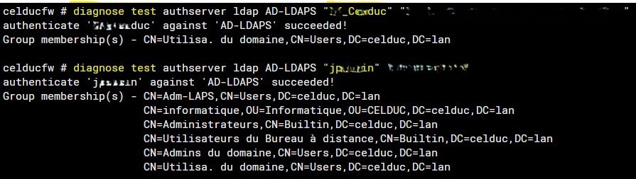

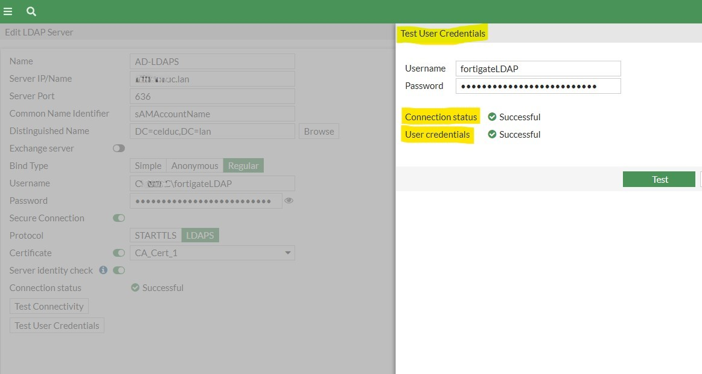

### Test VPN FortiClient

Un test de connexion VPN SSL avec FortiClient a également été réalisé. L’objectif était de valider que l’authentification des utilisateurs fonctionnait correctement à travers l’annuaire sécurisé et que l’ensemble de la chaîne, du client jusqu’au contrôleur de domaine, était opérationnel.

 * Test VPN FortiClient

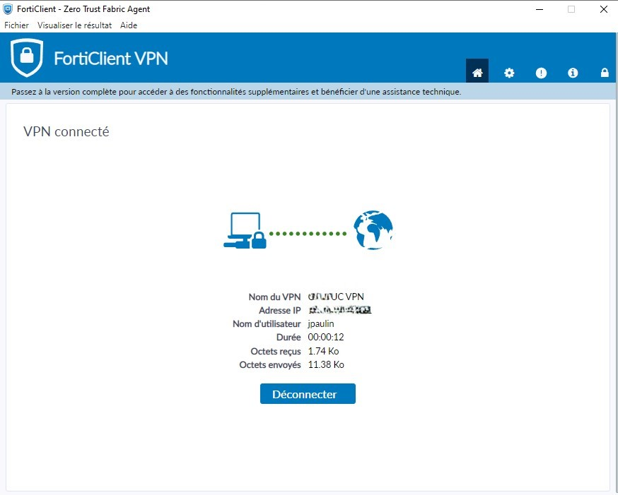

***

## Journalisation et validation

Les journaux du contrôleur de domaine ont permis de confirmer que les connexions LDAPS étaient bien prises en compte et que le fonctionnement était conforme à ce qui était attendu.

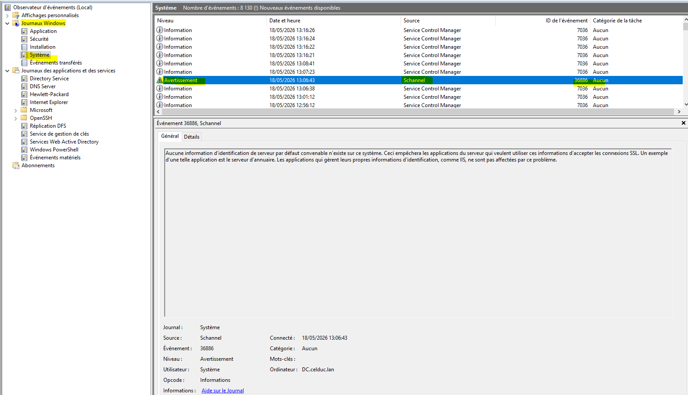

***

## Conclusion

Ce projet a permis de sécuriser l’authentification entre Active Directory et le FortiGate grâce à une combinaison de LDAP signing, de PKI interne et de LDAPS.

Il a également permis de valider la chaîne complète de confiance, depuis la création de la CA jusqu’aux tests fonctionnels sur le VPN SSL.

Au-delà de la mise en place technique, ce travail a confirmé l’importance du durcissement des échanges LDAP et de la gestion correcte des certificats dans un environnement Active Directory.

