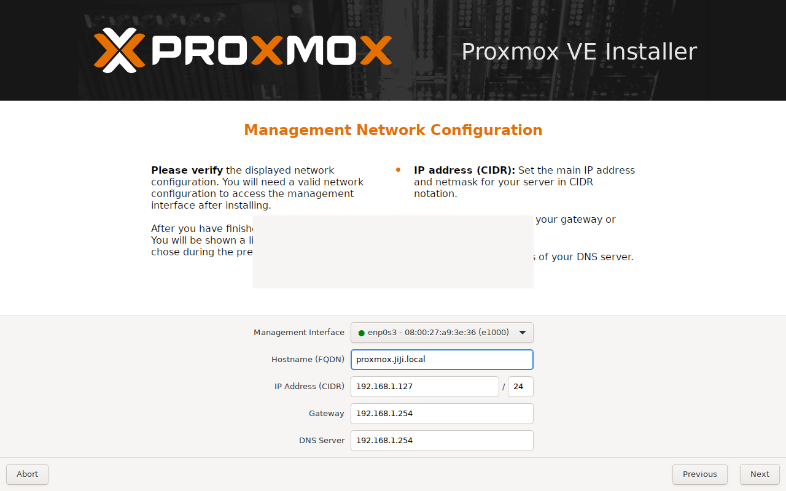
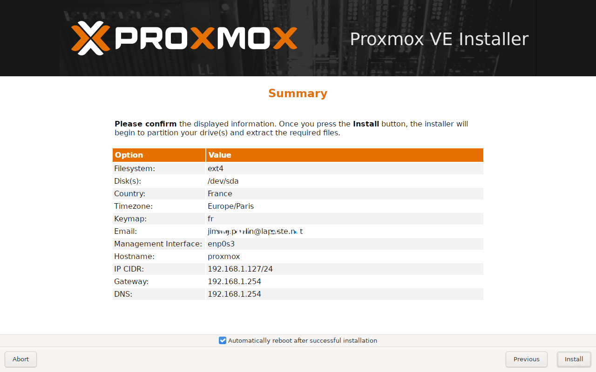
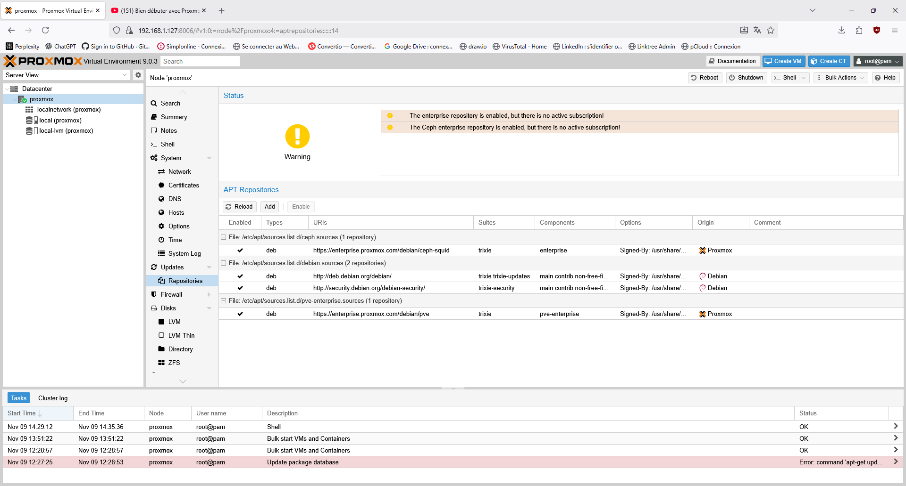
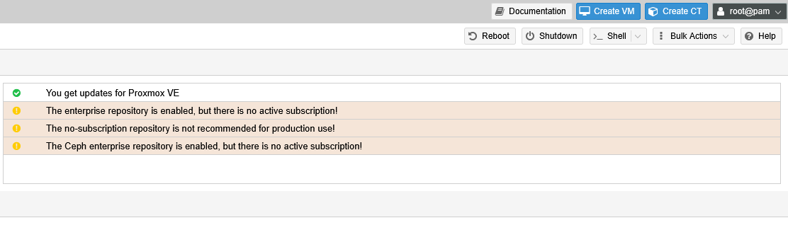
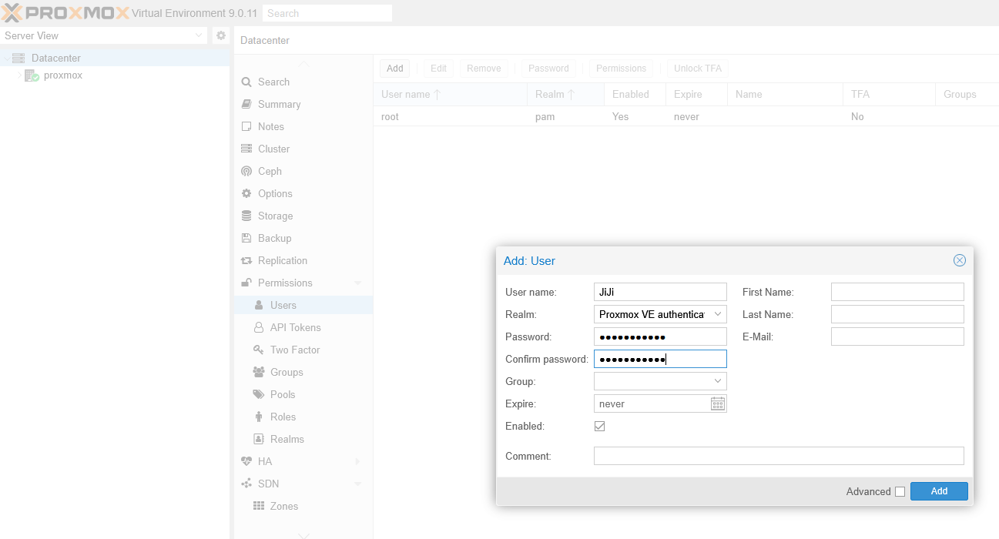

# **Installation et configuration de Proxmox VE et pfSense dans un environnement virtualisé**

---

## Sommaire
- [Contexte](#contexte)
- [Objectifs](#objectifs)
- [Matériel et logiciels](#matériel-et-logiciels)
- [Étapes réalisées](#etapes-réalisées)
- [Gestion des utilisateurs](#gestion-des-utilisateurs--création-dun-compte-non-root-dans-proxmox-ve)
- [Ajout et Vérification de l ISO Pfsense](#ajout-et-verification-de-l-iso-pfsense)
- [Création vm pfsense](#création-de-la-vm-pfsense)
- [Conclusion](#conclusion)

---

## Contexte

Ce TP a pour objectif d’installer et configurer Proxmox VE dans une machine virtuelle VirtualBox, puis de déployer une VM pfSense afin de mettre en place un hyperviseur capable de gérer des machines virtuelles, de simuler un environnement réseau sécurisé, et d’expérimenter différentes fonctionnalités de firewall, routage et services réseau.

# Introduction

- Proxmox Virtual Environment (Proxmox VE) est une plateforme open source de virtualisation qui permet de créer et gérer des machines virtuelles et des conteneurs sur un seul serveur. Elle offre une interface web puissante pour administrer facilement les systèmes virtualisés, optimiser les ressources matérielles, et gérer le stockage et la mise en réseau. Proxmox est souvent utilisé en entreprise pour consolider des serveurs, simplifier la gestion informatique et garantir une haute disponibilité des services.

- pfsense est une distribution open source basée sur FreeBSD permettant de déployer un pare-feu (firewall), de contrôler le routage, de gérer le NAT, et d’offrir de nombreux services réseau avancés (DHCP, VPN, etc.).
  Intégré comme machine virtuelle dans Proxmox, pfSense permet de simuler des architectures réseau sécurisées et d’apprendre la gestion des flux réseau et des règles de sécurité en environnement virtualisé.

---

## Objectifs

- Installer Proxmox VE dans Virtualbox
- Configurer les paramètres réseau et stockage
- Se connecter à l'interface web de gestion
- Créer et gérer des machines virtuelles
- Déployer une machine virtuelle pfsense via proxmox
- Configurer pfSense pour simuler un environnement réseau sécurisé (interfaces, DHCP, NAT, firewall)
- Vérifier la connectivité et les services réseau à partir d’une VM cliente

## Matériel et Logiciels

- PC hôte avec VirtualBox
- ISO Proxmox VE (version proxmox-ve_9.0-1)
- ISO pfSense (ex : pfSense-ce-2.7.2-RELEASE-amd64)
- OS hôte Windows 11 Pro
- VM cliente (Debian) pour tester le réseau

## Etapes réalisées

1. Téléchargement de l’image ISO officielle de Proxmox VE depuis le site officiel, suivi de la vérification de l’intégrité du fichier via le contrôle du hash SHA256 pour garantir la validité de l’ISO.

   

   
2. Création de la machine virtuelle Proxmox dans VirtualBox

   
3. Installation de Proxmox VE à partir de l'ISO

   

   
4. Retrait de l'ISO pour éviter la boucle d'installation
5. Configuration réseau en mode Bridge
6. Connexion à l'interface web via https://IP_VM:8006 + Premier login root

   
7. Interface de Gestion Web Proxmox

   
8. Configuration du compte en mode **no-subscription**

   - Proxmox VE propose par défaut un dépôt "Enterprise" réservé aux abonnés payants.

     
     
   - Pour les utilisateurs sans abonnement, il faut configurer le dépôt **no-subscription** pour continuer à recevoir les mises à jour du système et des paquets.

    

     
   - Ce dépôt offre un accès rapide aux mises à jour suffisant pour un usage personnel ou lab.

   
   
10. Mise à jour des caches des paquets

   

   

Cela garantit que le système est à jour avec les dernières corrections et améliorations.

---

Cette démarche est classique pour ceux qui utilisent Proxmox sans licence professionnelle et veulent garder leur installation à jour en toute légalité.

## Gestion des utilisateurs : création d’un compte non-root dans Proxmox VE

Dans une logique de bonnes pratiques de sécurité, toutes les opérations courantes relatives à la gestion des machines virtuelles, des stockages ou des ISO sont effectuées depuis un compte utilisateur **Proxmox VE** et non depuis le compte root.

Cette démarche s’inscrit dans un souci de séparation des privilèges et d’amélioration de la sécurité de l’infrastructure Proxmox.

---

## Ajout et Vérification de l ISO Pfsense

1 - Vérification de l'Intégrité de l'ISO Pfsense

Pour garantir l’intégrité et l’authenticité de l’image ISO utilisée, j’ai récupéré son SHA256 sur le site officiel Netgate, puis vérifier et comparer dans PowerShell.

2 - Ajout de l'ISO Pfsense dans Proxmox

---

## Création de la VM Pfsense

#### Création et ajout de l'interface réseau LAN sous Proxmox

Mise en place d’un bridge virtuel (vmbr1) dans Proxmox, associé à l’interface réseau (enp0s8), pour le réseau interne (LAN).
La VM pfSense a été configurée avec son interface LAN raccordée à ce bridge, permettant la connectivité avec les clients du réseau interne (ex : VM Debian en ‘Internal Network’).

---

## Création VM Pfsense depuis ISO

## Configuration interface réseau WAN + LAN

---

## Accés à l'interface Web de PFsense depuis une VM LAN

- #### Connexion par défaut avec "admin" et "pfsense"

- #### Configuration de base sur PFsense

  
- #### Fonctionnement DHCP avec attribution IP (192.168.2.100) à ma VM client dans LAN

- #### Dashbord Pfsense

---

## Conclusion

**Le TP est validé : l’environnement réseau fonctionne correctement et l’accès au dashboard de pfSense confirme la bonne configuration des interfaces WAN et LAN ainsi que la connectivité des clients.
La prochaine étape consistera à approfondir la gestion des certificats d’autorités et à mettre en place des règles de firewall sur pfSense.**
