# Laboratoire – Sauvegarde et restauration d’un contrôleur de domaine Active Directory

## Sommaire

- [Présentation](#présentation)
- [Architecture du laboratoire](#architecture-du-laboratoire)
- [Installation et promotion du contrôleur de domaine](#installation-et-promotion-du-contrôleur-de-domaine)
- [Installation de Windows Server Backup](#installation-de-windows-server-backup)
- [Peuplement de l’annuaire Active Directory](#peuplement-de-lannuaire-active-directory)
- [Vérifications avant sauvegarde](#vérifications-avant-sauvegarde)
- [Configuration et test du partage NAS](#configuration-et-test-du-partage-nas)
- [Sauvegarde du System State](#sauvegarde-du-system-state)
- [Simulation de l’incident](#simulation-de-lincident)
- [Passage en mode DSRM](#passage-en-mode-dsrm)
- [Restauration du System State](#restauration-du-system-state)
- [Vérifications après restauration](#vérifications-après-restauration)
- [Résultat du laboratoire](#résultat-du-laboratoire)
- [Avertissements](#avertissements)

---

## Présentation

Ce laboratoire a pour objectif de mettre en place un environnement de test isolé permettant de :

- Déployer un contrôleur de domaine Windows Server
- Créer une forêt Active Directory de test
- Sauvegarder l’état système (System State) sur un NAS
- Simuler un incident (suppression d’OU et d’utilisateurs)
- Restaurer le contrôleur de domaine en mode DSRM
- Vérifier le retour des objets Active Directory supprimés

L’environnement utilisé est strictement isolé du réseau de production.

---

## Architecture du laboratoire

- **Nom du serveur** : `DC-TEST`
- **Système** : Windows Server 2019 Evaluation x64
- **Domaine** : `lab.test`
- **Adresse IP du DC** : `192.168.1.231/24`
- **Adresse IP du NAS** : `192.168.1.2/24`
- **Partage NAS** : `\\192.168.1.2\SauvegardeAD`
- **Dossier de sauvegarde** : `\\192.168.1.2\SauvegardeAD\SauvegardeAD-TEST`


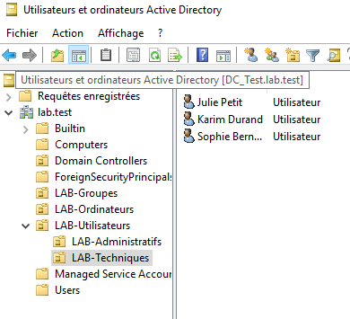

---

## Installation et promotion du contrôleur de domaine

Après l’installation de Windows Server 2019 :

- Renommage du serveur en `DC-TEST`
- Configuration d’une adresse IP fixe
- Installation des rôles **AD DS** et **DNS**
- Promotion du serveur en contrôleur de domaine
- Création de la forêt `lab.test`

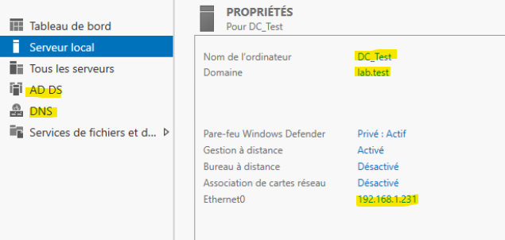

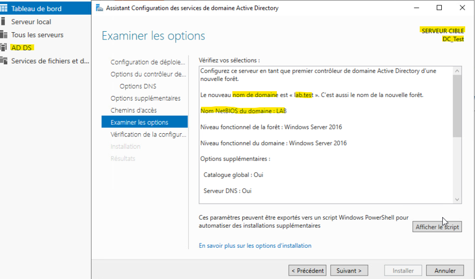

---

## Installation de Windows Server Backup

Le rôle **Windows Server Backup** est installé afin de réaliser la sauvegarde de l’état système.

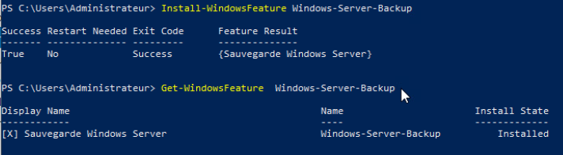

---

## Peuplement de l’annuaire Active Directory

L’annuaire est peuplé avec :

- Des unités d’organisation (OU)
- Des groupes de sécurité
- Des utilisateurs de test
- Une GPO de test

Les objets créés utilisent le préfixe `LAB-` pour les distinguer facilement.

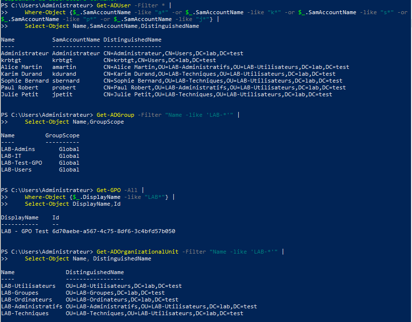

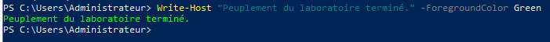

---

## Vérifications avant sauvegarde

Avant de lancer la sauvegarde, les contrôles suivants sont effectués :

- État des services : `NTDS`, `DNS`, `Netlogon`
- Diagnostic Active Directory avec `dcdiag`
- Vérification des partages `SYSVOL` et `NETLOGON`

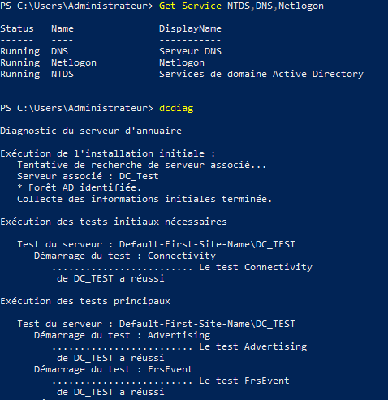

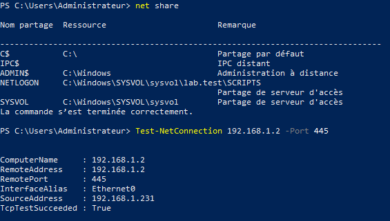

---

## Configuration et test du partage NAS

Le NAS est configuré avec :

- Adresse IP : `192.168.1.2`
- Partage : `\\192.168.1.2\SauvegardeAD`
- Compte : `admin`

Les tests de connectivité et d’accès sont réalisés depuis le contrôleur de domaine.


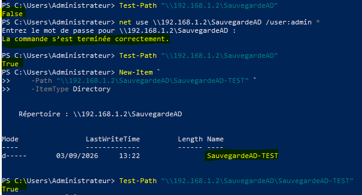

---

## Sauvegarde du System State

La sauvegarde de l’état système est lancée avec `wbadmin` :

```powershell
wbadmin start systemstatebackup -backuptarget:\\192.168.1.2\SauvegardeAD\SauvegardeAD-TEST -quiet
```

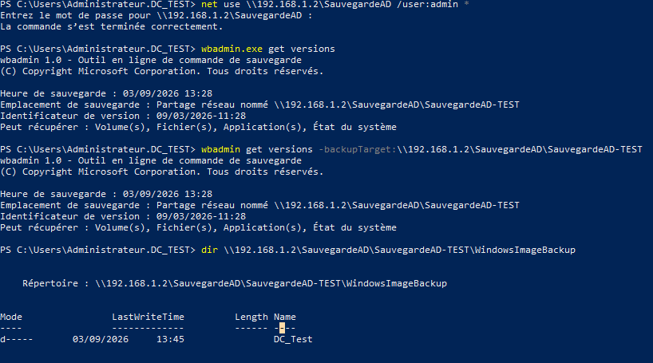

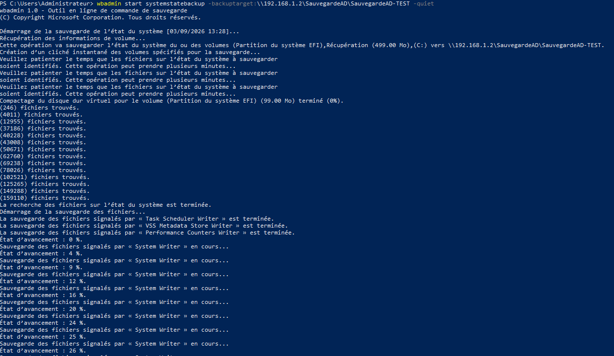

La présence de la sauvegarde est vérifiée :

- En ligne de commande avec `wbadmin get versions`
- Via l’interface du NAS

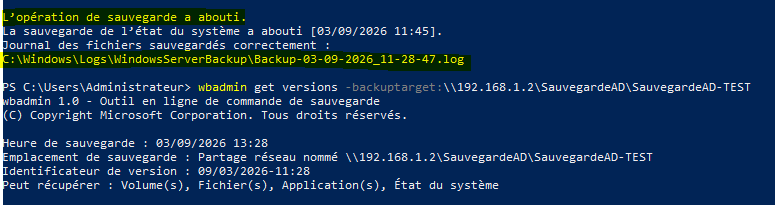

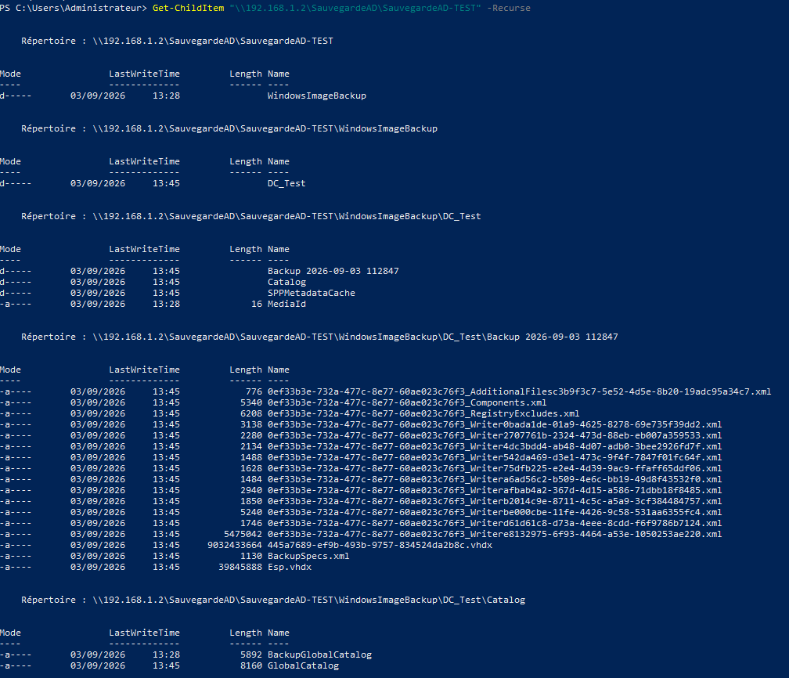

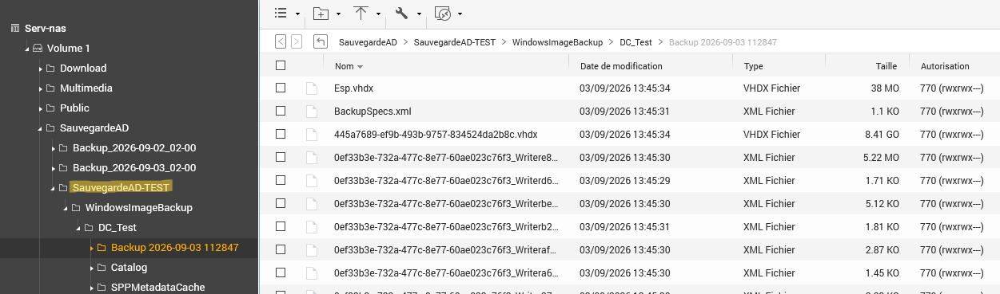

---

## Simulation de l’incident

Après validation de la sauvegarde, une OU contenant des utilisateurs est supprimée volontairement afin de simuler un incident Active Directory.

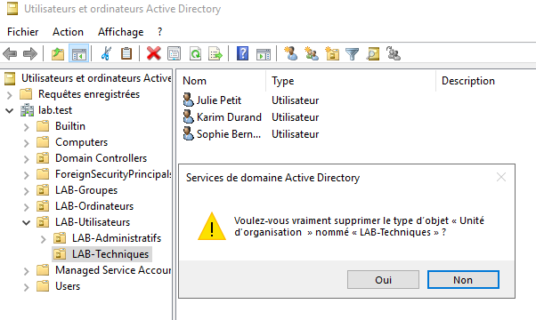

---

## Passage en mode DSRM

Pour restaurer l’état système, le contrôleur de domaine est redémarré en mode **Directory Services Restore Mode (DSRM)** :

```powershell
bcdedit /set safeboot dsrepair
shutdown /r /t 0
```

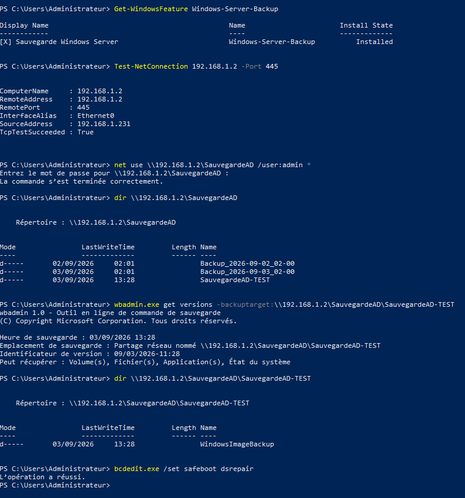

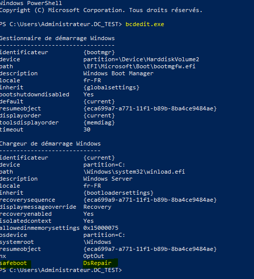

En DSRM :

- Le service `NTDS` est arrêté
- Les commandes Active Directory ne fonctionnent pas
- La connexion se fait avec le compte `.\Administrateur` et le mot de passe DSRM

---

## Restauration du System State

La restauration est lancée avec la version de sauvegarde précédemment identifiée :

```powershell
wbadmin start systemstaterecovery -version:09/03/2026-11:28 -backuptarget:\\192.168.1.2\SauvegardeAD\SauvegardeAD-TEST -quiet
```

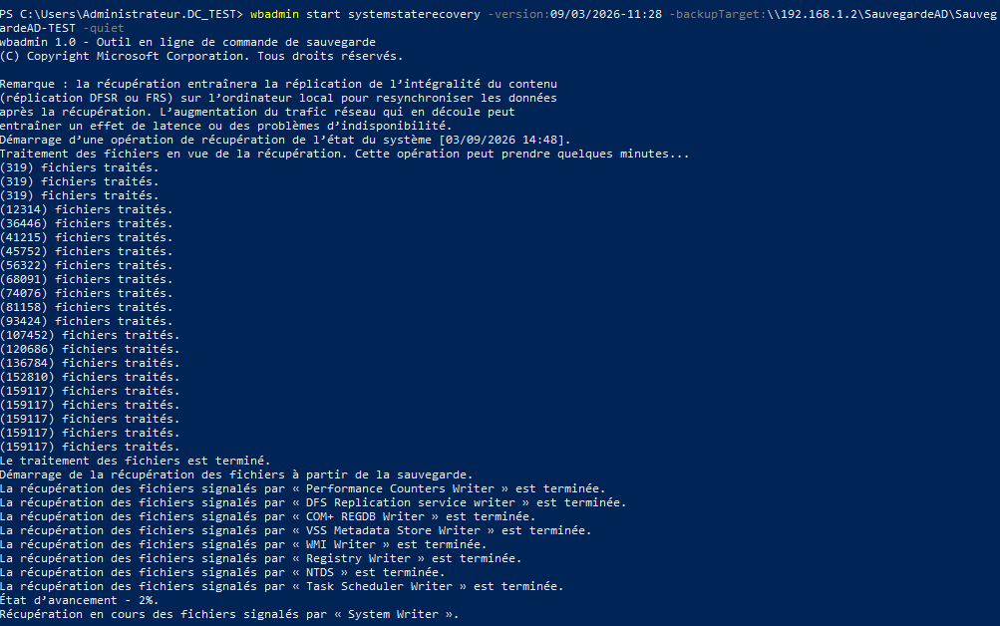

Après la restauration, le serveur est redémarré, puis DSRM est désactivé :

```powershell
bcdedit /deletevalue safeboot
shutdown /r /t 0
```

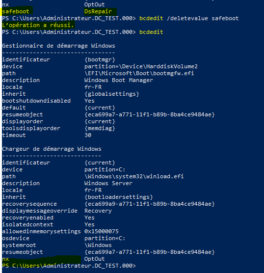

---

## Vérifications après restauration

Après redémarrage en mode normal, les contrôles suivants sont effectués :

- Services `NTDS`, `DNS`, `Netlogon` : état `Running`
- Partages `SYSVOL` et `NETLOGON` : présents
- Domaine `lab.test` : fonctionnel
- OU, groupes, utilisateurs supprimés : de nouveau présents
- GPO `LAB - GPO Test` : présente et liée

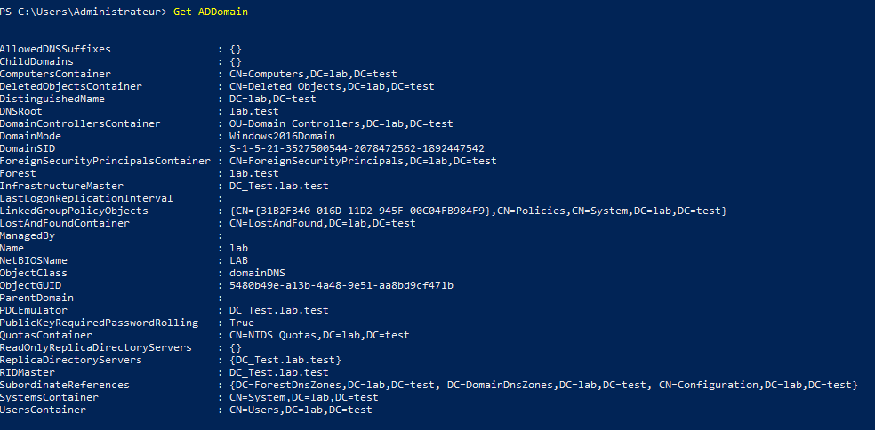

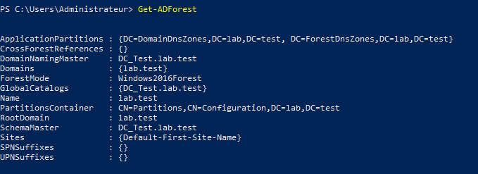

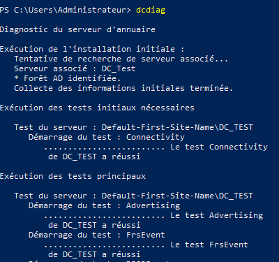

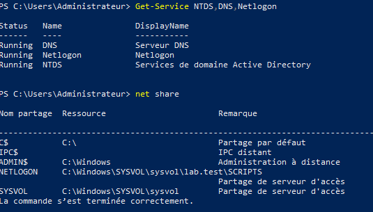

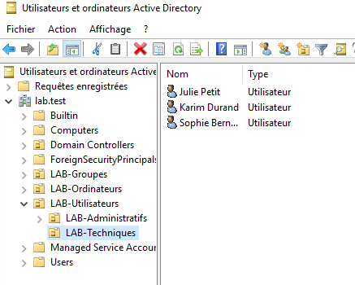

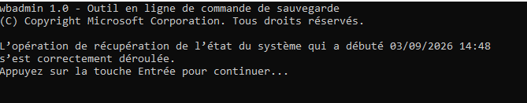

---

## Résultat du laboratoire

**Résultat : SUCCÈS**

Le scénario complet a été validé :

- Création et promotion du contrôleur de domaine
- Installation de Windows Server Backup
- Peuplement de l’annuaire avec OU, groupes, utilisateurs et GPO
- Sauvegarde du System State sur le NAS
- Simulation d’un incident (suppression d’OU)
- Restauration en mode DSRM
- Retour des objets Active Directory supprimés
- Vérifications post‑restauration positives

---

## Avertissements

Ce projet concerne un environnement de laboratoire isolé.

Ne pas appliquer directement une restauration System State sur un contrôleur de domaine de production sans :

- Procédure validée
- Analyse d’impact
- Stratégie de restauration Active Directory adaptée
- Sauvegardes vérifiées et testées

Les identifiants NAS et DSRM ne doivent jamais être enregistrés dans les scripts ou poussés dans le dépôt Git.
