# Zabbix 7 sur une VM Debian (Apache + PHP‑FPM)

## Sommaire

1. [Objectif du TP](#1-objectif-du-tp)  
2. [Prérequis](#2-prérequis)  
3. [Installation des paquets Zabbix](#3-installation-des-paquets-zabbix)  
4. [Base de données MariaDB pour Zabbix](#4-base-de-données-mariadb-pour-zabbix)  
5. [Configuration du serveur Zabbix](#5-configuration-du-serveur-zabbix)  
6. [Configuration Apache + PHP‑FPM pour Zabbix](#6-configuration-apache--php-fpm-pour-zabbix)  
7. [Configuration PHP (paramètres requis)](#7-configuration-php-paramètres-requis)  
8. [Assistant web Zabbix](#8-assistant-web-zabbix)  
9. [Ajustements des triggers (optionnel)](#9-optionnel-ajustements-des-triggers)  
10. [Résultat](#10-résultat)  

---

## 1. Objectif du TP

Ajouter **Zabbix 7** sur une VM Debian où **Apache + PHP‑FPM** et **MariaDB** sont déjà installés  
(par exemple une VM qui héberge déjà GLPI).

Au final, on obtient :

- un **serveur Zabbix** (`zabbix-server`)  
- une **interface web Zabbix** servie par Apache + PHP‑FPM  
- une **base MariaDB** dédiée à Zabbix  

---

## 2. Prérequis

- VM Debian 12/13 à jour  
- Apache + PHP‑FPM déjà fonctionnels (ex : pour GLPI)  
- MariaDB/MySQL installé et démarré  

Vérifications rapides :

```bash
systemctl status apache2
systemctl status php8.4-fpm
systemctl status mariadb
```

---

## 3. Installation des paquets Zabbix

### 3.1. Ajouter le dépôt Zabbix

Exemple Debian 12 (adapter la commande selon la version depuis le site Zabbix) [web:124][web:160] :

```bash
wget https://repo.zabbix.com/zabbix/7.0/debian/pool/main/z/zabbix-release/zabbix-release_7.0-2+debian12_all.deb
dpkg -i zabbix-release_7.0-2+debian12_all.deb
apt update
```

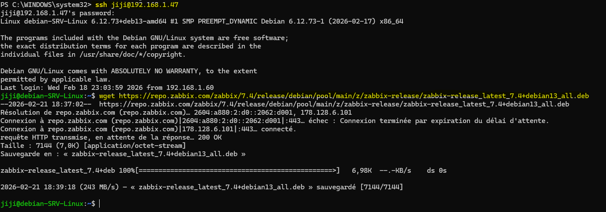
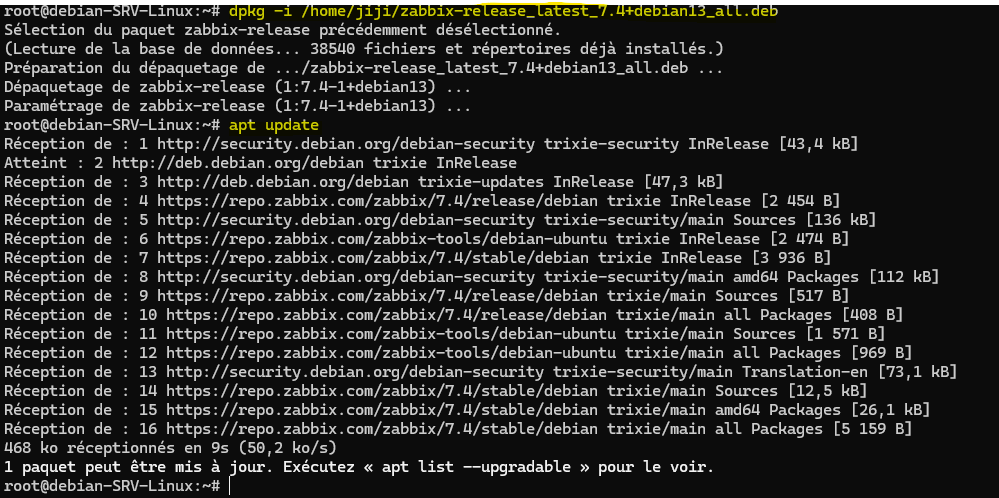

### 3.2. Installer serveur, frontend, agent

```bash
apt install zabbix-server-mysql zabbix-frontend-php zabbix-sql-scripts zabbix-apache-conf zabbix-agent
```

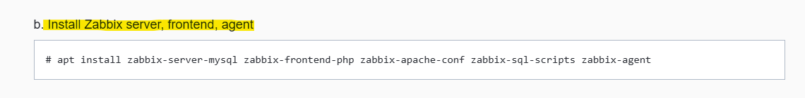
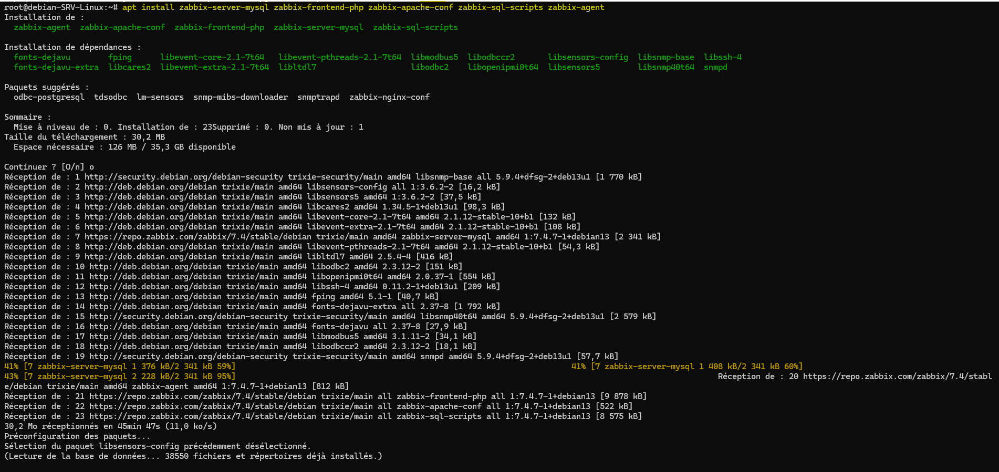

Les paquets `zabbix-frontend-php` et `zabbix-apache-conf` ajoutent la partie frontend et une conf Apache de base.[web:124][web:99]

---

## 4. Base de données MariaDB pour Zabbix

### 4.1. Connexion à MariaDB

```bash
mysql
```

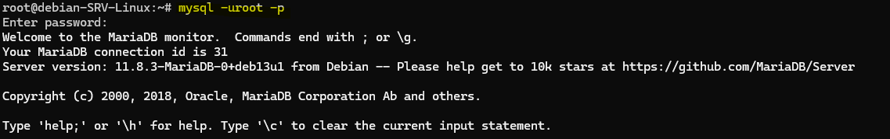

### 4.2. Création de la base et de l’utilisateur

```sql
CREATE DATABASE zabbix CHARACTER SET utf8mb4 COLLATE utf8mb4_bin;
CREATE USER 'zabbix'@'localhost' IDENTIFIED BY 'MotDePasseZabbix!';
GRANT ALL PRIVILEGES ON zabbix.* TO 'zabbix'@'localhost';
FLUSH PRIVILEGES;
EXIT;
```

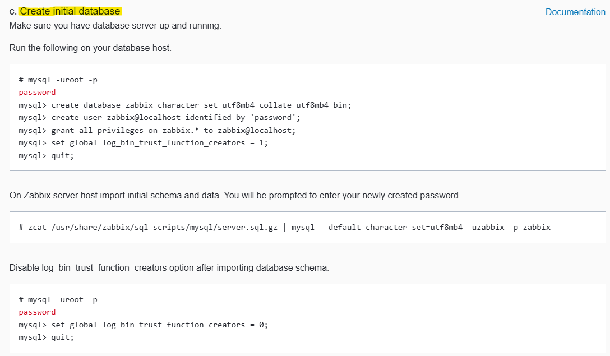
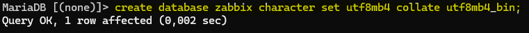
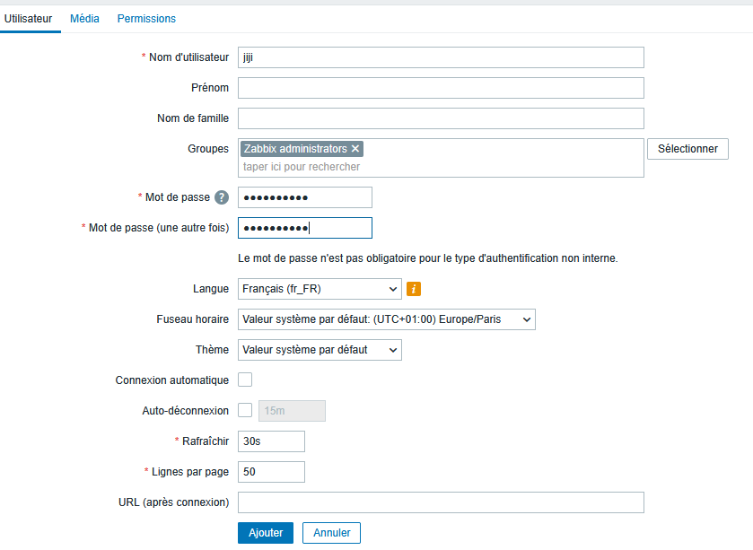
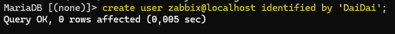
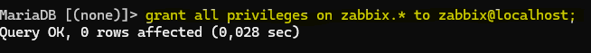
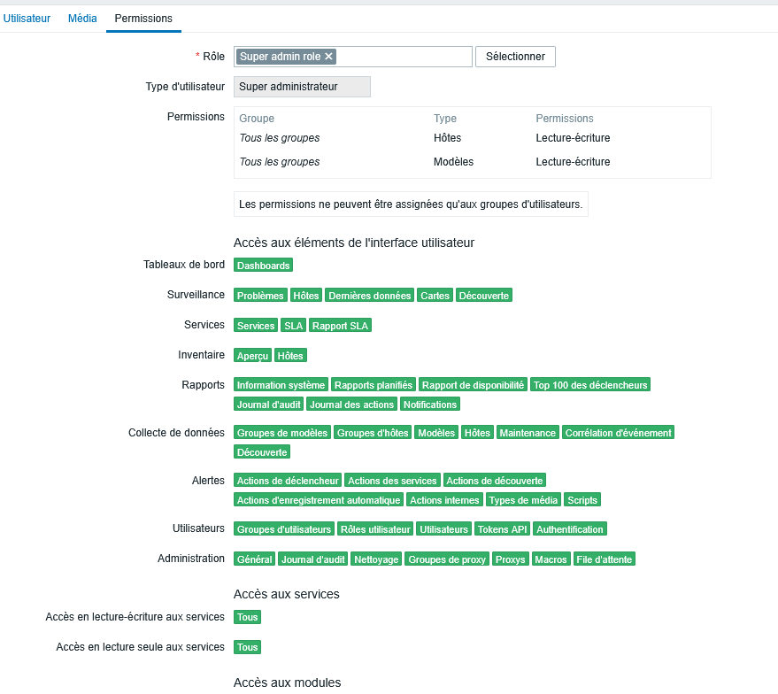

### 4.3. Import du schéma Zabbix

```bash
zcat /usr/share/zabbix-sql-scripts/mysql/server.sql.gz | mysql -uzabbix -p zabbix
```

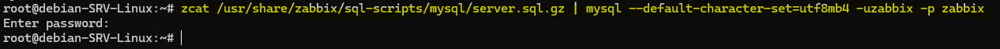

---

## 5. Configuration du serveur Zabbix

### 5.1. Fichier `zabbix_server.conf`

Éditer `/etc/zabbix/zabbix_server.conf` :

```bash
nano /etc/zabbix/zabbix_server.conf
```

Paramètres principaux :

```ini
DBName=zabbix
DBUser=zabbix
DBPassword=MotDePasseZabbix!
```

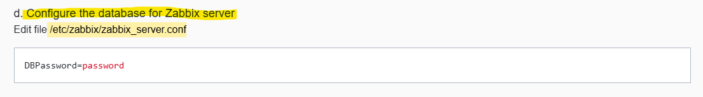
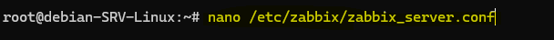
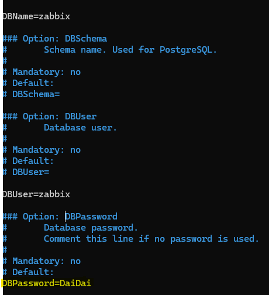
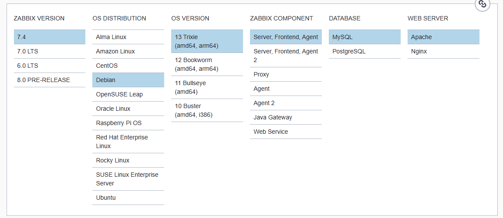

### 5.2. Démarrage du serveur Zabbix

```bash
systemctl enable zabbix-server
systemctl start zabbix-server
systemctl status zabbix-server
```

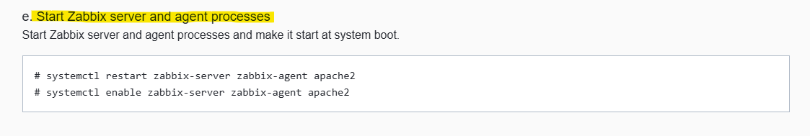
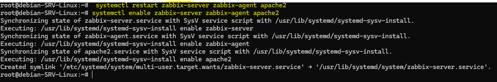

---

## 6. Configuration Apache + PHP‑FPM pour Zabbix

On suppose qu’Apache + PHP‑FPM sont déjà opérationnels (par exemple pour GLPI).

Zabbix a besoin d’un **vhost** Apache qui pointe vers `/usr/share/zabbix/ui` et applique les bons paramètres PHP.[web:90][web:124]

### 6.1. Variante homelab (port 81)

#### 6.1.1. `ports.conf`

```bash
nano /etc/apache2/ports.conf
```

Ajouter :

```apache
Listen 81
```

#### 6.1.2. Vhost Zabbix

Créer `/etc/apache2/sites-available/zabbix.conf` :

```apache
<VirtualHost *:81>
    ServerName zabbix_tp

    DocumentRoot /usr/share/zabbix/ui

    <Directory "/usr/share/zabbix/ui">
        Options FollowSymLinks
        AllowOverride All
        Require all granted

        php_value max_execution_time 300
        php_value memory_limit 256M
        php_value post_max_size 16M
        php_value upload_max_filesize 2M
        php_value max_input_time 300
        php_value max_input_vars 10000
        php_value date.timezone "Europe/Paris"
    </Directory>

    <Directory "/usr/share/zabbix/conf">
        Require all denied
    </Directory>

    <Directory "/usr/share/zabbix/app">
        Require all denied
    </Directory>

    <Directory "/usr/share/zabbix/include">
        Require all denied
    </Directory>

    <Directory "/usr/share/zabbix/local">
        Require all denied
    </Directory>

    <FilesMatch \.php$>
        SetHandler "proxy:unix:/run/php/php8.4-fpm.sock|fcgi://localhost/"
    </FilesMatch>

    ErrorLog ${APACHE_LOG_DIR}/zabbix_error.log
    CustomLog ${APACHE_LOG_DIR}/zabbix_access.log combined
</VirtualHost>
```

Activer le site et recharger Apache :

```bash
a2ensite zabbix.conf
systemctl reload apache2
```

Accès Zabbix :

```text
http://IP_DE_LA_VM:81
```

### 6.2. Variante prod (vhost sur 80 + DNS)

Avec un DNS interne (AD DS / pfSense) qui pointe `zabbix.tp.lab` vers l’IP de la VM [web:135] :

```text
zabbix.tp.lab  A  192.168.1.47
```

Vhost Apache :

```apache
<VirtualHost *:80>
    ServerName zabbix.tp.lab
    DocumentRoot /usr/share/zabbix/ui
    ...
</VirtualHost>
```

---

## 7. Configuration PHP (paramètres requis)

Zabbix vérifie plusieurs paramètres PHP lors de l’installation du frontend [web:90][web:89] :

- `memory_limit` ≥ 128M (256M recommandé)  
- `post_max_size` ≥ 16M  
- `upload_max_filesize` ≥ 2M  
- `max_execution_time` ≥ 300  
- `max_input_time` ≥ 300  
- `max_input_vars` ≥ 10000  
- `date.timezone` définie

Tu peux :

- les définir globalement dans `/etc/php/8.4/fpm/php.ini`,  
- ou les laisser “raisonnables” globalement et les surcharger dans le vhost Zabbix avec `php_value` (comme ci‑dessus).

Après modification du `php.ini` FPM :

```bash
systemctl restart php8.4-fpm
```

---

## 8. Assistant web Zabbix

Accède à l’URL de ton vhost, par exemple :

```text
http://IP_DE_LA_VM:81
```

Tu arrives sur l’assistant web :

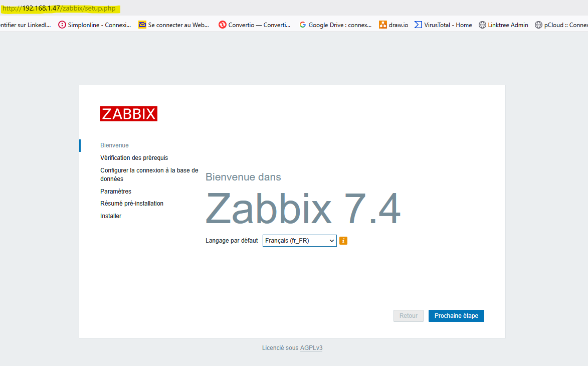
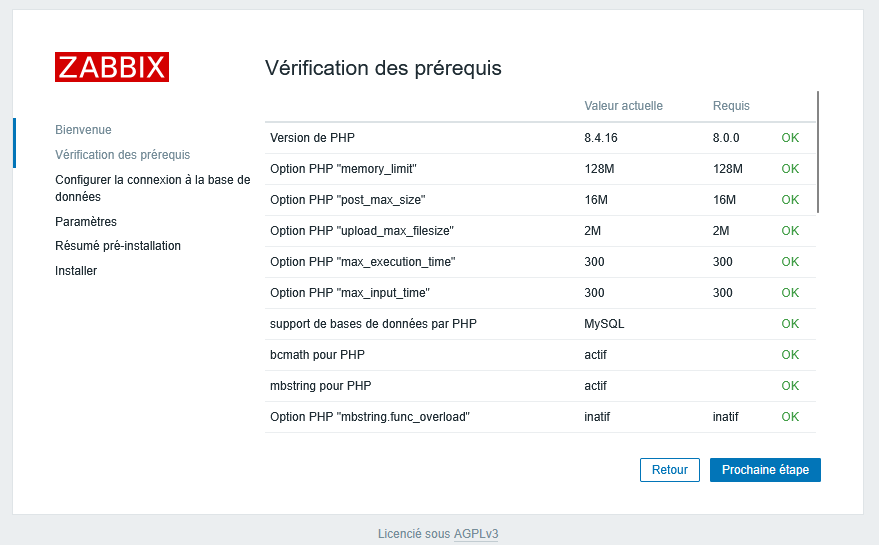
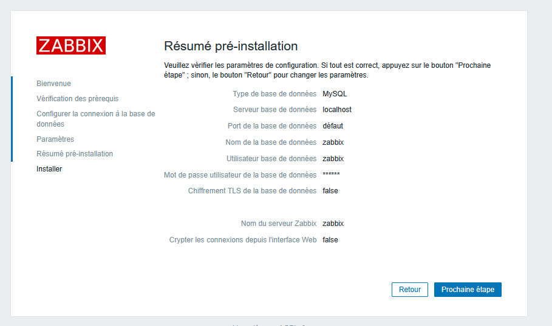
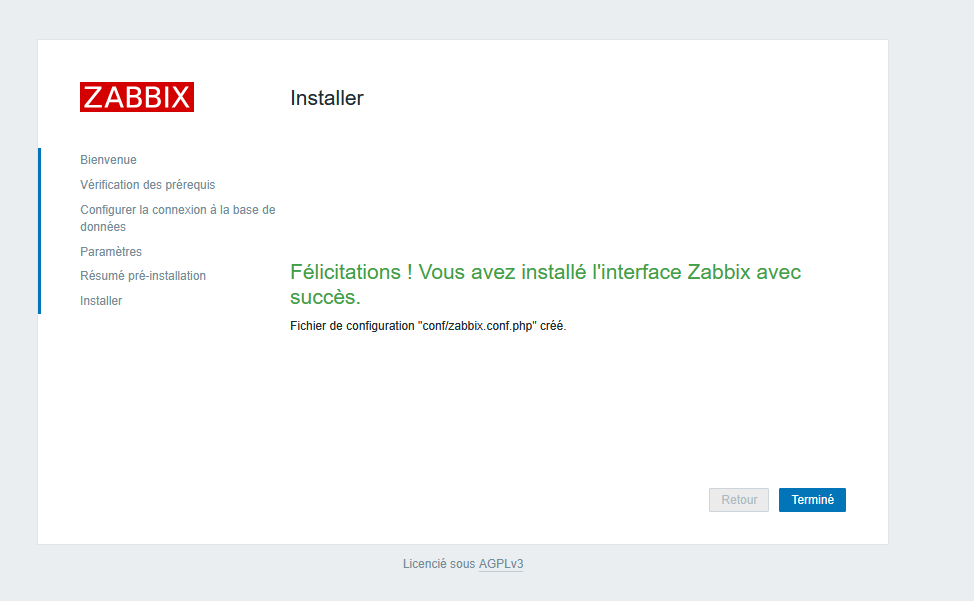
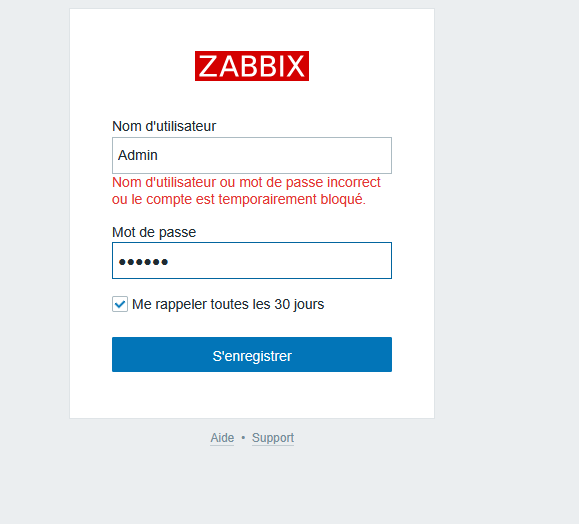

Renseigne :

- **Database host** : `localhost`  
- **Database name** : `zabbix`  
- **User** : `zabbix`  
- **Password** : `MotDePasseZabbix!`

Les prérequis PHP doivent être en vert si les `php_value` / `php.ini` sont correctement configurés.[web:90][web:89]

Connexion finale :

- URL : `http://IP_DE_LA_VM:81`  
- Utilisateur : `Admin`  
- Mot de passe : `zabbix`  

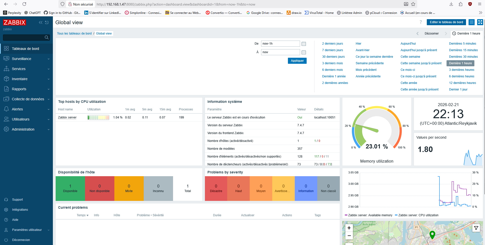

---

## 9. (Optionnel) Ajustements des triggers

Pour éviter certaines alertes dès le démarrage, tu peux désactiver temporairement des triggers ou autoriser la création de triggers personnalisés :

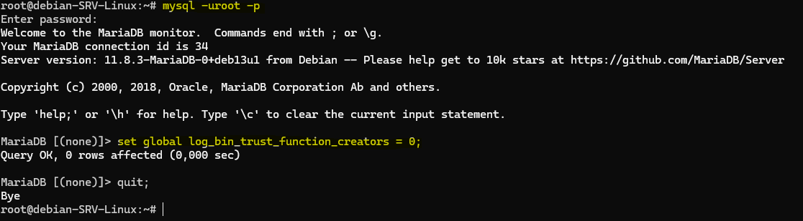
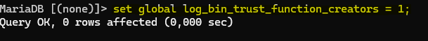

---

## 10. Résultat

À la fin de ce TP, tu as :

- un **serveur Zabbix** opérationnel sur ta VM Debian,  
- une **interface web Zabbix** servie par Apache + PHP‑FPM,  
- une **base MariaDB dédiée à Zabbix**,  
- un vhost Apache propre, compatible avec d’autres applis web (GLPI, etc.).  

Ce TP se concentre sur **Zabbix uniquement**, tout en restant compatible avec une VM déjà utilisée pour d’autres services.
