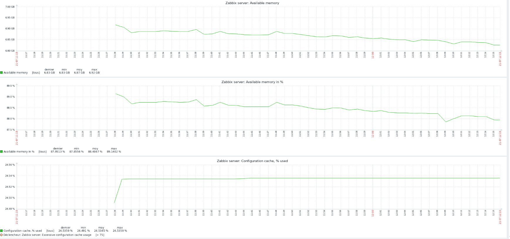
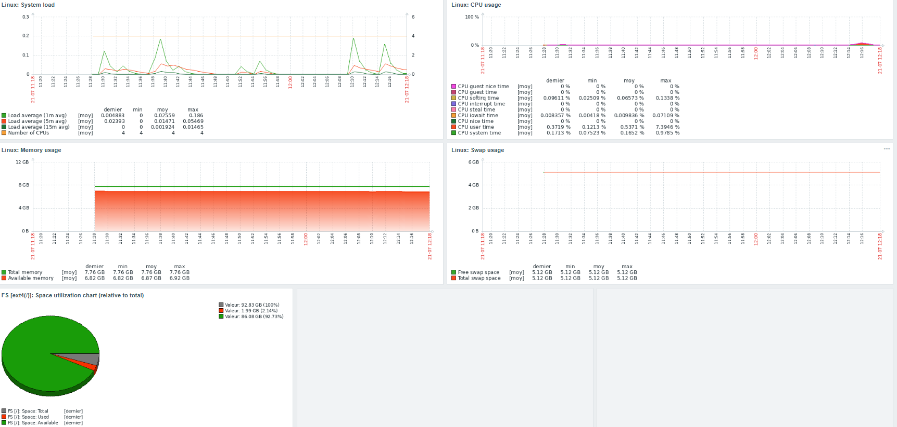

# Zabbix Infrastructure Monitoring & Ansible

## Supervision centralisée et automatisation du déploiement

---

## 1. Présentation du projet

Ce projet présente la mise en place d'une infrastructure de supervision centralisée basée sur **Zabbix**, associée à l'automatisation de l'administration système avec **Ansible**.

L'infrastructure permet de superviser différents composants d'un environnement informatique tout en automatisant le déploiement et la configuration des agents de supervision.

La solution associe notamment :

* Zabbix ;
* Ansible ;
* Active Directory ;
* les GPO ;
* WinRM ;
* Zabbix Agent 2 ;
* l'API Zabbix ;
* SNMPv3.

---

## 2. Objectifs

Les principaux objectifs du projet sont les suivants :

* mettre en place un serveur Zabbix sur Debian 13 ;
* superviser les serveurs Windows avec Zabbix Agent 2 ;
* superviser un serveur Linux utilisé comme contrôleur Ansible ;
* automatiser le déploiement des agents avec Ansible ;
* préparer les serveurs Windows avec Active Directory et les GPO ;
* utiliser WinRM pour l'administration distante ;
* protéger les informations sensibles avec Ansible Vault ;
* créer et mettre à jour automatiquement les hôtes dans Zabbix via son API ;
* superviser un équipement réseau FortiGate avec SNMPv3 ;
* exploiter les métriques, les événements et les alertes générés par Zabbix.

---

## 3. Architecture globale

L'architecture repose sur quatre composants principaux :

* un serveur Zabbix central ;
* un contrôleur Ansible ;
* des serveurs Windows équipés de Zabbix Agent 2 ;
* un FortiGate supervisé avec SNMPv3.

```text
                         ┌────────────────────────────┐
                         │     Active Directory        │
                         │                            │
                         │  GPO                       │
                         │  ├─ Configuration WinRM    │
                         │  └─ Droits du compte        │
                         │     d'administration        │
                         └─────────────┬──────────────┘
                                       │
                                       │ TCP 5985
                                       │ WinRM / NTLM
                                       ▼
┌────────────────────────────┐   ┌────────────────────────────┐
│     Contrôleur Ansible      │   │      Serveurs Windows       │
│                            │   │                            │
│ Debian 13                  │──▶│ Zabbix Agent 2              │
│                            │   │                            │
│ Ansible                    │   │ Contrôleurs de domaine      │
│ Ansible Vault              │   │ Serveurs applicatifs        │
│ API Zabbix                 │   │ Serveurs de données          │
└──────────────┬─────────────┘   └─────────────┬──────────────┘
               │                               │
               │                               │ TCP 10050
               │                               │
               └───────────────┬───────────────┘
                               ▼
                   ┌────────────────────────────┐
                   │       Serveur Zabbix        │
                   │                            │
                   │ Debian 13                  │
                   │ Zabbix Server              │
                   │ MariaDB                    │
                   │ Apache2                    │
                   │ PHP-FPM                    │
                   │                            │
                   │ Supervision centralisée    │
                   └─────────────┬──────────────┘
                                 │
                                 │ SNMPv3
                                 │ UDP 161
                                 ▼
                       ┌──────────────────────┐
                       │       FortiGate        │
                       │                      │
                       │       SNMPv3         │
                       │       authPriv        │
                       │       SHA + AES       │
                       └──────────────────────┘
```

### Flux principaux

| Flux                                  | Protocole        | Utilisation                            |
| ------------------------------------- | ---------------- | -------------------------------------- |
| Contrôleur Ansible → Serveurs Windows | WinRM / TCP 5985 | Administration distante et déploiement |
| Serveur Zabbix → Agents               | TCP 10050        | Collecte des métriques                 |
| Serveur Zabbix → FortiGate            | SNMPv3 / UDP 161 | Supervision de l'équipement réseau     |
| Ansible → Serveur Zabbix              | API HTTP         | Création et mise à jour des hôtes      |

---

## 4. Rôles des composants

### Serveur Zabbix

Le serveur Zabbix constitue le point central de l'infrastructure de supervision.

Il assure notamment :

* la collecte des données ;
* l'analyse des métriques ;
* la gestion des templates ;
* la génération des problèmes et alertes ;
* la conservation des historiques ;
* la visualisation des données ;
* la supervision des agents Zabbix ;
* la supervision SNMP des équipements réseau.

---

### Contrôleur Ansible

Le contrôleur Ansible est utilisé pour automatiser l'administration des serveurs Windows.

Il permet notamment :

* d'exécuter les playbooks ;
* de gérer l'inventaire des serveurs ;
* de protéger les informations sensibles avec Ansible Vault ;
* de déployer Zabbix Agent 2 ;
* de configurer les services Windows ;
* de configurer le pare-feu ;
* d'interagir avec l'API Zabbix.

Le contrôleur Ansible est lui-même supervisé par le serveur Zabbix.

---

### Serveurs Windows

Les serveurs Windows sont supervisés à l'aide de **Zabbix Agent 2**.

La supervision permet notamment de suivre :

* l'utilisation du processeur ;
* la mémoire ;
* l'espace disque ;
* les interfaces réseau ;
* les processus ;
* les services Windows ;
* les performances système ;
* la disponibilité des serveurs.

---

### FortiGate

Le FortiGate est supervisé via **SNMPv3**.

La configuration utilise :

```text
Niveau de sécurité : authPriv
Authentification   : SHA
Chiffrement        : AES
```

Cette méthode permet de superviser les informations système et les métriques exposées par l'équipement via SNMP.

---

# Sommaire

* [1. Préparation de la machine virtuelle](#1-préparation-de-la-machine-virtuelle)
* [2. Installation et configuration de Debian](#2-installation-et-configuration-de-debian)
* [3. Installation du serveur Zabbix](#3-installation-du-serveur-zabbix)
* [4. Configuration de MariaDB](#4-configuration-de-mariadb)
* [5. Configuration d'Apache et PHP-FPM](#5-configuration-dapache-et-php-fpm)
* [6. Première connexion à l'interface Zabbix](#6-première-connexion-à-linterface-zabbix)
* [7. Préparation des serveurs Windows avec Active Directory et GPO](#7-préparation-des-serveurs-windows-avec-active-directory-et-gpo)
* [8. Configuration de WinRM](#8-configuration-de-winrm)
* [9. Déploiement de Zabbix Agent 2 avec Ansible](#9-déploiement-de-zabbix-agent-2-avec-ansible)
* [10. Protection des secrets avec Ansible Vault](#10-protection-des-secrets-avec-ansible-vault)
* [11. Création automatique des hôtes via l'API Zabbix](#11-création-automatique-des-hôtes-via-lapi-zabbix)
* [12. Déploiement sur plusieurs serveurs Windows](#12-déploiement-sur-plusieurs-serveurs-windows)
* [13. Cas particulier : Windows Server 2012 et PowerShell 3.0](#13-cas-particulier-windows-server-2012-et-powershell-30)
* [14. Déploiement sur les contrôleurs de domaine](#14-déploiement-sur-les-contrôleurs-de-domaine)
* [15. Supervision du contrôleur Ansible](#15-supervision-du-contrôleur-ansible)
* [16. Supervision du FortiGate avec SNMPv3](#16-supervision-du-fortigate-avec-snmpv3)
* [17. Exploitation de la supervision](#17-exploitation-de-la-supervision)
* [18. Bilan du projet](#18-bilan-du-projet)

---

# 1. Préparation de la machine virtuelle

La première étape du projet consiste à créer et préparer la machine virtuelle destinée à héberger le serveur Zabbix.

La machine virtuelle est déployée sous VMware et utilise Debian 13.

## 1.1 Configuration de la machine virtuelle

La machine virtuelle est créée avec une configuration adaptée à l'hébergement du serveur Zabbix.


La machine virtuelle constitue le socle de l'infrastructure de supervision.

---

## 1.2 Installation de Debian

Après la création de la machine virtuelle, Debian 13 est installé.

Une fois l'installation terminée, le système est mis à jour :

```bash
sudo apt update
sudo apt upgrade -y
```

---

## 1.3 Configuration du réseau

La machine utilise une adresse IP fixe afin de garantir la stabilité des communications avec les agents Zabbix et les équipements supervisés.

La configuration réseau est réalisée dans :

```text
/etc/network/interfaces
```

La configuration initiale utilise une adresse attribuée automatiquement par DHCP.


La configuration est ensuite modifiée afin d'utiliser une adresse IP statique.


La configuration finale utilisée est :

```text
Adresse IP : 192.168.1.230
Préfixe    : /24
Passerelle : 192.168.1.254
Interface  : ens192
```

La configuration réseau est séparée de la configuration DNS.

Le fichier :

```text
/etc/network/interfaces
```

est utilisé pour :

* l'adresse IP ;
* le préfixe réseau ;
* la passerelle ;
* la configuration de l'interface réseau.

Le fichier :

```text
/etc/resolv.conf
```

est utilisé pour la configuration du DNS.


La configuration DNS permet notamment la résolution des noms nécessaires au fonctionnement de l'infrastructure.

---

## 1.4 Configuration du nom d'hôte

Le serveur est identifié dans l'infrastructure sous le nom :

```text
ZABBIX-SRV
```

Le nom d'hôte permet d'identifier clairement le serveur dans l'environnement réseau et dans les différents outils d'administration.

---

## 1.5 Installation de sudo

Le compte utilisateur utilisé pour l'administration du serveur est ajouté au groupe `sudo`.

Cette configuration permet d'exécuter des commandes nécessitant des privilèges administrateur sans utiliser directement le compte `root`.


---

## 1.6 Validation de la configuration

Une fois la configuration terminée, les éléments suivants sont vérifiés :

* l'adresse IP statique ;
* la passerelle ;
* la résolution DNS ;
* l'accès réseau ;
* le nom d'hôte ;
* les droits d'administration.

Le serveur est désormais prêt à recevoir les composants nécessaires à l'installation de Zabbix.

# 2. Installation du serveur Zabbix

Après la préparation de la machine Debian, les composants nécessaires au fonctionnement du serveur Zabbix sont installés.

L'architecture logicielle repose sur :

* le dépôt officiel Zabbix ;
* Zabbix Server ;
* Zabbix Frontend ;
* MariaDB ;
* Apache2 ;
* PHP-FPM.

---

## 2.1 Installation du dépôt officiel Zabbix

Le dépôt officiel Zabbix est installé afin de récupérer les paquets nécessaires à la version utilisée.

Le paquet du dépôt est téléchargé puis installé :

```bash
wget https://repo.zabbix.com/zabbix/7.4/release/debian/pool/main/z/zabbix-release/zabbix-release_latest+debian13_all.deb

sudo dpkg -i zabbix-release_latest+debian13_all.deb
```

Les dépôts sont ensuite actualisés :

```bash
sudo apt update
```


Le dépôt Zabbix est désormais disponible sur le système.

---

## 2.2 Installation de MariaDB

MariaDB est utilisé comme système de gestion de base de données pour stocker les données de supervision Zabbix.

Le serveur et le client MariaDB sont installés avec :

```bash
sudo apt install mariadb-server mariadb-client -y
```


Le service est ensuite vérifié :

```bash
sudo systemctl status mariadb
```

Le service doit être actif :

```text
active (running)
```


---

## 2.3 Installation du serveur Zabbix et de ses composants

Les composants principaux de Zabbix sont installés avec :

```bash
sudo apt install \
zabbix-server-mysql \
zabbix-frontend-php \
zabbix-apache-conf \
zabbix-sql-scripts \
zabbix-agent2 \
-y
```

Ces paquets fournissent notamment :

| Composant             | Rôle                       |
| --------------------- | -------------------------- |
| `zabbix-server-mysql` | Serveur de supervision     |
| `zabbix-frontend-php` | Interface Web              |
| `zabbix-apache-conf`  | Configuration Apache       |
| `zabbix-sql-scripts`  | Schéma de base de données  |
| `zabbix-agent2`       | Agent local de supervision |


---

## 2.4 Importation du schéma SQL Zabbix

Le paquet `zabbix-sql-scripts` fournit le schéma SQL nécessaire à la création de la structure de la base de données Zabbix.

Les fichiers installés par le paquet peuvent être vérifiés avec :

```bash
dpkg -L zabbix-sql-scripts
```

Le schéma MySQL/MariaDB utilisé par Zabbix se trouve notamment dans :

```text
/usr/share/zabbix-sql-scripts/mysql/server.sql.gz
```

Le schéma est compressé au format `gzip`.

Il est décompressé avec `zcat`, puis directement envoyé au client MariaDB afin d'être importé dans la base de données Zabbix :

```bash
zcat /usr/share/zabbix-sql-scripts/mysql/server.sql.gz | \
mariadb -uzabbix -p zabbix
```

Le mot de passe de l'utilisateur MariaDB `zabbix` est ensuite demandé.


Une connexion directe à la base de données est ensuite effectuée afin de vérifier que l'utilisateur MariaDB `zabbix` peut y accéder correctement :

```bash
mariadb -uzabbix -p zabbix
```

Cette vérification confirme que :

* la base de données `zabbix` est accessible ;
* l'utilisateur MariaDB `zabbix` peut s'y connecter ;
* le schéma SQL Zabbix a bien été importé.


---

## 2.5 Configuration du serveur Zabbix

Le fichier de configuration principal du serveur Zabbix est :

```text
/etc/zabbix/zabbix_server.conf
```

Ce fichier contient notamment les paramètres nécessaires à la connexion du serveur Zabbix à la base de données MariaDB.

Le paramètre principal configuré est :

```text
DBPassword=<mot_de_passe_de_l_utilisateur_zabbix>
```

Le mot de passe utilisé correspond à celui défini précédemment pour l'utilisateur MariaDB :

```text
zabbix
```

Le fichier peut être édité avec :

```bash
sudo nano /etc/zabbix/zabbix_server.conf
```


Cette configuration permet au processus `zabbix-server` de se connecter à la base de données `zabbix`.


---

## 2.6 Démarrage des services

Les services nécessaires au fonctionnement de la plateforme sont activés et démarrés :

```bash
sudo systemctl enable zabbix-server
sudo systemctl enable zabbix-agent2
sudo systemctl enable apache2
sudo systemctl enable mariadb
```

Les services peuvent ensuite être vérifiés :

```bash
systemctl status zabbix-server
systemctl status zabbix-agent2
systemctl status apache2
systemctl status mariadb
```


---

## 2.7 Vérification des ports

Les ports utilisés par les différents composants sont vérifiés avec :

```bash
sudo ss -tulpn
```

Les principaux ports attendus sont :

| Port      | Service                       |
| --------- | ----------------------------- |
| TCP 80    | Apache / interface Web Zabbix |
| TCP 10050 | Zabbix Agent 2                |
| TCP 10051 | Zabbix Server                 |
| TCP 3306  | MariaDB                       |

La présence du service Web Apache peut également être vérifiée :

```bash
sudo ss -tulpn | grep :80
```


La plateforme Zabbix est désormais installée et les services principaux sont opérationnels.

# 3. Configuration et première connexion à l'interface Zabbix

Une fois les composants du serveur installés et configurés, l'interface Web Zabbix est accessible depuis un navigateur.

L'installation finale est réalisée depuis l'interface Web.

---

## 3.1 Accès à l'interface Web

L'interface Zabbix est accessible à l'adresse :

```text
http://192.168.1.230/zabbix
```

La page d'installation de Zabbix est alors affichée.

---

## 3.2 Vérification des prérequis

L'installateur Web vérifie automatiquement les composants nécessaires au fonctionnement de Zabbix.

Les éléments contrôlés comprennent notamment :

* la version de PHP ;
* les extensions PHP nécessaires ;
* la configuration de PHP-FPM ;
* la configuration du fuseau horaire ;
* les composants nécessaires à l'accès à la base de données.

Les prérequis doivent être validés avant de poursuivre l'installation.


---

## 3.3 Configuration de la connexion à la base de données

L'interface Web demande ensuite les informations nécessaires pour se connecter à la base de données MariaDB.

Les paramètres utilisés sont :

```text
Type de base de données : MySQL
Serveur de base         : localhost
Port                    : 3306
Nom de la base           : zabbix
Utilisateur              : zabbix
Mot de passe             : mot de passe défini précédemment
```

Ces informations permettent à l'interface Web et au serveur Zabbix d'utiliser la base de données créée lors de l'installation.

---

## 3.4 Finalisation de l'installation

Après validation des paramètres, l'installateur termine la configuration de l'interface Zabbix.

La fin de l'installation est confirmée par l'affichage de la page de succès.


---

## 3.5 Première connexion

Une première connexion à l'interface Web est réalisée avec le compte administrateur initial :

```text
Utilisateur : Admin
Mot de passe : zabbix
```


Le mot de passe par défaut est ensuite modifié afin de sécuriser l'accès à l'interface d'administration.


La plateforme Zabbix est désormais installée et accessible.

Le serveur est prêt à être configuré pour superviser les différents équipements et serveurs de l'infrastructure.


# 4. Validation opérationnelle du serveur Zabbix

Après l'installation et la configuration initiale, le fonctionnement général du serveur Zabbix est vérifié.

L'objectif est de confirmer que la plateforme est opérationnelle avant d'intégrer les premiers équipements et serveurs à superviser.

---

## 4.1 Vérification de la disponibilité du serveur Zabbix

Après l'installation et la configuration des composants, la disponibilité du serveur Zabbix est vérifiée depuis l'interface Web.

Dans le menu :

**Surveillance → Hôtes**

le serveur Zabbix apparaît avec son interface Zabbix disponible.


L'indicateur **ZBX** apparaît en vert.

Cette vérification confirme que :

- l'agent Zabbix fonctionne sur le serveur ;
- le serveur Zabbix peut communiquer avec son agent ;
- la supervision du serveur Zabbix est opérationnelle.
---

## 4.2 Vérification des informations système

Les informations système du serveur Zabbix peuvent être consultées depuis l'interface d'administration.

Cette vue permet de vérifier les caractéristiques de l'environnement utilisé pour la supervision.


---

## 4.3 Vérification des services Web et base de données

Les services nécessaires au fonctionnement de l'interface Web et de la base de données sont vérifiés depuis le terminal.

Les services contrôlés sont :

- Apache2 ;
- MariaDB ;
- PHP-FPM.

La vérification est réalisée avec les commandes `systemctl status` correspondantes.


Les trois services sont actifs et fonctionnels.

---

## 4.4 Première utilisation du tableau de bord

Après la validation de l'installation, le tableau de bord Zabbix est accessible.

Le dashboard permet de visualiser les informations principales de la plateforme de supervision.


Un tableau de bord personnalisé a également été créé afin de regrouper les informations utiles à la supervision de l'infrastructure.


Le serveur Zabbix est désormais opérationnel et prêt à intégrer les premiers équipements et serveurs supervisés.


# 5. Première intégration manuelle d'un serveur Linux

Avant d'automatiser le déploiement de Zabbix Agent 2 sur les serveurs Windows avec Ansible, un premier serveur Linux est intégré manuellement à Zabbix.

Le serveur utilisé est le serveur GLPI.

Cette étape permet de valider progressivement le fonctionnement de la supervision d'un serveur Linux avant de passer à l'automatisation.

La démarche suivie est la suivante :

```text
Installation de Zabbix Agent 2
              ↓
Configuration de l'agent
              ↓
Démarrage du service
              ↓
Vérification du port TCP 10050
              ↓
Ajout de l'hôte dans Zabbix
              ↓
Association du template Linux
              ↓
Validation de la disponibilité
              ↓
Remontée des métriques
              ↓
Visualisation des données
```

---

## 5.1 Installation de Zabbix Agent 2

Zabbix Agent 2 est installé manuellement sur le serveur GLPI.

Cette première installation permet de valider le fonctionnement de l'agent Linux avant de rechercher une éventuelle automatisation de cette étape.

---

## 5.2 Configuration de l'agent

Le fichier de configuration utilisé est :

```text
/etc/zabbix/zabbix_agent2.conf
```

La configuration de l'agent permet notamment d'indiquer :

* l'adresse du serveur Zabbix ;
* le serveur autorisé à interroger l'agent ;
* le serveur utilisé pour la supervision active ;
* le nom de l'hôte.

La configuration est réalisée manuellement sur le serveur GLPI.


---

## 5.3 Démarrage et activation du service

Une fois la configuration terminée, le service Zabbix Agent 2 est démarré.

Le service est également activé afin de démarrer automatiquement avec le système.

Cette étape permet de garantir que l'agent reste disponible après un redémarrage du serveur.

---

## 5.4 Vérification de la communication réseau

Zabbix Agent 2 utilise le port TCP :

```text
10050
```

Ce port doit être accessible depuis le serveur Zabbix afin de permettre la collecte des données.

La disponibilité du port est vérifiée depuis le serveur Zabbix.


Cette vérification confirme que le serveur Zabbix peut atteindre l'agent installé sur le serveur GLPI.

---

## 5.5 Ajout manuel de l'hôte dans Zabbix

Le serveur GLPI est ensuite ajouté manuellement dans l'interface Zabbix.

Une interface de type :

```text
Zabbix Agent
```

est configurée avec l'adresse IP du serveur GLPI et le port :

```text
10050
```

Un template Linux est ensuite associé à l'hôte afin de permettre la collecte des métriques système.

Cette étape est volontairement réalisée manuellement afin de valider le fonctionnement de la supervision avant la mise en place de l'automatisation avec Ansible.

---

## 5.6 Vérification de la disponibilité de l'agent

Après la création de l'hôte, la disponibilité de l'agent est vérifiée depuis l'interface Zabbix.

L'agent du serveur GLPI apparaît comme disponible dans la supervision.


Cette validation confirme que :

* l'hôte est correctement configuré ;
* l'interface Agent est accessible ;
* le serveur Zabbix communique avec l'agent Linux.

---

## 5.7 Validation de la communication depuis le serveur Zabbix

La communication entre le serveur Zabbix et l'agent installé sur le serveur GLPI est ensuite vérifiée.


Cette étape confirme que la supervision de l'hôte Linux est opérationnelle.

---

## 5.8 Remontée des premières métriques

Une fois la communication validée, Zabbix commence à collecter les informations du serveur GLPI.

Les données collectées concernent notamment :

* l'utilisation du processeur ;
* la mémoire ;
* l'espace disque ;
* l'activité réseau ;
* les performances générales du serveur.


---

## 5.9 Visualisation graphique des données

Les données collectées peuvent être consultées sous forme de graphiques.

Cette représentation permet de suivre l'évolution des performances du serveur dans le temps.



---

## 5.10 Visualisation des performances dans un tableau de bord

Les informations de supervision peuvent également être regroupées dans un tableau de bord.

Cette présentation permet d'obtenir une vision synthétique de l'état et des performances du serveur GLPI.



---

## 5.11 Bilan de la première intégration

L'intégration manuelle du serveur GLPI a permis de valider l'ensemble de la chaîne de supervision Linux :

```text
Serveur GLPI
     ↓
Zabbix Agent 2
     ↓
Port TCP 10050
     ↓
Serveur Zabbix
     ↓
Template Linux
     ↓
Collecte des métriques
     ↓
Graphiques et tableaux de bord
```

Cette validation constitue une étape importante du projet.

Le fonctionnement de Zabbix ayant été confirmé manuellement sur un serveur Linux, le projet peut ensuite évoluer vers l'automatisation du déploiement de Zabbix Agent 2 sur les serveurs Windows avec Ansible.
