# Zabbix Infrastructure Monitoring & Ansible

## Supervision centralisée et automatisation du déploiement

---

## 1. Présentation du projet

Ce projet présente la mise en place d'une infrastructure de supervision centralisée basée sur **Zabbix**, associée à l'automatisation de l'administration système avec **Ansible**.

L'infrastructure permet de superviser différents composants d'un environnement informatique tout en automatisant le déploiement et la configuration des agents de supervision.

La solution associe notamment :

* Zabbix ;
* Ansible ;
* Active Directory ;
* les GPO ;
* WinRM ;
* Zabbix Agent 2 ;
* l'API Zabbix ;
* SNMPv3.

---

## 2. Objectifs

Les principaux objectifs du projet sont les suivants :

* mettre en place un serveur Zabbix sur Debian 13 ;
* superviser les serveurs Windows avec Zabbix Agent 2 ;
* superviser un serveur Linux utilisé comme contrôleur Ansible ;
* automatiser le déploiement des agents avec Ansible ;
* préparer les serveurs Windows avec Active Directory et les GPO ;
* utiliser WinRM pour l'administration distante ;
* protéger les informations sensibles avec Ansible Vault ;
* créer et mettre à jour automatiquement les hôtes dans Zabbix via son API ;
* superviser un équipement réseau FortiGate avec SNMPv3 ;
* exploiter les métriques, les événements et les alertes générés par Zabbix.

---

## 3. Architecture globale

L'architecture repose sur quatre composants principaux :

* un serveur Zabbix central ;
* un contrôleur Ansible ;
* des serveurs Windows équipés de Zabbix Agent 2 ;
* un FortiGate supervisé avec SNMPv3.

```text
                         ┌────────────────────────────┐
                         │     Active Directory        │
                         │                            │
                         │  GPO                       │
                         │  ├─ Configuration WinRM    │
                         │  └─ Droits du compte        │
                         │     d'administration        │
                         └─────────────┬──────────────┘
                                       │
                                       │ TCP 5985
                                       │ WinRM / NTLM
                                       ▼
┌────────────────────────────┐   ┌────────────────────────────┐
│     Contrôleur Ansible      │   │      Serveurs Windows       │
│                            │   │                            │
│ Debian 13                  │──▶│ Zabbix Agent 2              │
│                            │   │                            │
│ Ansible                    │   │ Contrôleurs de domaine      │
│ Ansible Vault              │   │ Serveurs applicatifs        │
│ API Zabbix                 │   │ Serveurs de données          │
└──────────────┬─────────────┘   └─────────────┬──────────────┘
               │                               │
               │                               │ TCP 10050
               │                               │
               └───────────────┬───────────────┘
                               ▼
                   ┌────────────────────────────┐
                   │       Serveur Zabbix        │
                   │                            │
                   │ Debian 13                  │
                   │ Zabbix Server              │
                   │ MariaDB                    │
                   │ Apache2                    │
                   │ PHP-FPM                    │
                   │                            │
                   │ Supervision centralisée    │
                   └─────────────┬──────────────┘
                                 │
                                 │ SNMPv3
                                 │ UDP 161
                                 ▼
                       ┌──────────────────────┐
                       │       FortiGate        │
                       │                      │
                       │       SNMPv3         │
                       │       authPriv        │
                       │       SHA + AES       │
                       └──────────────────────┘
```

### Flux principaux

| Flux                                  | Protocole        | Utilisation                            |
| ------------------------------------- | ---------------- | -------------------------------------- |
| Contrôleur Ansible → Serveurs Windows | WinRM / TCP 5985 | Administration distante et déploiement |
| Serveur Zabbix → Agents               | TCP 10050        | Collecte des métriques                 |
| Serveur Zabbix → FortiGate            | SNMPv3 / UDP 161 | Supervision de l'équipement réseau     |
| Ansible → Serveur Zabbix              | API HTTP         | Création et mise à jour des hôtes      |

---

## 4. Rôles des composants

### Serveur Zabbix

Le serveur Zabbix constitue le point central de l'infrastructure de supervision.

Il assure notamment :

* la collecte des données ;
* l'analyse des métriques ;
* la gestion des templates ;
* la génération des problèmes et alertes ;
* la conservation des historiques ;
* la visualisation des données ;
* la supervision des agents Zabbix ;
* la supervision SNMP des équipements réseau.

---

### Contrôleur Ansible

Le contrôleur Ansible est utilisé pour automatiser l'administration des serveurs Windows.

Il permet notamment :

* d'exécuter les playbooks ;
* de gérer l'inventaire des serveurs ;
* de protéger les informations sensibles avec Ansible Vault ;
* de déployer Zabbix Agent 2 ;
* de configurer les services Windows ;
* de configurer le pare-feu ;
* d'interagir avec l'API Zabbix.

Le contrôleur Ansible est lui-même supervisé par le serveur Zabbix.

---

### Serveurs Windows

Les serveurs Windows sont supervisés à l'aide de **Zabbix Agent 2**.

La supervision permet notamment de suivre :

* l'utilisation du processeur ;
* la mémoire ;
* l'espace disque ;
* les interfaces réseau ;
* les processus ;
* les services Windows ;
* les performances système ;
* la disponibilité des serveurs.

---

### FortiGate

Le FortiGate est supervisé via **SNMPv3**.

La configuration utilise :

```text
Niveau de sécurité : authPriv
Authentification   : SHA
Chiffrement        : AES
```

Cette méthode permet de superviser les informations système et les métriques exposées par l'équipement via SNMP.

---

# Sommaire

* [1. Préparation de la machine virtuelle](#1-préparation-de-la-machine-virtuelle)
* [2. Installation et configuration de Debian](#2-installation-et-configuration-de-debian)
* [3. Installation du serveur Zabbix](#3-installation-du-serveur-zabbix)
* [4. Configuration de MariaDB](#4-configuration-de-mariadb)
* [5. Configuration d'Apache et PHP-FPM](#5-configuration-dapache-et-php-fpm)
* [6. Première connexion à l'interface Zabbix](#6-première-connexion-à-linterface-zabbix)
* [7. Préparation des serveurs Windows avec Active Directory et GPO](#7-préparation-des-serveurs-windows-avec-active-directory-et-gpo)
* [8. Configuration de WinRM](#8-configuration-de-winrm)
* [9. Déploiement de Zabbix Agent 2 avec Ansible](#9-déploiement-de-zabbix-agent-2-avec-ansible)
* [10. Protection des secrets avec Ansible Vault](#10-protection-des-secrets-avec-ansible-vault)
* [11. Création automatique des hôtes via l'API Zabbix](#11-création-automatique-des-hôtes-via-lapi-zabbix)
* [12. Déploiement sur plusieurs serveurs Windows](#12-déploiement-sur-plusieurs-serveurs-windows)
* [13. Cas particulier : Windows Server 2012 et PowerShell 3.0](#13-cas-particulier-windows-server-2012-et-powershell-30)
* [14. Déploiement sur les contrôleurs de domaine](#14-déploiement-sur-les-contrôleurs-de-domaine)
* [15. Supervision du contrôleur Ansible](#15-supervision-du-contrôleur-ansible)
* [16. Supervision du FortiGate avec SNMPv3](#16-supervision-du-fortigate-avec-snmpv3)
* [17. Exploitation de la supervision](#17-exploitation-de-la-supervision)
* [18. Bilan du projet](#18-bilan-du-projet)

---

# 1. Préparation de la machine virtuelle

La première étape du projet consiste à créer et préparer la machine virtuelle destinée à héberger le serveur Zabbix.

La machine virtuelle est déployée sous VMware et utilise Debian 13.

## 1.1 Configuration de la machine virtuelle

La machine virtuelle est créée avec une configuration adaptée à l'hébergement du serveur Zabbix.


La machine virtuelle constitue le socle de l'infrastructure de supervision.

---

## 1.2 Installation de Debian

Après la création de la machine virtuelle, Debian 13 est installé.

Une fois l'installation terminée, le système est mis à jour :

```bash
sudo apt update
sudo apt upgrade -y
```

---

## 1.3 Configuration du réseau

La machine utilise une adresse IP fixe afin de garantir la stabilité des communications avec les agents Zabbix et les équipements supervisés.

La configuration réseau est réalisée dans :

```text
/etc/network/interfaces
```

La configuration initiale utilise une adresse attribuée automatiquement par DHCP.

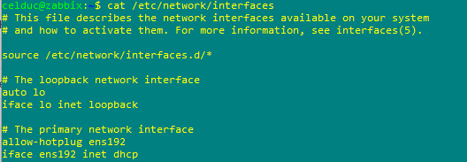

La configuration est ensuite modifiée afin d'utiliser une adresse IP statique.

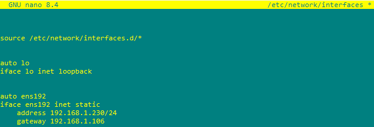

La configuration finale utilisée est :

```text
Adresse IP : 192.168.1.230
Préfixe    : /24
Passerelle : 192.168.1.254
Interface  : ens192
```

La configuration réseau est séparée de la configuration DNS.

Le fichier :

```text
/etc/network/interfaces
```

est utilisé pour :

* l'adresse IP ;
* le préfixe réseau ;
* la passerelle ;
* la configuration de l'interface réseau.

Le fichier :

```text
/etc/resolv.conf
```

est utilisé pour la configuration du DNS.

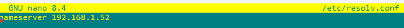

La configuration DNS permet notamment la résolution des noms nécessaires au fonctionnement de l'infrastructure.

---

## 1.4 Configuration du nom d'hôte

Le serveur est identifié dans l'infrastructure sous le nom :

```text
ZABBIX-SRV
```

Le nom d'hôte permet d'identifier clairement le serveur dans l'environnement réseau et dans les différents outils d'administration.

---

## 1.5 Installation de sudo

Le compte utilisateur utilisé pour l'administration du serveur est ajouté au groupe `sudo`.

Cette configuration permet d'exécuter des commandes nécessitant des privilèges administrateur sans utiliser directement le compte `root`.

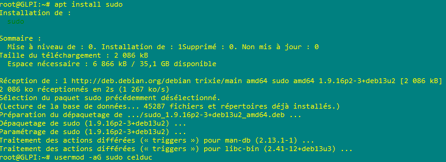

---

## 1.6 Validation de la configuration

Une fois la configuration terminée, les éléments suivants sont vérifiés :

* l'adresse IP statique ;
* la passerelle ;
* la résolution DNS ;
* l'accès réseau ;
* le nom d'hôte ;
* les droits d'administration.

Le serveur est désormais prêt à recevoir les composants nécessaires à l'installation de Zabbix.

# 2. Installation du serveur Zabbix

Après la préparation de la machine Debian, les composants nécessaires au fonctionnement du serveur Zabbix sont installés.

L'architecture logicielle repose sur :

* le dépôt officiel Zabbix ;
* Zabbix Server ;
* Zabbix Frontend ;
* MariaDB ;
* Apache2 ;
* PHP-FPM.

---

## 2.1 Installation du dépôt officiel Zabbix

Le dépôt officiel Zabbix est installé afin de récupérer les paquets nécessaires à la version utilisée.

Le paquet du dépôt est téléchargé puis installé :

```bash
wget https://repo.zabbix.com/zabbix/7.4/release/debian/pool/main/z/zabbix-release/zabbix-release_latest+debian13_all.deb

sudo dpkg -i zabbix-release_latest+debian13_all.deb
```

Les dépôts sont ensuite actualisés :

```bash
sudo apt update
```

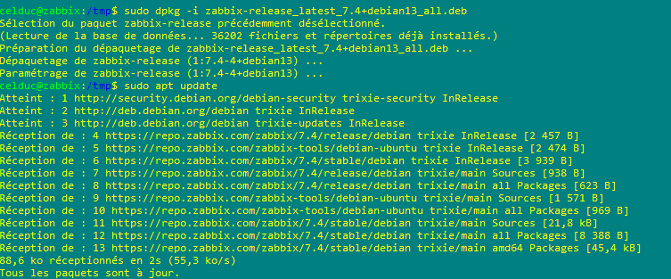

Le dépôt Zabbix est désormais disponible sur le système.

---

## 2.2 Installation de MariaDB

MariaDB est utilisé comme système de gestion de base de données pour stocker les données de supervision Zabbix.

Le serveur et le client MariaDB sont installés avec :

```bash
sudo apt install mariadb-server mariadb-client -y
```

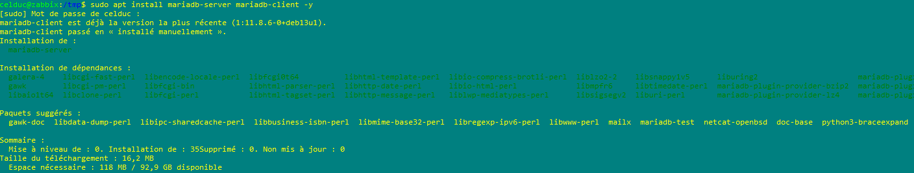

Le service est ensuite vérifié :

```bash
sudo systemctl status mariadb
```

Le service doit être actif :

```text
active (running)
```

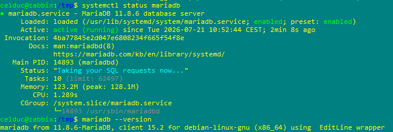

---

## 2.3 Installation du serveur Zabbix et de ses composants

Les composants principaux de Zabbix sont installés avec :

```bash
sudo apt install \
zabbix-server-mysql \
zabbix-frontend-php \
zabbix-apache-conf \
zabbix-sql-scripts \
zabbix-agent2 \
-y
```

Ces paquets fournissent notamment :

| Composant             | Rôle                       |
| --------------------- | -------------------------- |
| `zabbix-server-mysql` | Serveur de supervision     |
| `zabbix-frontend-php` | Interface Web              |
| `zabbix-apache-conf`  | Configuration Apache       |
| `zabbix-sql-scripts`  | Schéma de base de données  |
| `zabbix-agent2`       | Agent local de supervision |

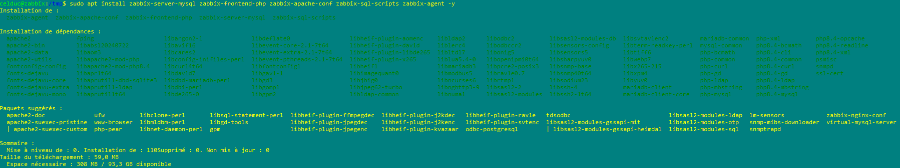

---

## 2.4 Importation du schéma SQL Zabbix

Le paquet `zabbix-sql-scripts` fournit le schéma SQL nécessaire à la création de la structure de la base de données Zabbix.

Les fichiers installés par le paquet peuvent être vérifiés avec :

```bash
dpkg -L zabbix-sql-scripts
```

Le schéma MySQL/MariaDB utilisé par Zabbix se trouve notamment dans :

```text
/usr/share/zabbix-sql-scripts/mysql/server.sql.gz
```

Le schéma est compressé au format `gzip`.

Il est décompressé avec `zcat`, puis directement envoyé au client MariaDB afin d'être importé dans la base de données Zabbix :

```bash
zcat /usr/share/zabbix-sql-scripts/mysql/server.sql.gz | \
mariadb -uzabbix -p zabbix
```

Le mot de passe de l'utilisateur MariaDB `zabbix` est ensuite demandé.

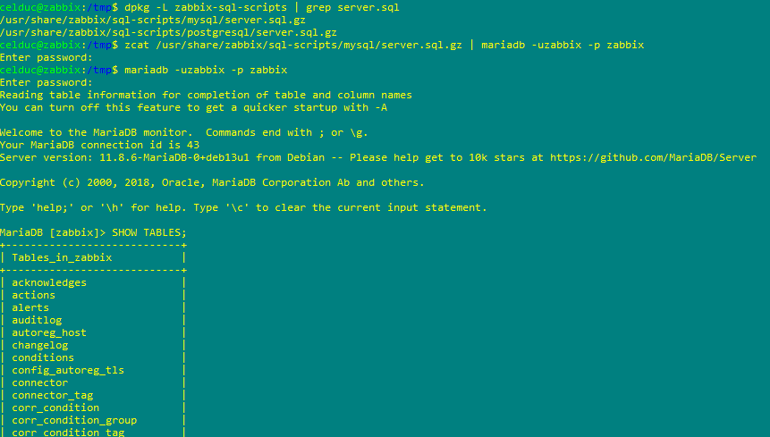

Une connexion directe à la base de données est ensuite effectuée afin de vérifier que l'utilisateur MariaDB `zabbix` peut y accéder correctement :

```bash
mariadb -uzabbix -p zabbix
```

Cette vérification confirme que :

* la base de données `zabbix` est accessible ;
* l'utilisateur MariaDB `zabbix` peut s'y connecter ;
* le schéma SQL Zabbix a bien été importé.


---

## 2.5 Configuration du serveur Zabbix

Le fichier de configuration principal du serveur Zabbix est :

```text
/etc/zabbix/zabbix_server.conf
```

Ce fichier contient notamment les paramètres nécessaires à la connexion du serveur Zabbix à la base de données MariaDB.

Le paramètre principal configuré est :

```text
DBPassword=<mot_de_passe_de_l_utilisateur_zabbix>
```

Le mot de passe utilisé correspond à celui défini précédemment pour l'utilisateur MariaDB :

```text
zabbix
```

Le fichier peut être édité avec :

```bash
sudo nano /etc/zabbix/zabbix_server.conf
```

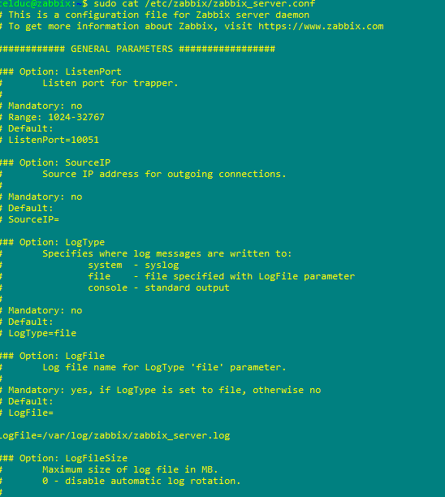

Cette configuration permet au processus `zabbix-server` de se connecter à la base de données `zabbix`.


---

## 2.6 Démarrage des services

Les services nécessaires au fonctionnement de la plateforme sont activés et démarrés :

```bash
sudo systemctl enable zabbix-server
sudo systemctl enable zabbix-agent2
sudo systemctl enable apache2
sudo systemctl enable mariadb
```

Les services peuvent ensuite être vérifiés :

```bash
systemctl status zabbix-server
systemctl status zabbix-agent2
systemctl status apache2
systemctl status mariadb
```

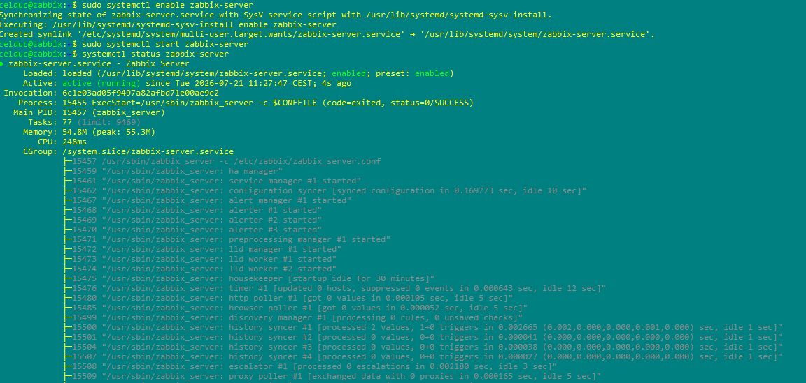

---

## 2.7 Vérification des ports

Les ports utilisés par les différents composants sont vérifiés avec :

```bash
sudo ss -tulpn
```

Les principaux ports attendus sont :

| Port      | Service                       |
| --------- | ----------------------------- |
| TCP 80    | Apache / interface Web Zabbix |
| TCP 10050 | Zabbix Agent 2                |
| TCP 10051 | Zabbix Server                 |
| TCP 3306  | MariaDB                       |

La présence du service Web Apache peut également être vérifiée :

```bash
sudo ss -tulpn | grep :80
```

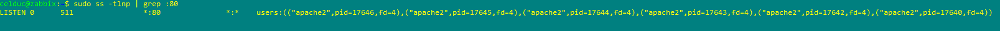

La plateforme Zabbix est désormais installée et les services principaux sont opérationnels.

# 3. Configuration et première connexion à l'interface Zabbix

Une fois les composants du serveur installés et configurés, l'interface Web Zabbix est accessible depuis un navigateur.

L'installation finale est réalisée depuis l'interface Web.

---

## 3.1 Accès à l'interface Web

L'interface Zabbix est accessible à l'adresse :

```text
http://192.168.1.230/zabbix
```

La page d'installation de Zabbix est alors affichée.

---

## 3.2 Vérification des prérequis

L'installateur Web vérifie automatiquement les composants nécessaires au fonctionnement de Zabbix.

Les éléments contrôlés comprennent notamment :

* la version de PHP ;
* les extensions PHP nécessaires ;
* la configuration de PHP-FPM ;
* la configuration du fuseau horaire ;
* les composants nécessaires à l'accès à la base de données.

Les prérequis doivent être validés avant de poursuivre l'installation.

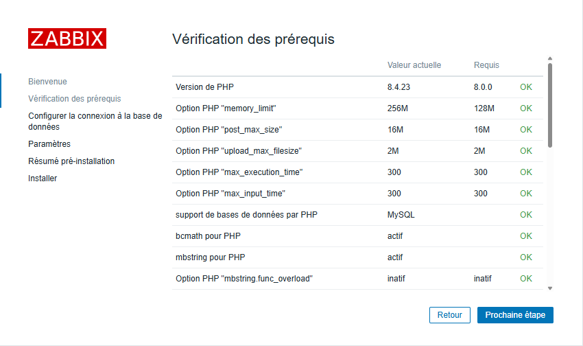

---

## 3.3 Configuration de la connexion à la base de données

L'interface Web demande ensuite les informations nécessaires pour se connecter à la base de données MariaDB.

Les paramètres utilisés sont :

```text
Type de base de données : MySQL
Serveur de base         : localhost
Port                    : 3306
Nom de la base           : zabbix
Utilisateur              : zabbix
Mot de passe             : mot de passe défini précédemment
```

Ces informations permettent à l'interface Web et au serveur Zabbix d'utiliser la base de données créée lors de l'installation.

---

## 3.4 Finalisation de l'installation

Après validation des paramètres, l'installateur termine la configuration de l'interface Zabbix.

La fin de l'installation est confirmée par l'affichage de la page de succès.

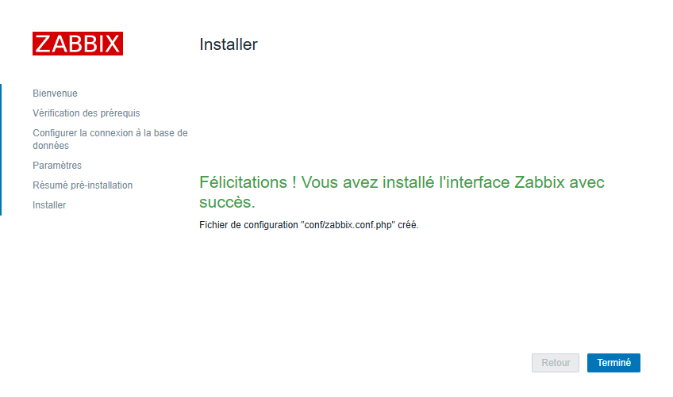

---

## 3.5 Première connexion

Une première connexion à l'interface Web est réalisée avec le compte administrateur initial :

```text
Utilisateur : Admin
Mot de passe : zabbix
```

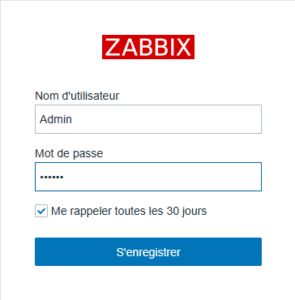

Le mot de passe par défaut est ensuite modifié afin de sécuriser l'accès à l'interface d'administration.

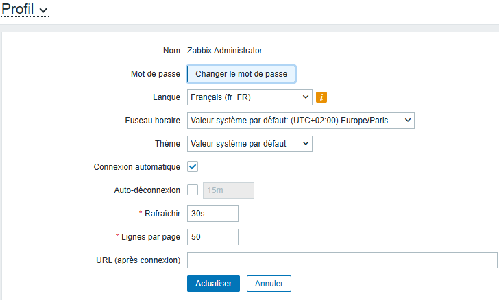

La plateforme Zabbix est désormais installée et accessible.

Le serveur est prêt à être configuré pour superviser les différents équipements et serveurs de l'infrastructure.


# 4. Validation opérationnelle du serveur Zabbix

Après l'installation et la configuration initiale, le fonctionnement général du serveur Zabbix est vérifié.

L'objectif est de confirmer que la plateforme est opérationnelle avant d'intégrer les premiers équipements et serveurs à superviser.

---

## 4.1 Vérification de la disponibilité du serveur Zabbix

Après l'installation et la configuration des composants, la disponibilité du serveur Zabbix est vérifiée depuis l'interface Web.

Dans le menu :

**Surveillance → Hôtes**

le serveur Zabbix apparaît avec son interface Zabbix disponible.

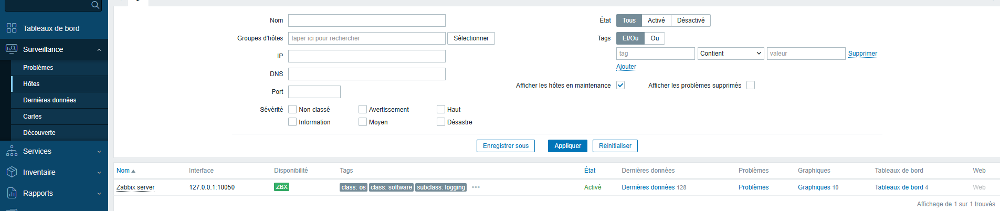

L'indicateur **ZBX** apparaît en vert.

Cette vérification confirme que :

- l'agent Zabbix fonctionne sur le serveur ;
- le serveur Zabbix peut communiquer avec son agent ;
- la supervision du serveur Zabbix est opérationnelle.
---

## 4.2 Vérification des informations système

Les informations système du serveur Zabbix peuvent être consultées depuis l'interface d'administration.

Cette vue permet de vérifier les caractéristiques de l'environnement utilisé pour la supervision.

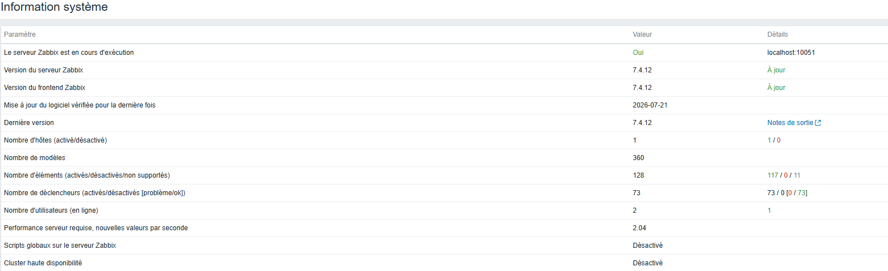

---

## 4.3 Vérification des services Web et base de données

Les services nécessaires au fonctionnement de l'interface Web et de la base de données sont vérifiés depuis le terminal.

Les services contrôlés sont :

- Apache2 ;
- MariaDB ;
- PHP-FPM.

La vérification est réalisée avec les commandes `systemctl status` correspondantes.

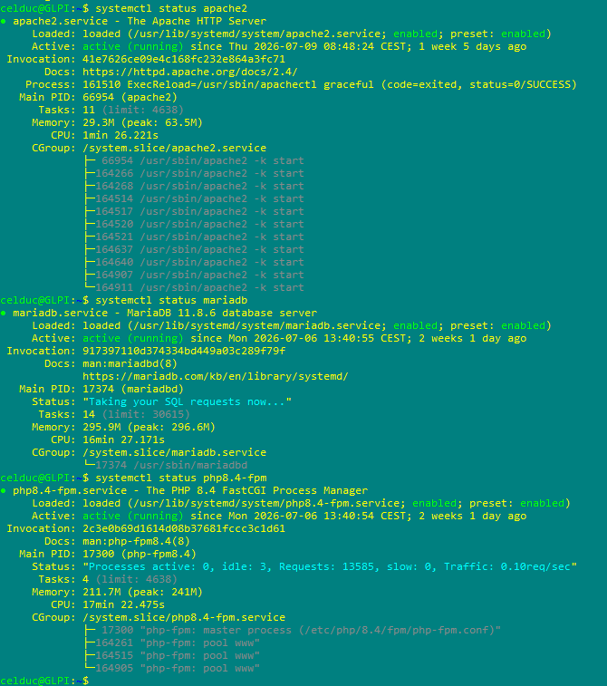

Les trois services sont actifs et fonctionnels.

---

## 4.4 Première utilisation du tableau de bord

Après la validation de l'installation, le tableau de bord Zabbix est accessible.

Le dashboard permet de visualiser les informations principales de la plateforme de supervision.

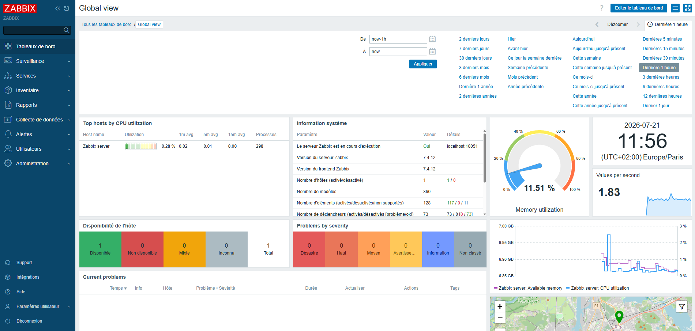

Un tableau de bord personnalisé a également été créé afin de regrouper les informations utiles à la supervision de l'infrastructure.

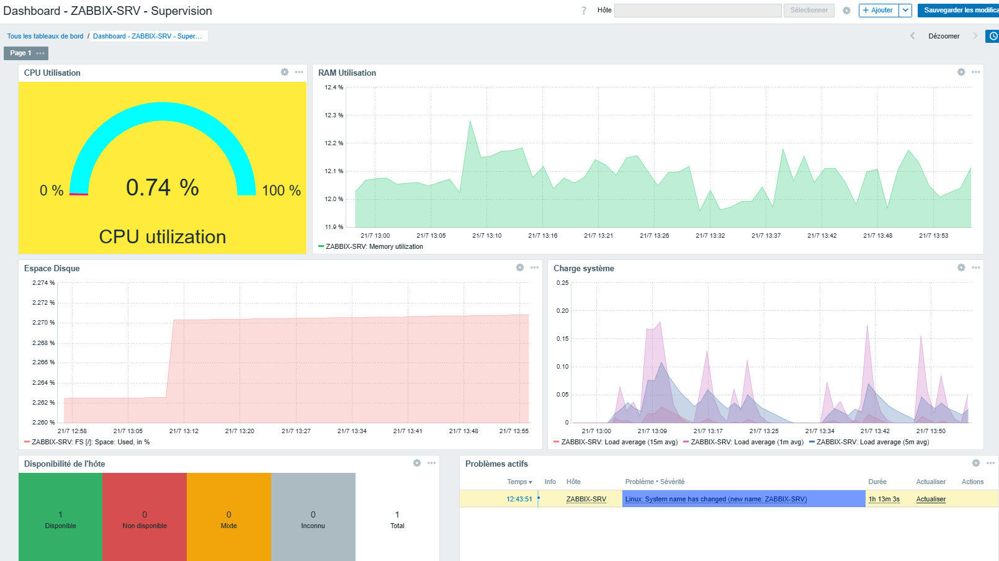

Le serveur Zabbix est désormais opérationnel et prêt à intégrer les premiers équipements et serveurs supervisés.


# 5. Première intégration manuelle d'un serveur Linux

Avant d'automatiser le déploiement de Zabbix Agent 2 sur les serveurs Windows avec Ansible, un premier serveur Linux est intégré manuellement à Zabbix.

Le serveur utilisé est le serveur GLPI.

Cette étape permet de valider le fonctionnement de la supervision d'un serveur Linux avant de passer à l'automatisation.

---

## 5.1 Vérification et installation de l'agent Zabbix

La disponibilité du paquet `zabbix-agent` est d'abord vérifiée avec :

```bash
apt policy zabbix-agent
```

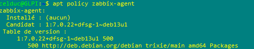

L'agent est ensuite installé manuellement :

```bash
sudo apt install zabbix-agent -y
```

Après l'installation, l'état du service est vérifié :

```bash
systemctl status zabbix-agent
```

Le service doit apparaître comme actif et fonctionnel.

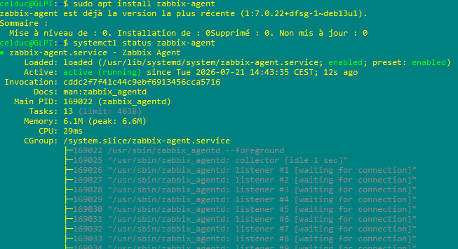

---

## 5.2 Configuration de l'agent Zabbix

Le fichier de configuration utilisé est :

```text
/etc/zabbix/zabbix_agentd.conf
```

Le fichier est modifié manuellement avec :

```bash
sudo nano /etc/zabbix/zabbix_agentd.conf
```

Les principaux paramètres configurés sont ensuite vérifiés avec :

```bash
grep -E '^(Server|ServerActive|Hostname)=' \
/etc/zabbix/zabbix_agentd.conf
```

Les paramètres permettent notamment de définir :

* le serveur Zabbix autorisé à interroger l'agent ;
* le serveur Zabbix utilisé pour la supervision active ;
* le nom de l'hôte dans Zabbix.

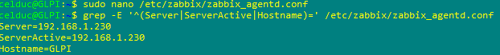

---

## 5.3 Vérification du port d'écoute de l'agent

L'agent Zabbix utilise le port TCP :

```text
10050
```

La présence du service en écoute est vérifiée avec :

```bash
ss -tulpn | grep 10050
```

Cette vérification confirme que l'agent est correctement démarré et écoute sur le port prévu.

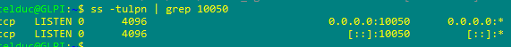

---

## 5.4 Test de communication depuis le serveur Zabbix

L'accessibilité du port TCP 10050 est ensuite testée depuis le serveur Zabbix :

```bash
nc -zv 192.168.1.247 10050
```

Le résultat obtenu est :

```text
open
```

La communication réseau entre le serveur Zabbix et l'agent installé sur le serveur GLPI est donc fonctionnelle.

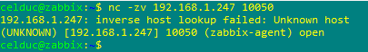

---

## 5.5 Vérification de la disponibilité dans Zabbix

Le serveur GLPI est ajouté dans l'interface Zabbix et associé à un template Linux adapté.

Dans :

**Surveillance → Hôtes**

l'interface de l'agent apparaît comme disponible.

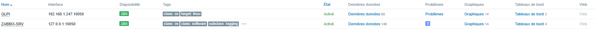

L'indicateur vert confirme que le serveur Zabbix communique correctement avec l'agent installé sur le serveur GLPI.

---

## 5.6 Remontée des métriques

Une fois la communication établie, les premières métriques du serveur GLPI sont collectées par Zabbix.

Les données de supervision sont visibles directement dans l'interface graphique.

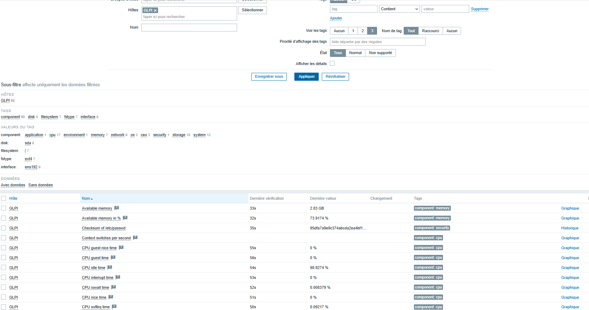

Cette première intégration manuelle valide le fonctionnement de la supervision d'un serveur Linux.

Elle permet ensuite de passer à l'étape suivante du projet : l'automatisation du déploiement de Zabbix Agent 2 sur les serveurs Windows avec Ansible.


# 6. Déploiement automatisé de Zabbix Agent 2 avec Ansible

Après avoir validé manuellement la supervision du serveur Linux GLPI, l'étape suivante consiste à automatiser le déploiement de Zabbix Agent 2 sur les serveurs Windows avec Ansible.

Le serveur PKI est utilisé comme première machine de validation de cette automatisation.

L'objectif est de vérifier progressivement :

* la communication entre le contrôleur Ansible et le serveur Windows ;
* le déploiement automatisé de l'agent ;
* la configuration du service ;
* l'ouverture du port TCP 10050 ;
* la communication entre Zabbix et l'agent ;
* puis, dans un second temps, la création automatique de l'hôte dans Zabbix via l'API.

La démarche suivie est donc :

```text
Contrôleur Ansible
        ↓
Test réseau et WinRM
        ↓
Déploiement de Zabbix Agent 2
        ↓
Validation du service Windows
        ↓
Ouverture du port TCP 10050
        ↓
Test depuis le serveur Zabbix
        ↓
Création manuelle initiale de l'hôte PKI
        ↓
Validation de la supervision
        ↓
Création du token API Zabbix
        ↓
Test Ansible → API Zabbix
        ↓
Automatisation de la création des hôtes
```

---

## 6.1 Validation de la communication avec le serveur PKI

Avant de déployer l'agent Zabbix, la communication entre le contrôleur Ansible et le serveur PKI est vérifiée.

Le contrôleur Ansible est situé sur :

```text
ControllerNodeAnsible
192.168.1.246
```

Le serveur PKI est situé sur :

```text
WS2022-CA
192.168.1.236
```

La première étape consiste à vérifier la connectivité réseau entre les deux machines.

Depuis le contrôleur Ansible, un test `ping` est effectué vers le serveur PKI :

```bash
ping -c 4 192.168.1.236
```


Le résultat confirme que la communication IP est fonctionnelle.

La communication utilisée par Ansible repose ensuite sur :

```text
WinRM
TCP 5985
Transport NTLM
```

L'accessibilité du service WinRM est vérifiée avec :

```bash
nc -zv 192.168.1.236 5985
```

Le port doit apparaître comme accessible.

La connexion Ansible est ensuite testée avec le module :

```bash
ansible pki \
-i inventory/zabbix_agent.yml \
-m ansible.windows.win_ping \
--ask-vault-pass
```

Le résultat attendu est :

```text
pki | SUCCESS => {
    "changed": false,
    "ping": "pong"
}
```

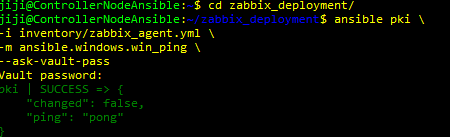

Ce résultat valide simultanément :

* la connectivité réseau ;
* l'accès au service WinRM ;
* l'authentification du compte `CELDUC\ansible` ;
* l'utilisation du transport NTLM ;
* la capacité d'Ansible à exécuter une tâche distante sur le serveur Windows.

Le serveur PKI est donc prêt à recevoir le déploiement automatisé de Zabbix Agent 2.

---

## 6.2 Premier déploiement automatisé sur le serveur PKI

Une fois la communication validée, le playbook de déploiement est exécuté sur le serveur PKI.

Le déploiement est réalisé avec :

```bash
ansible-playbook \
-i inventory/zabbix_agent.yml \
playbooks/install_zabbix_agent.yml \
--limit pki \
--ask-vault-pass
```

Le playbook réalise automatiquement les opérations nécessaires à l'installation de l'agent Zabbix 2.

Les principales étapes sont :

1. vérifier si l'agent est déjà installé ;
2. créer un répertoire temporaire ;
3. copier le fichier MSI sur le serveur Windows ;
4. installer Zabbix Agent 2 ;
5. configurer l'agent ;
6. démarrer le service ;
7. configurer le démarrage automatique ;
8. ouvrir le port TCP 10050 ;
9. supprimer le fichier MSI temporaire.

Le déploiement est réalisé depuis le contrôleur Ansible sans intervention manuelle sur le serveur PKI.

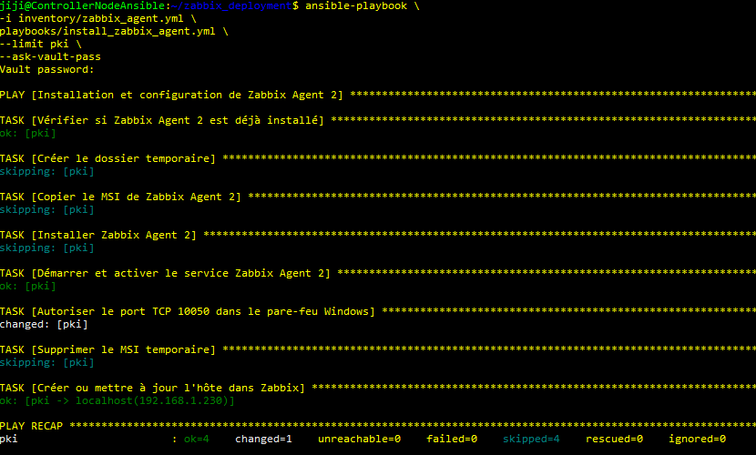

---

## 6.3 Vérification du service et de la règle de pare-feu

Après le déploiement, le fonctionnement de l'agent Zabbix Agent 2 est vérifié à distance depuis le contrôleur Ansible.

La vérification est réalisée avec le module `win_shell` afin d'exécuter des commandes PowerShell directement sur le serveur Windows PKI :

```bash
ansible pki \
-i inventory/zabbix_agent.yml \
-m ansible.windows.win_shell \
-a "Get-Service 'Zabbix Agent 2'; Get-NetFirewallRule -DisplayName 'Zabbix Agent 2 - TCP 10050'" \
--ask-vault-pass
```

Cette commande permet de vérifier simultanément :

* l'existence du service **Zabbix Agent 2** ;
* son état de fonctionnement ;
* la présence de la règle de pare-feu autorisant le port TCP 10050.

Le service doit apparaître dans l'état :

```text
Status : Running
```

La règle de pare-feu doit également être présente et active afin d'autoriser les connexions entrantes vers l'agent Zabbix.

Cette vérification confirme que le déploiement automatisé a correctement configuré les principaux composants nécessaires à la supervision du serveur PKI.

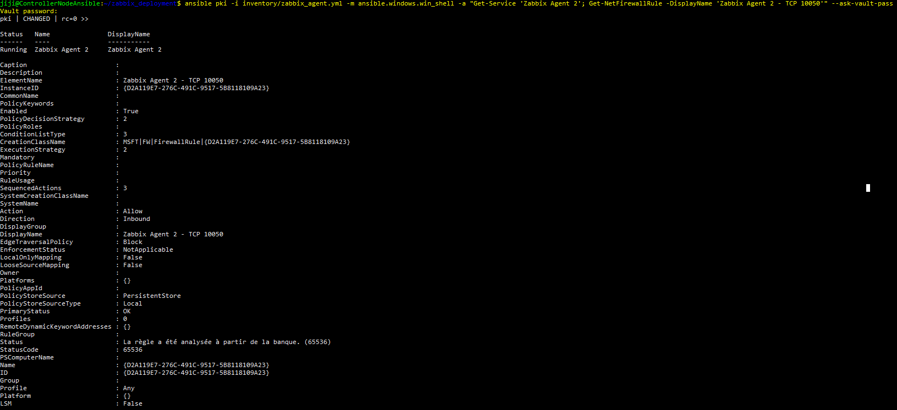

---

## 6.4 Création manuelle du serveur PKI dans Zabbix

À ce stade, Zabbix Agent 2 est installé et fonctionnel sur le serveur PKI.

La création de l'hôte dans Zabbix est d'abord réalisée manuellement afin de valider le fonctionnement complet de la supervision avant d'automatiser cette étape avec l'API Zabbix.

### Création de l'hôte

Dans l'interface Web de Zabbix, accéder à :

```text
Collecte de données → Hôtes
````

Cliquer ensuite sur :

```text
Créer un hôte
```

L'hôte est créé avec les paramètres suivants :

```text
Nom de l'hôte : PKI
```

Dans la section **Interfaces**, ajouter une interface de type :

```text
Type : Agent
IP   : 192.168.1.236
Port : 10050
```

L'interface Agent permet à Zabbix Server de communiquer directement avec le service **Zabbix Agent 2** installé sur le serveur PKI.


### Association du template de supervision

Un template de supervision Windows est ensuite associé à l'hôte.

Le template contient notamment :

* les éléments de collecte ;
* les règles de découverte ;
* les déclencheurs ;
* les paramètres permettant de récupérer les métriques du système.

Le template permet ainsi d'éviter de créer manuellement chaque élément de supervision.

L'association d'un template permet donc à Zabbix de commencer automatiquement à collecter les informations du serveur PKI, telles que :

* l'utilisation du processeur ;
* la mémoire ;
* les disques ;
* les interfaces réseau ;
* les services Windows ;
* différents paramètres système.

La configuration de l'hôte est ensuite enregistrée.

La communication attendue est :

```text
Serveur Zabbix
192.168.1.230
        │
        │ TCP 10050
        ▼
Zabbix Agent 2
PKI
192.168.1.236
```

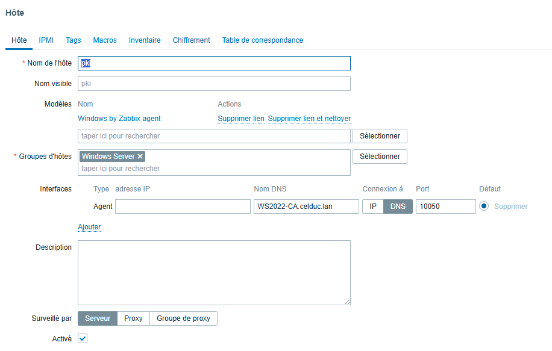

Une fois l'hôte créé et le template associé, Zabbix peut interroger l'agent installé sur le serveur PKI et commencer à collecter ses données.

La disponibilité de l'agent et la remontée des premières métriques sont ensuite vérifiées dans l'interface Zabbix.


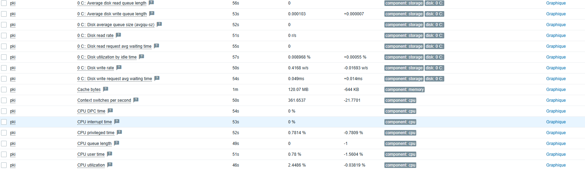

---

## 6.5 Vérification de la communication avec `zabbix_get`

Après la création manuelle de l'hôte PKI dans Zabbix, la communication avec l'agent est vérifiée directement depuis le serveur Zabbix à l'aide de l'outil `zabbix_get`.

Cet outil permet d'interroger directement un agent Zabbix et de vérifier qu'il répond correctement aux requêtes.

L'installation de l'outil est réalisée avec :

```bash
sudo apt install zabbix-get -y
```

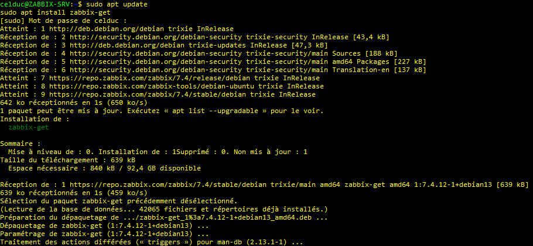

La communication avec l'agent installé sur le serveur PKI est ensuite testée avec :

```bash
zabbix_get -s 192.168.1.236 -k agent.ping
```

Le résultat attendu est :

```text
1
```

La version de l'agent est ensuite vérifiée avec :

```bash
zabbix_get -s 192.168.1.236 -k agent.version
```

Cette commande permet de confirmer la version de Zabbix Agent 2 installée sur le serveur PKI.

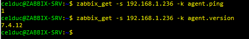

Ces tests valident directement la communication entre le serveur Zabbix `192.168.1.230` et l'agent Zabbix Agent 2 installé sur le serveur PKI `192.168.1.236` via le port TCP `10050`.

La communication entre le serveur Zabbix et l'agent étant validée, l'étape suivante consiste à préparer l'automatisation de la création des hôtes dans Zabbix via son API.

---

## 6.6 Création du token API Zabbix

Après avoir validé la communication entre le serveur Zabbix et l'agent installé sur le serveur PKI, l'étape suivante consiste à permettre à Ansible de communiquer avec l'API Zabbix.

L'API Zabbix permet notamment d'automatiser la gestion des hôtes, des templates et de différents éléments de configuration.

Dans le cadre de ce projet, elle sera utilisée pour automatiser la création des hôtes supervisés après leur déploiement.

### Création du token API

La création du token est réalisée depuis l'interface Web de Zabbix.

Le menu suivant est utilisé :

```text
Administration → Utilisateurs
```

L'utilisateur utilisé pour l'accès à l'API est sélectionné, puis l'onglet :

```text
Tokens API
```

est ouvert.

Un nouveau token est ensuite créé avec :

```text
Nom : Ansible-Zabbix-API
```

Le token généré est ensuite utilisé par Ansible pour s'authentifier auprès de l'API Zabbix.

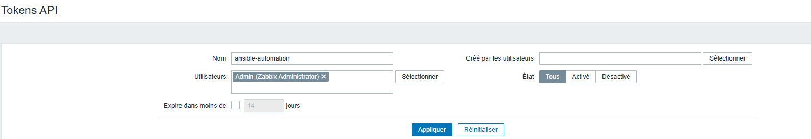

Une fois la création terminée, le token généré est affiché.

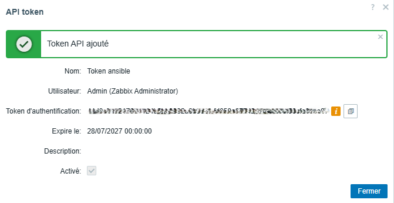

Le token constitue une donnée sensible. Il ne doit donc pas être intégré directement dans un playbook ou dans un fichier de configuration en clair.

Il est donc protégé à l'aide d'**Ansible Vault** dans l'étape suivante.

---

## 6.7 Protection du token API avec Ansible Vault

Le token API créé précédemment est une donnée sensible. Il ne doit pas être stocké directement en clair dans un playbook ou dans un fichier de configuration accessible.

Ansible Vault est utilisé pour chiffrer les informations sensibles utilisées par Ansible.

Un fichier Vault est créé dans le projet :

```bash
ansible-vault create group_vars/windows/vault.yml
```

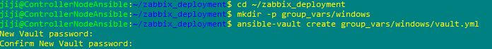

Le mot de passe du Vault est ensuite défini afin de protéger le contenu du fichier.

Le token API Zabbix est ensuite stocké dans une variable chiffrée :

```yaml
vault_zabbix_api_token: "TOKEN_API_ZABBIX"
```

Le fichier est ensuite chiffré par Ansible Vault.

Le contenu du fichier peut être vérifié avec :

```bash
ansible-vault view group_vars/windows/vault.yml
```

Sans le mot de passe du Vault, le contenu du fichier n'est pas lisible directement.

Le fichier chiffré apparaît sous forme de données protégées :

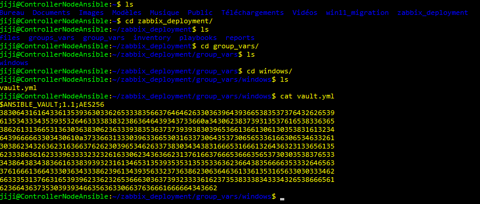


Le token API est ainsi séparé de la logique des playbooks et protégé contre une lecture directe.

---

## 6.8 Test de communication entre Ansible et l'API Zabbix

Avant d'automatiser la création des hôtes dans Zabbix, la communication entre le contrôleur Ansible et l'API Zabbix est vérifiée.

Cette étape permet de valider séparément la communication avec l'API avant d'intégrer cette fonction au playbook complet de déploiement de Zabbix Agent 2.

Le contrôleur Ansible doit pouvoir :

* contacter le serveur Zabbix ;
* atteindre l'API Zabbix ;
* s'authentifier avec le token API ;
* utiliser le token stocké dans le fichier chiffré avec Ansible Vault ;
* communiquer avec le module `community.zabbix.zabbix_host`.

Un playbook de test est utilisé afin de vérifier cette communication.

Le playbook utilise notamment le module :

```yaml
community.zabbix.zabbix_host
```

Ce module permet à Ansible de gérer les hôtes Zabbix via l'API. Il permet notamment de créer, modifier ou supprimer automatiquement des hôtes dans Zabbix.

Le test est exécuté avec :

```bash
ansible-playbook \
-i inventory/zabbix_agent.yml \
playbooks/test_zabbix_api.yml \
--ask-vault-pass
```

Le résultat obtenu confirme que le contrôleur Ansible peut communiquer avec l'API Zabbix et utiliser le module `community.zabbix.zabbix_host`.

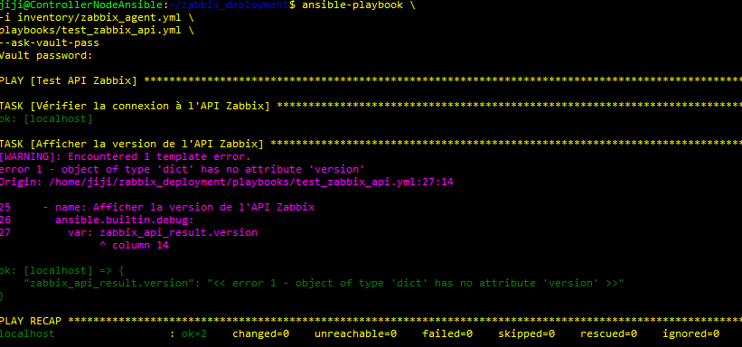

Cette validation confirme que les éléments nécessaires à l'automatisation sont fonctionnels :

```text
Contrôleur Ansible
        │
        │ Token API
        │ Ansible Vault
        ▼
API Zabbix
        │
        ▼
Gestion des hôtes Zabbix
```

La communication entre Ansible et l'API Zabbix étant validée, la création des hôtes peut désormais être intégrée au playbook de déploiement de Zabbix Agent 2.


## 6.9 Validation de l'automatisation sur le serveur `srv_veeam`

Après avoir validé la communication entre Ansible et l'API Zabbix, l'automatisation complète est testée sur un second serveur Windows : `srv_veeam`.

Cette étape permet de vérifier que le playbook peut désormais réaliser automatiquement l'ensemble du processus :

```text
Contrôleur Ansible
        │
        ├── Déploiement de Zabbix Agent 2
        │
        ├── Configuration de l'agent
        │
        ├── Démarrage du service
        │
        ├── Ouverture du port TCP 10050
        │
        └── Création automatique de l'hôte dans Zabbix
```

Le déploiement est exécuté en ciblant uniquement le serveur `srv_veeam` afin de valider la nouvelle automatisation avant de l'étendre à plusieurs serveurs.

Le lancement ciblé est réalisé avec :

```bash
ansible-playbook \
-i inventory/zabbix_agent.yml \
playbooks/install_zabbix_agent.yml \
--limit srv_veeam \
--ask-vault-pass
```

Le paramètre :

```text
--limit srv_veeam
```

permet de limiter l'exécution du playbook à ce seul serveur.

Cette méthode permet de tester l'évolution du playbook sur une machine ciblée sans modifier les autres serveurs de l'infrastructure.

Le playbook réalise automatiquement :

* l'installation de Zabbix Agent 2 ;
* la configuration de l'agent ;
* le démarrage du service ;
* l'ouverture du port TCP 10050 ;
* la création ou la mise à jour de l'hôte `srv_veeam` dans Zabbix via l'API.

Le résultat de l'exécution confirme que le déploiement s'est déroulé correctement.

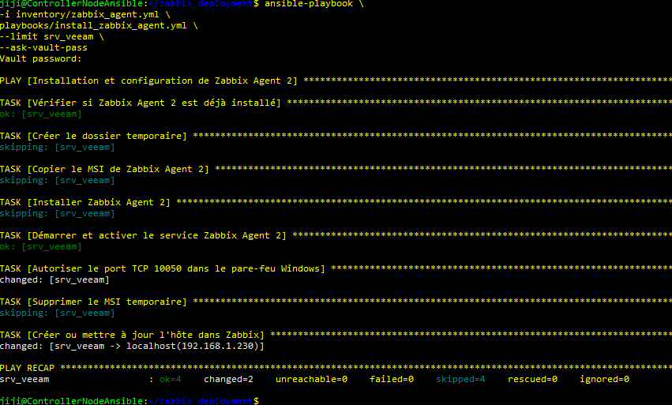

La création automatique de l'hôte dans Zabbix est ensuite vérifiée depuis l'interface Web.


Cette validation confirme que le processus complet est désormais automatisé :

```text
Ansible
   ↓
Installation de l'agent
   ↓
Configuration du serveur Windows
   ↓
Ouverture du port TCP 10050
   ↓
API Zabbix
   ↓
Création automatique de l'hôte
   ↓
Supervision active
```

Le test réalisé sur `srv_veeam` étant concluant, l'automatisation peut désormais être étendue à plusieurs serveurs Windows.

---

## 6.10 Validation de la détection des problèmes

Après la création automatique de l'hôte `srv_veeam` et la remontée de ses premières métriques, Zabbix est capable de surveiller automatiquement l'état du serveur et de détecter les situations anormales.

Cette détection est réalisée grâce aux **triggers** associés au template de supervision.

Un trigger permet de définir une condition considérée comme anormale, par exemple :

* une utilisation importante du processeur ;
* un espace disque insuffisant ;
* un service arrêté ;
* une indisponibilité de l'agent ;
* une anomalie détectée sur le système.

Lorsqu'une condition définie par un trigger est remplie, Zabbix crée automatiquement un problème dans l'interface de supervision.

Dans le cadre du test réalisé sur `srv_veeam`, Zabbix a détecté un problème lié à l'espace disque :

```text
Space is low (used > 80%, total 109.4 GB)
```

Le problème est apparu dans :

```text
Surveillance → Problèmes
```

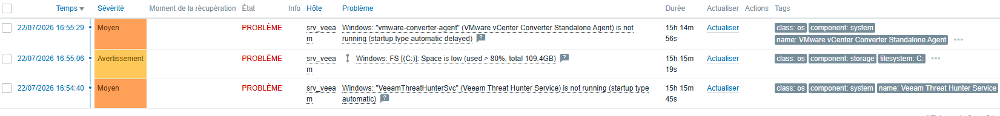

L'analyse du serveur a montré qu'une partition d'environ `109 Go` atteignait le seuil d'alerte, tandis qu'une seconde partition d'environ `100 Go` était inutilisée.

La partition inutilisée a donc été supprimée afin de récupérer l'espace disponible et d'étendre la partition utilisée.

Après cette modification, l'espace disponible a augmenté et l'utilisation du disque est repassée sous le seuil défini par le trigger.

Le problème a alors été résolu dans Zabbix.

Cet exemple montre concrètement le fonctionnement de la supervision :

```text
Collecte des métriques
        ↓
Dépassement d'un seuil
        ↓
Création automatique d'un problème
        ↓
Analyse de la cause
        ↓
Action corrective
        ↓
Résolution du problème
```

Cette étape permet de vérifier que la solution ne se limite pas à la collecte de métriques. Zabbix est également capable de détecter automatiquement une anomalie et de signaler un problème nécessitant une intervention.

---

## 6.11 Déploiement automatisé sur plusieurs serveurs Windows

Après avoir validé le fonctionnement de l'automatisation sur les serveurs `PKI` et `srv_veeam`, le déploiement de Zabbix Agent 2 est étendu à plusieurs serveurs Windows de l'infrastructure.

L'objectif est désormais de pouvoir déployer et configurer automatiquement l'agent sur plusieurs machines depuis le contrôleur Ansible.

Le playbook réalise automatiquement les opérations suivantes :

* vérification de la présence de Zabbix Agent 2 ;
* création du répertoire temporaire ;
* copie du fichier d'installation MSI ;
* installation de Zabbix Agent 2 ;
* configuration de l'agent ;
* démarrage du service ;
* configuration du démarrage automatique ;
* création de la règle de pare-feu TCP `10050` ;
* création ou mise à jour automatique de l'hôte dans Zabbix via l'API ;
* association du template de supervision ;
* suppression du fichier d'installation temporaire.

Le déploiement est lancé depuis le contrôleur Ansible sur les serveurs sélectionnés.

Les résultats obtenus confirment le bon déroulement des opérations :

```text
cao_relais    : ok=8 changed=7 failed=0
cao_transfo   : ok=8 changed=7 failed=0
data1_2014    : ok=8 changed=6 failed=0
pki           : ok=4 changed=2 failed=0
sage          : ok=8 changed=7 failed=0
```

Aucune erreur n'est signalée sur les serveurs validés.

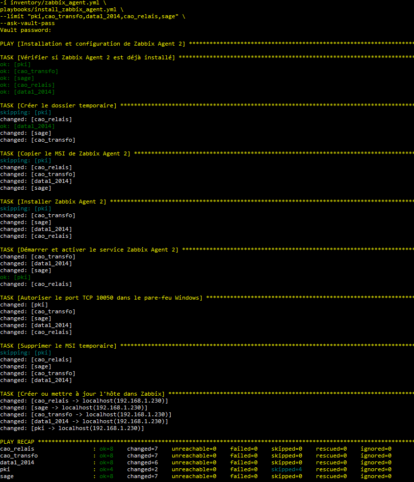

Après le déploiement, la communication entre le serveur Zabbix et les agents installés sur les différents serveurs Windows est vérifiée avec l'outil `zabbix_get`.

Le test utilise la clé :

```bash
zabbix_get -s IP_DU_SERVEUR -k agent.ping
```

Le résultat attendu est :

```text
1
```

Ce test est réalisé sur les cinq serveurs déployés.

Cette vérification confirme que le serveur Zabbix peut communiquer directement avec les agents Zabbix Agent 2 installés sur les serveurs Windows.

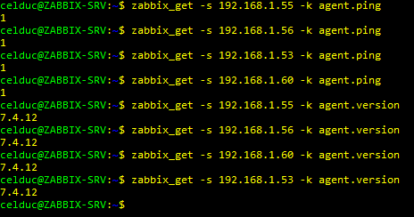

La dernière vérification est réalisée depuis l'interface Web de Zabbix.

Les cinq serveurs apparaissent dans la liste des hôtes supervisés et leurs interfaces Agent sont disponibles.

Cette vérification permet de confirmer que les serveurs sont correctement intégrés à la supervision centralisée.

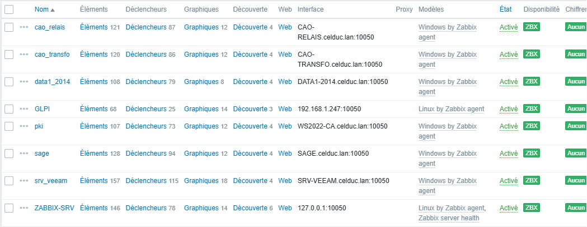

Le processus complet est désormais automatisé :

```text
Contrôleur Ansible
        │
        ▼
Déploiement de Zabbix Agent 2
        │
        ▼
Configuration automatique
        │
        ▼
Ouverture du port TCP 10050
        │
        ▼
Création automatique de l'hôte via l'API Zabbix
        │
        ▼
Test avec zabbix_get
        │
        ▼
Supervision visible dans l'interface Zabbix
```

L'automatisation permet ainsi de réduire les interventions manuelles et d'assurer une configuration homogène des serveurs supervisés.

Cette étape marque le passage d'une supervision configurée serveur par serveur à une véritable gestion automatisée du déploiement et de l'intégration des serveurs dans Zabbix.

---

# 7. Cas particuliers et résolution des problèmes

Le déploiement automatisé a permis de superviser plusieurs serveurs Windows avec succès. Cependant, certains environnements ont nécessité des traitements spécifiques.

Ces difficultés sont liées aux différences de versions de Windows Server, aux droits nécessaires pour l'administration distante et aux règles de sécurité appliquées sur certains serveurs.

Les principaux cas rencontrés sont présentés dans cette partie :

```text
Problème de compatibilité PowerShell
              ↓
Droits spécifiques sur les contrôleurs de domaine
              ↓
Problèmes d'authentification NTLM
              ↓
Problèmes de communication WinRM
              ↓
Problèmes de pare-feu et de port TCP 10050
```

L'objectif de cette partie est de présenter les difficultés réellement rencontrées lors du déploiement et les solutions mises en œuvre pour les résoudre.


Oui 👍 Voici ta **partie 7.1 complète**, avec les cinq captures intégrées aux endroits logiques, sans modifier le contenu de fond.

## 7.1 Problème lié à une version trop ancienne de PowerShell

Lors des premiers tests de déploiement sur deux serveurs Windows anciens, le playbook Ansible ne fonctionnait pas correctement.

Le problème ne venait pas de la communication réseau ni de WinRM, mais de la version de PowerShell installée sur ces serveurs.

La version présente était :

```text
PowerShell 3.0
```

Or, les modules Windows utilisés par Ansible nécessitent une version minimale de :

```text
PowerShell 5.1
```

La version de PowerShell est vérifiée avec :

```powershell
$PSVersionTable.PSVersion
```

Les deux serveurs concernés étaient :

```text
SQL1-2014
KELIO
```

Pour résoudre le problème, le fichier d'installation de PowerShell 5.1 est d'abord téléchargé depuis le poste d'administration Windows.

Un dossier temporaire est ensuite créé sur les serveurs concernés :

```powershell
New-Item -ItemType Directory -Path "\\SQL1-2014\C$\Temp" -Force
New-Item -ItemType Directory -Path "\\KELIO\C$\Temp" -Force
```

Le fichier d'installation est ensuite copié via le partage administratif `C$` :

```powershell
Copy-Item "C:\Temp\PowerShell-5.1-Windows6.1-KB3191566-x64.msu" `
"\\SQL1-2014\C$\Temp\" -Force

Copy-Item "C:\Temp\PowerShell-5.1-Windows6.1-KB3191566-x64.msu" `
"\\KELIO\C$\Temp\" -Force
```

L'installation de PowerShell 5.1 est ensuite réalisée sur les deux serveurs.

Après l'installation, les serveurs sont redémarrés afin que la mise à niveau soit correctement prise en compte.

La version de PowerShell est ensuite vérifiée à nouveau afin de confirmer que la version compatible est bien installée :

```powershell
$PSVersionTable.PSVersion
```

Une fois cette vérification effectuée, le déploiement est relancé depuis le contrôleur Ansible.

Le playbook fonctionne alors correctement et permet de déployer Zabbix Agent 2 sur les deux serveurs.

Le résultat obtenu sur le serveur `KELIO` confirme que la mise à niveau de PowerShell a permis de résoudre le problème initial et que le déploiement de l'agent Zabbix s'est ensuite terminé correctement.

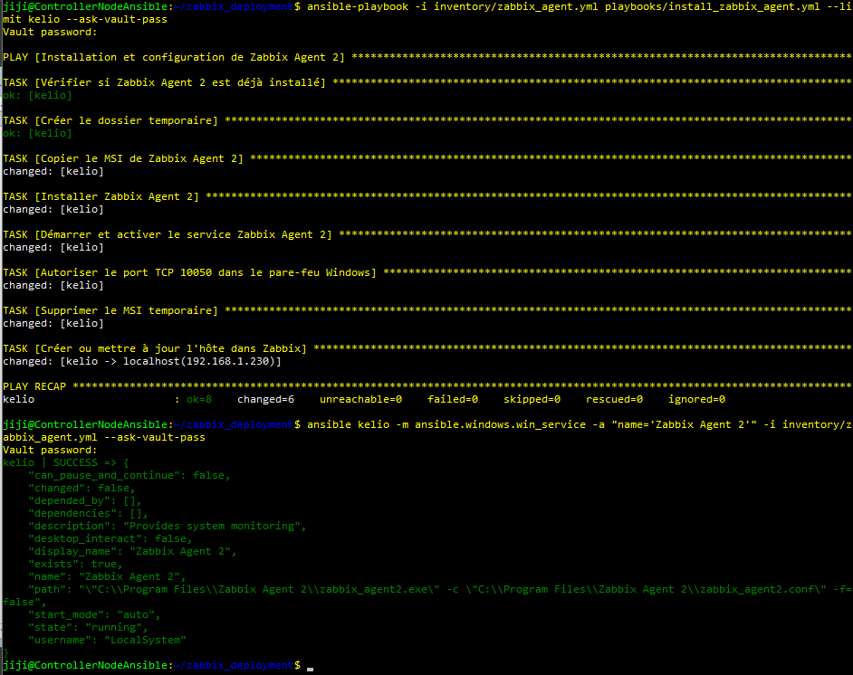

La remontée du serveur `KELIO` est ensuite vérifiée dans l'interface Zabbix afin de confirmer que l'agent est correctement supervisé.

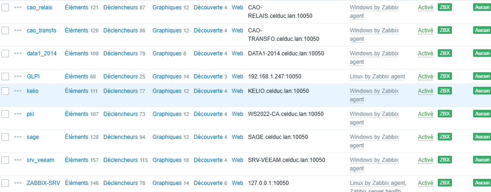

Le même processus est ensuite validé sur le serveur `SQL1-2014`.

La communication avec le serveur est d'abord vérifiée, puis l'installation de l'agent Zabbix est réalisée.

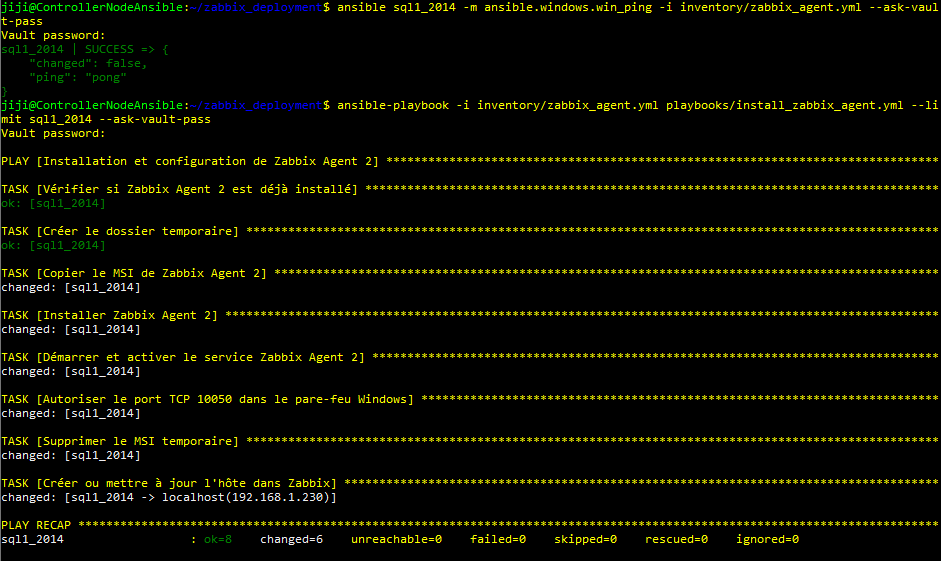

Après l'installation, la présence et le fonctionnement de l'agent Zabbix sont vérifiés depuis la ligne de commande.

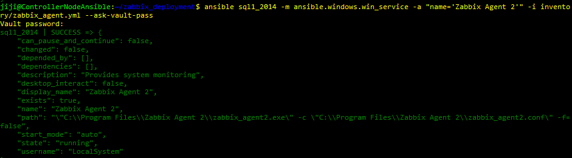

Enfin, la remontée de `SQL1-2014` est vérifiée dans l'interface graphique de Zabbix.

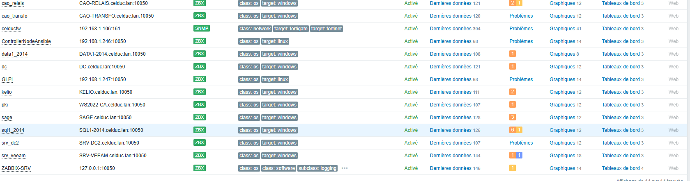

Le déroulement est donc le suivant :

```text
Windows Server 2012
        ↓
PowerShell 3.0
        ↓
Incompatibilité avec les modules Ansible
        ↓
Téléchargement du MSI PowerShell 5.1
        ↓
Copie via le partage administratif C$
        ↓
Installation sur les deux serveurs
        ↓
Redémarrage des serveurs
        ↓
Vérification de la version PowerShell
        ↓
Relance du playbook Ansible
        ↓
Déploiement réussi
        ↓
Validation de l'agent en CLI
        ↓
Validation de la supervision dans Zabbix
```

Ce cas montre l'importance de vérifier les prérequis techniques avant d'automatiser le déploiement sur un parc Windows hétérogène.

Après la mise à niveau de PowerShell, les deux serveurs ont pu être intégrés au processus de déploiement automatisé de Zabbix Agent 2 avec Ansible.


## 7.2 Cas particulier des contrôleurs de domaine

Le déploiement sur les contrôleurs de domaine a nécessité une configuration spécifique des droits du compte utilisé par Ansible.

Dans le fonctionnement général du projet, le compte de service :

```text
CELDUC\ansible
```

est utilisé pour administrer les machines Windows à distance avec Ansible.

Les contrôleurs de domaine constituent toutefois un cas particulier, car leur fonctionnement et leur modèle de gestion des droits diffèrent de ceux des serveurs membres.

Lors des premiers tests, le compte `CELDUC\ansible` ne disposait pas des droits nécessaires pour permettre correctement l'administration distante des contrôleurs de domaine.

Afin de permettre le déploiement automatisé de Zabbix Agent 2, le compte est temporairement ajouté au groupe disposant des droits d'administration nécessaires :

```powershell
Add-ADGroupMember `
-Identity "Administrateurs" `
-Members "CELDUC\ansible"
```

La présence du compte dans le groupe est ensuite vérifiée avec :

```powershell
Get-ADGroupMember -Identity "Administrateurs"
```

Le compte `CELDUC\ansible` doit alors apparaître dans la liste des membres du groupe.

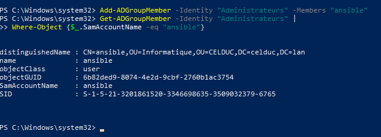

Une fois les droits nécessaires accordés, la communication avec les contrôleurs de domaine est vérifiée depuis le contrôleur Ansible avec le module `win_ping`.

Le résultat attendu est :

```text
SUCCESS
"ping": "pong"
```

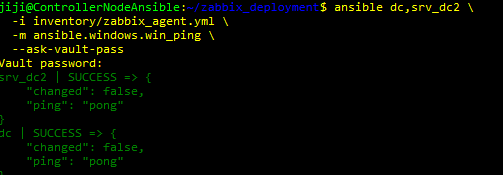

La communication entre le contrôleur Ansible et les contrôleurs de domaine étant validée, le playbook de déploiement de Zabbix Agent 2 est lancé sur les deux serveurs.

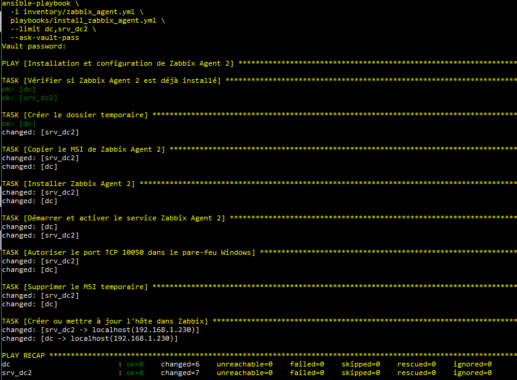

Après le déploiement, le service **Zabbix Agent 2** est vérifié sur les contrôleurs de domaine afin de confirmer qu'il est correctement installé et démarré.

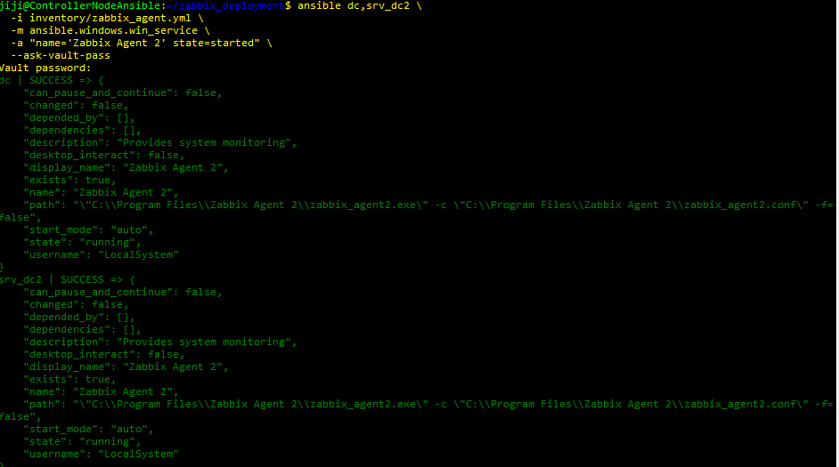

L'état du service est également vérifié depuis le contrôleur Ansible avec :

```bash
ansible <nom_du_DC> \
-i inventory/zabbix_agent.yml \
-m ansible.windows.win_shell \
-a "Get-Service 'Zabbix Agent 2'"
```

Le service doit apparaître dans l'état :

```text
Status : Running
```


Les contrôleurs de domaine sont ensuite vérifiés dans l'interface graphique de Zabbix.

Les deux serveurs apparaissent correctement dans la supervision et leurs agents sont disponibles.

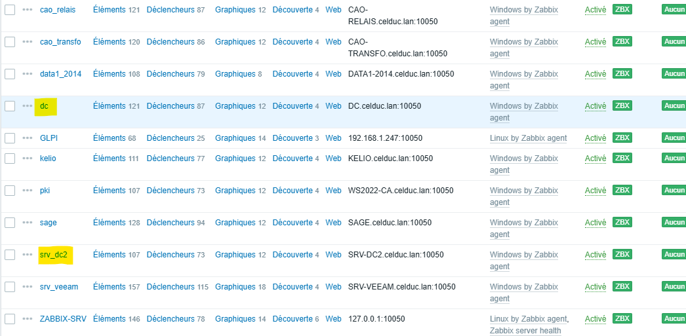

Une fois le déploiement et la supervision des deux contrôleurs de domaine validés, les droits d'administration accordés temporairement au compte `CELDUC\ansible` sont retirés.

Cette étape permet d'appliquer le principe du moindre privilège : le compte utilisé pour l'automatisation ne conserve pas de droits d'administration élevés au-delà de la phase nécessaire au déploiement.

Le compte est retiré du groupe avec :

```powershell
Remove-ADGroupMember `
-Identity "Administrateurs" `
-Members "CELDUC\ansible" `
-Confirm:$false
```

La présence du compte dans le groupe est ensuite vérifiée avec :

```powershell
Get-ADGroupMember -Identity "Administrateurs"
```

Le compte `CELDUC\ansible` ne doit alors plus apparaître dans la liste des membres.

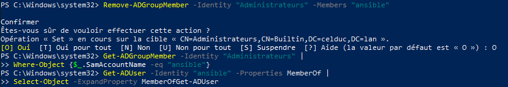

La démarche suivie est donc :

```text
Ajout temporaire des droits nécessaires
        ↓
Vérification de la présence du compte
        ↓
Test de communication Ansible
        ↓
Déploiement de Zabbix Agent 2
        ↓
Vérification du service
        ↓
Validation de la supervision dans Zabbix
        ↓
Retrait des droits d'administration
        ↓
Vérification finale des droits
```

Ce cas montre que l'automatisation d'un parc Windows ne dépend pas uniquement du playbook Ansible. La configuration préalable de l'Active Directory, des stratégies de groupe et des droits du compte de service est également essentielle.

Les contrôleurs de domaine nécessitent une attention particulière, car leur niveau de sécurité et leur modèle de gestion des droits peuvent différer de ceux des serveurs membres.

Le fait de retirer les droits d'administration après le déploiement permet également de limiter les privilèges du compte de service et d'améliorer la sécurité de l'environnement.


## 7.3 Supervision du contrôleur Ansible Linux

Le contrôleur Ansible utilisé pour administrer les serveurs Windows est lui-même un serveur Debian Linux.

Afin de superviser également cette machine avec Zabbix, l'agent Zabbix Agent 2 est installé et configuré directement depuis la ligne de commande.

Le contrôleur Ansible possède l'adresse IP suivante :

```text
192.168.1.246
```

Le serveur Zabbix possède l'adresse IP suivante :

```text
192.168.1.230
```

La première étape consiste à vérifier la connectivité réseau entre le contrôleur Ansible et le serveur Zabbix :

```bash
ping -c 4 192.168.1.230
```

La communication réseau étant fonctionnelle, l'accessibilité du port utilisé par le serveur Zabbix est ensuite vérifiée :

```bash
nc -zvu 192.168.1.230 10051
```

Le port TCP `10051` correspond au port d'écoute du serveur Zabbix.

L'agent Zabbix Agent 2 est ensuite activé et démarré sur le contrôleur Ansible avec :

```bash
sudo systemctl enable --now zabbix-agent2
```

L'état du service est ensuite vérifié :

```bash
sudo systemctl status zabbix-agent2
```

Le service doit apparaître dans l'état :

```text
Active: active (running)
```

Cette vérification confirme que l'agent Zabbix Agent 2 est correctement démarré sur le contrôleur Ansible.

La communication entre les deux machines est donc la suivante :

```text
ControllerNodeAnsible
192.168.1.246
        │
        │ Zabbix Agent 2
        │ TCP 10050
        ▼
Serveur Zabbix
192.168.1.230
```

Le serveur Zabbix peut ainsi interroger l'agent installé sur le contrôleur Ansible et récupérer les informations de supervision du système Linux.

L'hôte correspondant au contrôleur Ansible est ensuite vérifié dans l'interface graphique de Zabbix.

La disponibilité de l'agent ainsi que la remontée des métriques système sont contrôlées afin de confirmer que le serveur est correctement supervisé.

Cette étape permet donc d'étendre la supervision à l'infrastructure utilisée pour l'automatisation elle-même.

Le contrôleur Ansible n'est ainsi plus uniquement utilisé pour déployer et administrer les serveurs Windows : il est également intégré à la plateforme de supervision Zabbix.

La supervision de l'infrastructure est donc désormais étendue aux différents systèmes utilisés dans le projet :

```text
Serveurs Windows
        ↓
Zabbix Agent 2

Serveurs Linux
        ↓
Zabbix Agent 2

ControllerNodeAnsible
        ↓
Zabbix Agent 2

        ↓

Zabbix Server
        ↓
Collecte et centralisation des métriques
```

