# 🚀 Déploiement automatisé de GLPI Agent avec Ansible et WinRM

> Automatisation du déploiement, de l'installation et de la vérification de **GLPI Agent** sur un parc Windows à partir d'un **Controller Node Debian** utilisant **Ansible** et **WinRM**.

---

## 📚 Sommaire

* [🎯 Présentation du projet](#-présentation-du-projet)
* [🏗️ Architecture générale](#️-architecture-générale)
* [🔄 Fonctionnement global](#-fonctionnement-global)
* [🔐 Active Directory et GPO](#-active-directory-et-gpo)
* [🌐 WinRM et communication distante](#-winrm-et-communication-distante)
* [🖥️ Controller Node Ansible](#️-controller-node-ansible)
* [📁 Organisation du projet](#-organisation-du-projet)
* [📦 Préparation de GLPI Agent](#-préparation-de-glpi-agent)
* [🧾 Inventaire Ansible](#-inventaire-ansible)
* [🔎 Résolution DNS des postes](#-résolution-dns-des-postes)
* [🧪 Validation de la connectivité](#-validation-de-la-connectivité)
* [📜 Playbook de déploiement](#-playbook-de-déploiement)
* [⚙️ Déroulement du playbook](#️-déroulement-du-playbook)
* [🚀 Déploiement ciblé avec `--limit`](#-déploiement-ciblé-avec---limit)
* [✅ Validation du déploiement](#-validation-du-déploiement)
* [📡 Fonctionnement de l'inventaire GLPI](#-fonctionnement-de-linventaire-glpi)
* [🧠 Architecture complète du projet](#-architecture-complète-du-projet)
* [📈 Évolutions possibles](#-évolutions-possibles)
* [🏁 Conclusion](#-conclusion)

---

# 🎯 Présentation du projet

Ce projet met en œuvre une solution d'administration automatisée permettant de déployer **GLPI Agent** sur des postes Windows sans intervention physique sur les machines.

L'environnement repose sur plusieurs briques complémentaires :

```text
Active Directory
        +
GPO
        +
DNS
        +
WinRM
        +
Ansible
        +
GLPI Agent
        ↓
Administration automatisée du parc Windows
```

L'objectif est de transformer une installation manuelle :

```text
Poste 1 → Installation manuelle
Poste 2 → Installation manuelle
Poste 3 → Installation manuelle
Poste 4 → Installation manuelle
```

en un processus automatisé :

```text
Controller Node Debian
          │
          │ Ansible / WinRM
          ▼
    Parc Windows
          │
          ▼
    GLPI Agent installé
          │
          ▼
     Inventaire GLPI
```

Le projet s'inscrit dans une démarche plus large d'automatisation de l'administration d'un parc informatique Windows.

Le même environnement Ansible est également utilisé pour automatiser d'autres opérations, notamment la migration de postes Windows 10 vers Windows 11.

---

# 🏗️ Architecture générale

```text
                         ┌──────────────────────────────┐
                         │       Active Directory        │
                         │                              │
                         │  DNS                         │
                         │  GPO                         │
                         │  Groupes de sécurité          │
                         └──────────────┬───────────────┘
                                        │
                                        │ GPO
                                        ▼
                         ┌──────────────────────────────┐
                         │       Postes Windows          │
                         │                              │
                         │  WinRM activé                 │
                         │  TCP 5985 autorisé            │
                         │  Compte Ansible admin local   │
                         └──────────────┬───────────────┘
                                        │
                                        │ WinRM / TCP 5985
                                        ▼
┌────────────────────────────────────────────────────────────────┐
│                    Controller Node Debian                      │
│                                                                │
│  Ansible                                                       │
│  Inventaire                                                    │
│  Playbooks                                                     │
│  Programmes d'installation                                    │
└──────────────────────────────┬─────────────────────────────────┘
                               │
                               │ Installation distante
                               ▼
                         ┌───────────────┐
                         │ GLPI Agent    │
                         │ Windows       │
                         └───────┬───────┘
                                 │
                                 │ Inventaire périodique
                                 ▼
                         ┌───────────────┐
                         │ Serveur GLPI  │
                         │               │
                         │ GLPI Inventory│
                         └───────────────┘
```

---

# 🔄 Fonctionnement global

Le déploiement suit la chaîne suivante :

```text
1. Le poste est membre du domaine Active Directory
                    ↓
2. La GPO configure les paramètres nécessaires
                    ↓
3. WinRM est activé
                    ↓
4. Le port TCP 5985 est autorisé
                    ↓
5. Le compte CELDUC\ansible possède les droits nécessaires
                    ↓
6. Le Controller Node résout le nom du poste via DNS
                    ↓
7. Ansible établit une connexion WinRM
                    ↓
8. Le playbook vérifie si GLPI Agent existe déjà
                    ↓
9. Le MSI est copié si nécessaire
                    ↓
10. GLPI Agent est installé
                    ↓
11. Le service est démarré automatiquement
                    ↓
12. Le poste contacte le serveur GLPI
                    ↓
13. L'inventaire remonte dans GLPI
```

---

# 🔐 Active Directory et GPO

L'infrastructure Active Directory fournit les éléments nécessaires à l'administration distante.

Les GPO permettent notamment de :

* configurer WinRM ;
* autoriser les connexions distantes ;
* ouvrir le port TCP 5985 ;
* appliquer les règles de pare-feu ;
* ajouter le compte de service Ansible aux administrateurs locaux.

Le principe utilisé est le suivant :

```text
Groupe de sécurité Active Directory
              ↓
          GPO ciblée
              ↓
      Ordinateurs membres
              ↓
   Configuration automatique
```

Les ordinateurs peuvent être ajoutés à un groupe de sécurité dédié afin de contrôler précisément les machines concernées.

Exemple :

```text
GG_Migration_W11
        │
        ├── PC-JIJI
        ├── COM-ORIVERA
        ├── INFO-SMA1
        ├── INFO-MGREGOIRE
        └── autres postes
```

Cette méthode permet de préparer progressivement les postes avant leur administration automatisée.

---

## ⚙️ Préparation des postes Windows avec les GPO

Avant de pouvoir utiliser Ansible pour administrer les postes Windows à distance, une préparation est nécessaire au niveau d'Active Directory.

Deux GPO ont été créées spécifiquement pour préparer les postes qui doivent être administrés par Ansible :

```text
Active Directory
        │
        ├── Activation_WinRM_Ansible
        │
        └── GPO_Ansible_Local_Admin
                    │
                    ▼
             Postes Windows
```

Ces deux GPO ont des rôles complémentaires.

---

### 🔐 GPO `Activation_WinRM_Ansible`

Cette GPO prépare le service **Windows Remote Management (WinRM)** sur les postes Windows.

Elle permet notamment de configurer les éléments nécessaires à l'administration distante :

```text
Activation_WinRM_Ansible
        │
        ├── Service WinRM activé
        │
        ├── Démarrage automatique du service
        │
        ├── Configuration de l'écoute WinRM
        │
        └── Autorisation du trafic WinRM
```

Une règle de pare-feu Windows est également déployée afin d'autoriser le trafic nécessaire à la communication entre le Controller Node Ansible et les postes Windows.


Le protocole WinRM utilisé dans ce projet fonctionne sur le port :

```text
TCP 5985
```

La GPO permet ainsi de préparer les postes Windows afin qu'ils puissent recevoir des connexions d'administration distante.

---

### 👤 GPO `GPO_Ansible_Local_Admin`

La deuxième GPO permet d'ajouter le compte de service utilisé par Ansible au groupe des administrateurs locaux des postes Windows.

Le compte utilisé est :

```text
CELDUC\ansible
```

Le fonctionnement est le suivant :

```text
Compte de domaine
        │
        ▼
CELDUC\ansible
        │
        ▼
GPO_Ansible_Local_Admin
        │
        ▼
Groupe Administrateurs local
        │
        ▼
Poste Windows
```

Le compte `CELDUC\ansible` dispose ainsi des droits nécessaires pour effectuer les opérations d'administration à distance réalisées par Ansible.

Cette configuration permet notamment à Ansible de :

* vérifier l'état des services Windows ;
* créer des dossiers ;
* copier des fichiers ;
* installer des logiciels ;
* démarrer ou arrêter des services ;
* exécuter des commandes PowerShell ;
* effectuer des opérations d'administration sur les postes.

---

### 🔗 Rôle complémentaire des deux GPO

Les deux GPO répondent à deux besoins différents :

```text
Activation_WinRM_Ansible
        │
        └── Permet la communication distante
                    │
                    ▼
GPO_Ansible_Local_Admin
        │
        └── Fournit les droits d'administration
```

La première GPO rend la communication distante possible.

La seconde permet au compte utilisé par Ansible de disposer des droits nécessaires pour agir sur le poste.

La préparation complète d'un poste Windows repose donc sur :

```text
Active Directory
        │
        ▼
Application des GPO
        │
        ├── WinRM configuré
        │
        └── CELDUC\ansible
            administrateur local
                    │
                    ▼
          Poste prêt pour Ansible
```

Cette préparation est ensuite vérifiée dans les étapes suivantes du projet, avec les tests de connectivité réseau, de disponibilité du port WinRM et de communication Ansible.

````markdown
### Résolution DNS : noms courts et FQDN

Lors des premiers tests, l'inventaire utilisait les noms courts des postes, par exemple :

```yaml
ansible_host: PC-JIJI
````

Certains postes étaient correctement résolus, mais la majorité ne l'était pas depuis le Controller Node Ansible.

L'inventaire a donc été standardisé avec les **FQDN** (*Fully Qualified Domain Name*), c'est-à-dire le nom complet d'une machine incluant son domaine DNS :

```yaml
ansible_host: PC-JIJI.celduc.lan
```

L'utilisation du FQDN permet une résolution DNS plus explicite et plus fiable depuis le Controller Node :

```text
PC-JIJI.celduc.lan → 192.168.1.231
```

Après cette modification, les tests de connexion WinRM ont fonctionné correctement sur davantage de postes.

### Sélection automatique des postes accessibles

Lorsque le test `win_ping` est effectué sur l'ensemble de l'inventaire, il est possible de récupérer uniquement les machines ayant répondu avec succès :

```bash
ansible glpi_targets \
-i inventory/glpi_agent.yml \
-m ansible.windows.win_ping \
| awk '/SUCCESS/ {print $1}' \
| paste -sd, -
```

La commande génère une liste au format :

```text
pc_jiji,transfo_ada,transfo_prod,info_mgregoire
```

Cette liste peut ensuite être utilisée directement avec l'option `--limit` afin de lancer le playbook uniquement sur les machines accessibles :

```bash
ansible-playbook \
-i inventory/glpi_agent.yml \
playbooks/install_glpi_agent.yml \
--limit "pc_jiji,transfo_ada,transfo_prod,info_mgregoire"
```

Cette méthode permet de déployer progressivement l'agent GLPI sur les postes accessibles, sans bloquer le déploiement à cause des machines éteintes, non résolues par DNS ou présentant encore un problème WinRM.

```

# 🌐 WinRM et communication distante

**WinRM (Windows Remote Management)** est le protocole utilisé par Ansible pour communiquer avec les postes Windows.

Dans cette architecture :

```text
Controller Node Debian
          │
          │ HTTP / TCP 5985
          ▼
       WinRM
          │
          ▼
    Poste Windows
```

La communication utilisée est :

```text
Protocole : HTTP
Port      : TCP 5985
Transport : NTLM
```

Le port TCP 5985 doit être accessible depuis le Controller Node.

Une règle de pare-feu est donc appliquée par GPO afin d'autoriser les connexions WinRM.

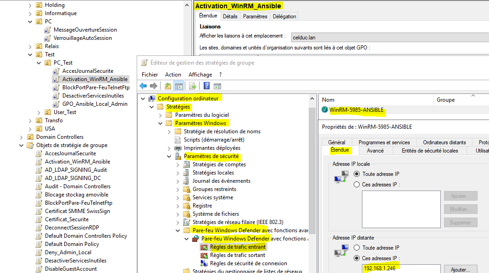

La communication est validée avec :

```bash
nc -vz -w 3 NOM_DU_POSTE 5985
```

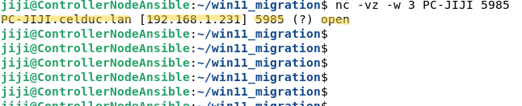

Puis avec Ansible :

```bash
ansible NOM_DU_POSTE \
-i inventory/glpi_agent.yml \
-m ansible.windows.win_ping
```

Résultat attendu :

```text
SUCCESS => {
    "changed": false,
    "ping": "pong"
}
```

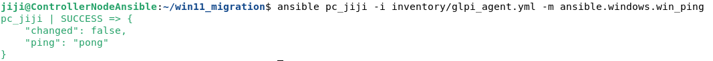

---

# 🖥️ Controller Node Ansible

Le Controller Node est un serveur Debian utilisé pour piloter l'administration distante du parc Windows.

Il contient :

```text
Ansible
    │
    ├── Inventaires
    │
    ├── Playbooks
    │
    ├── Programmes d'installation
    │
    └── Scripts d'automatisation
```

Le Controller Node n'exécute pas directement GLPI Agent.

Il orchestre l'installation à distance :

```text
Controller Node
       │
       │ Ansible
       ▼
   WinRM
       │
       ▼
Poste Windows
       │
       ▼
GLPI Agent
```

---

# 📁 Organisation du projet

```text
win11_migration/
│
├── files/
│   └── GLPI-Agent-1.18-x64.msi
│
├── inventory/
│   └── glpi_agent.yml
│
├── playbooks/
│   └── install_glpi_agent.yml
│
└── ...
```

Le programme utilisé pour le déploiement est GLPI Agent 1.18 pour Windows 64 bits.

Le programme d'installation est téléchargé depuis la page officielle des releases du projet GLPI Agent sur GitHub.

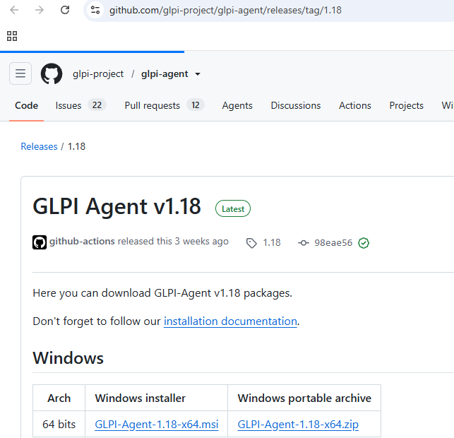

Il est ensuite copié temporairement sur le poste Windows uniquement lorsque cela est nécessaire.

---

# 📦 Préparation de GLPI Agent

Le programme d'installation utilisé est :

```text
GLPI-Agent-1.18-x64.msi
```

Le fichier MSI est stocké sur le Controller Node.

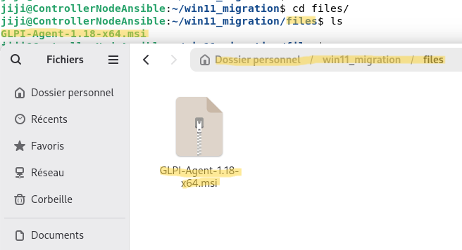

Le principe est :

```text
Controller Node
      │
      │ win_copy
      ▼
C:\Temp\GLPI-Agent-1.18-x64.msi
      │
      │ Installation
      ▼
GLPI Agent installé
      │
      │ Nettoyage
      ▼
MSI supprimé
```

Le fichier MSI n'est donc pas conservé inutilement sur les postes après installation.

---

# 🧾 Inventaire Ansible

Un inventaire spécifique est utilisé pour les postes destinés au déploiement de GLPI Agent :

```text
inventory/glpi_agent.yml
```

Exemple de structure :

```yaml
all:
  children:
    glpi_targets:
      hosts:
        pc_jiji:
          ansible_host: PC-JIJI
          ansible_connection: winrm
          ansible_winrm_scheme: http
          ansible_winrm_port: 5985
          ansible_winrm_transport: ntlm
```

Les mots de passe et informations sensibles ne doivent pas être publiés dans un dépôt GitHub public.

L'inventaire peut contenir l'ensemble du parc :

```text
glpi_targets
    │
    ├── pc_jiji
    ├── com_orivera
    ├── transfo_ada
    ├── transfo_prod
    └── autres postes
```

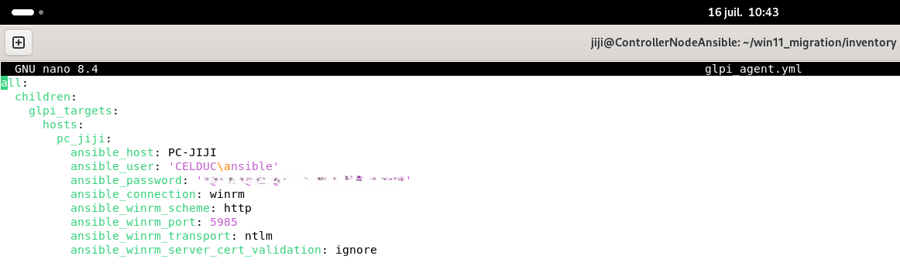

---

# 🔎 Résolution DNS des postes

L'adresse IP n'est pas obligatoirement utilisée dans l'inventaire.

Le nom DNS du poste peut être utilisé :

```yaml
ansible_host: PC-JIJI
```

Le DNS Active Directory réalise la correspondance :

```text
PC-JIJI
    ↓
PC-JIJI.celduc.lan
    ↓
192.168.1.231
```

La résolution est vérifiée depuis Debian :

```bash
getent hosts PC-JIJI
```

Cette méthode évite de maintenir manuellement les adresses IP dans l'inventaire.

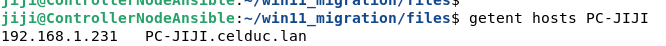

---

# 🧪 Validation de la connectivité

Avant de lancer le playbook, la communication est testée en plusieurs étapes.

## 1. Résolution DNS

```bash
getent hosts PC-JIJI
```

## 2. Test réseau

```bash
ping -c 4 PC-JIJI
```

## 3. Test du port WinRM

```bash
nc -vz -w 3 PC-JIJI 5985
```

## 4. Test Ansible

```bash
ansible pc_jiji \
-i inventory/glpi_agent.yml \
-m ansible.windows.win_ping
```

Résultat :

```text
pc_jiji | SUCCESS => {
    "changed": false,
    "ping": "pong"
}
```


Lorsque plusieurs postes sont testés :

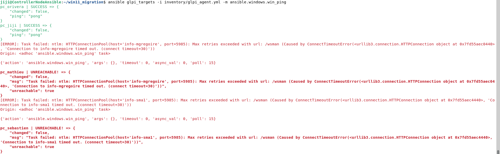

Les postes accessibles répondent :

```text
SUCCESS
```

Les postes non accessibles sont identifiés :

```text
UNREACHABLE
```

Cette distinction permet de diagnostiquer rapidement les problèmes de connectivité ou de configuration WinRM.

---

# 📜 Playbook de déploiement

Le playbook utilisé est :

```text
playbooks/install_glpi_agent.yml
```

Le playbook configure :

```text
Serveur GLPI :
http://192.168.1.247/marketplace/glpiinventory/

TAG :
CELDUC

Tâches :
inventory
deploy
collect
```

Le principe est de rendre le déploiement idempotent.

Cela signifie que le playbook peut être relancé sans réinstaller inutilement GLPI Agent si celui-ci est déjà présent.

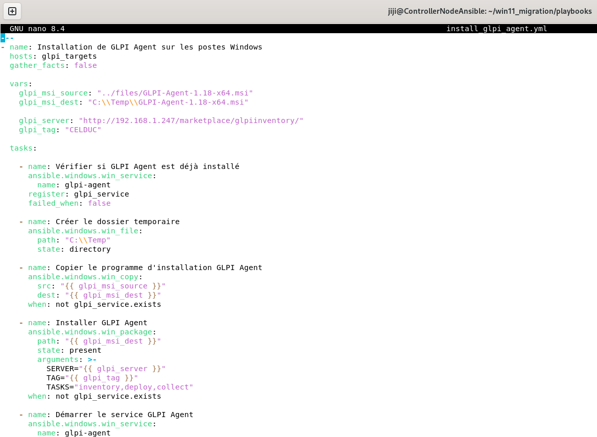

---

# ⚙️ Déroulement du playbook

Le playbook suit les étapes suivantes :

```text
1. Vérifier si le service GLPI Agent existe
                    ↓
2. Créer C:\Temp
                    ↓
3. Copier le MSI si nécessaire
                    ↓
4. Installer GLPI Agent si nécessaire
                    ↓
5. Démarrer le service
                    ↓
6. Configurer le démarrage automatique
                    ↓
7. Vérifier l'état du service
                    ↓
8. Afficher le résultat
                    ↓
9. Supprimer le MSI temporaire

```
# 🧪 Vérification de la syntaxe

Avant l'exécution, la syntaxe du playbook est vérifiée :

```bash
ansible-playbook \
-i inventory/glpi_agent.yml \
playbooks/install_glpi_agent.yml \
--syntax-check
```

Résultat attendu :

```text
playbook: playbooks/install_glpi_agent.yml
```

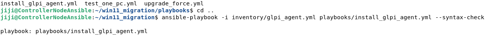

Cette étape permet de détecter les erreurs YAML avant de contacter les postes Windows.

---

# 🚀 Exécution du playbook

Le déploiement complet peut être lancé avec :

```bash
ansible-playbook \
-i inventory/glpi_agent.yml \
playbooks/install_glpi_agent.yml
```

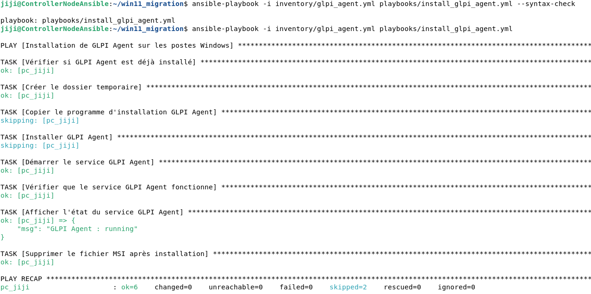

Exemple de résultat :

```text
pc_jiji      : ok=6  changed=0  failed=0
pc_orivera   : ok=8  changed=4  failed=0
```

Interprétation :

```text
changed=4
```

Le poste a subi des modifications :

* copie du MSI ;
* installation ;
* configuration ;
* nettoyage.

Un poste déjà installé peut retourner :

```text
changed=0
```

car Ansible détecte que l'installation existe déjà.

---

### ⚠️ Cas particulier : incompatibilité d'architecture 32 bits / 64 bits

Le playbook utilise le package d'installation :

```text
GLPI-Agent-1.18-x64.msi
```

Ce package est destiné aux systèmes Windows 64 bits.

Lors du déploiement, une machine (`RECEPTION-DTR`) a généré l'erreur MSI suivante :

```text
rc: 1633
```

avec le message :

```text
Ce package d’installation n’est pas pris en charge par ce type de processeur.
```

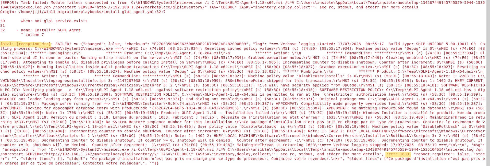

Le diagnostic a montré que le poste utilisait :

```text
Microsoft Windows 10 Professionnel 32 bits
```

Le problème provenait donc d'une incompatibilité entre l'architecture du système d'exploitation et le package MSI x64 utilisé par le playbook.

L'architecture du système distant peut être vérifiée directement depuis le Controller Node Ansible avec :

```bash
ansible reception_dtr \
-i inventory/glpi_agent.yml \
-m ansible.windows.win_shell \
-a 'Get-CimInstance Win32_OperatingSystem | Select-Object Caption,OSArchitecture; Get-CimInstance Win32_Processor | Select-Object Name,AddressWidth'
```

Exemple de résultat :

```text
Caption                            OSArchitecture
-------                            --------------
Microsoft Windows 10 Professionnel 32 bits
```

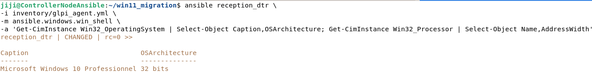

Cette vérification permet d'identifier rapidement les postes incompatibles avec le package `GLPI-Agent-1.18-x64.msi`.

Pour ces postes, il est nécessaire d'utiliser une version de l'agent compatible avec l'architecture 32 bits, ou de prévoir un traitement spécifique dans le playbook.

---

# 🎯 Déploiement ciblé avec `--limit`

Lorsque l'inventaire contient de nombreux postes, il n'est pas nécessaire d'exécuter le playbook sur l'ensemble du parc.

L'option :

```text
--limit
```

permet de limiter l'exécution du playbook à une ou plusieurs machines précises.

## Un seul poste

```bash
ansible-playbook \
-i inventory/glpi_agent.yml \
playbooks/install_glpi_agent.yml \
--limit pc_jiji
```

## Plusieurs postes

```bash
ansible-playbook \
-i inventory/glpi_agent.yml \
playbooks/install_glpi_agent.yml \
--limit "transfo_ada,transfo_prod"
```

## 🎯 Cibler automatiquement les machines accessibles

Lorsque l'inventaire contient un grand nombre de postes, il est possible de tester la connectivité WinRM de l'ensemble des machines et de récupérer uniquement celles ayant répondu avec succès :

```bash
ansible glpi_targets \
-i inventory/glpi_agent.yml \
-m ansible.windows.win_ping \
| awk '/SUCCESS/ {print $1}' \
| paste -sd, -
```

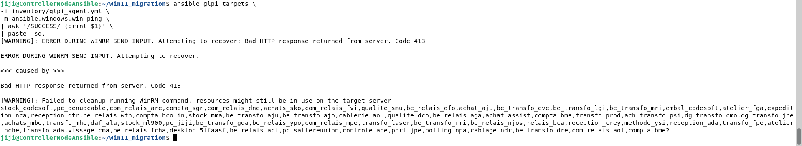

La commande :

```text
awk '/SUCCESS/ {print $1}'
```

récupère uniquement les noms des machines ayant répondu avec :

```text
SUCCESS
```

Puis :

```text
paste -sd, -
```

assemble ces noms sur une seule ligne, séparés par des virgules.

Exemple :

```text
pc_jiji,transfo_ada,transfo_prod,compta_sgr,...
```

Cette liste peut ensuite être utilisée directement avec l'option `--limit` :

```bash
ansible-playbook \
-i inventory/glpi_agent.yml \
playbooks/install_glpi_agent.yml \
--limit "pc_jiji,transfo_ada,transfo_prod,compta_sgr"
```

Le playbook est ainsi exécuté uniquement sur les machines ayant répondu correctement au test `win_ping`.

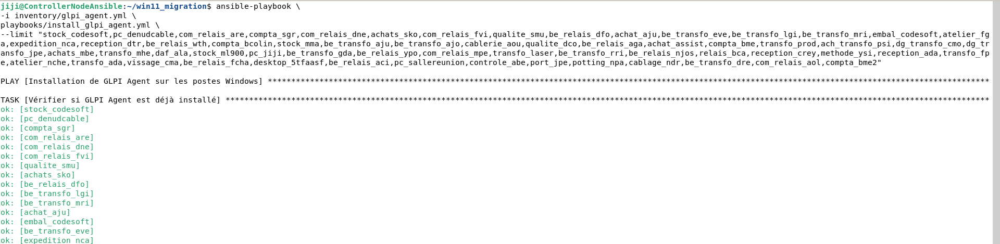

La stratégie utilisée est donc :

```text
Inventaire complet
        ↓
Test de connectivité WinRM
        ↓
Machines répondant SUCCESS
        ↓
awk + paste -sd, -
        ↓
Liste des machines accessibles
        ↓
--limit
        ↓
Déploiement uniquement sur ces machines
```

Cette méthode permet de conserver un inventaire complet tout en contrôlant précisément le périmètre de chaque déploiement et en évitant de lancer le playbook sur les machines qui ne sont pas accessibles au moment du déploiement.

---

# ✅ Validation du déploiement

Après l'installation, le service peut être vérifié à distance :

```bash
ansible transfo_ada,transfo_prod \
-i inventory/glpi_agent.yml \
-m ansible.windows.win_service \
-a "name=glpi-agent"
```

Résultat attendu :

```text
exists: true
state: running
start_mode: auto
username: LocalSystem
```

Cela confirme :

```text
GLPI Agent installé
        ↓
Service présent
        ↓
Service démarré
        ↓
Démarrage automatique
```

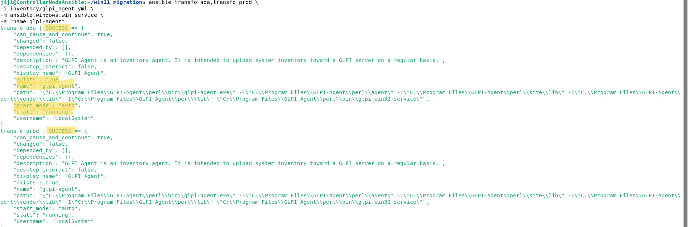

---

# 📡 Fonctionnement de l'inventaire GLPI

Une fois installé, GLPI Agent contacte périodiquement le serveur GLPI.

Exemple de journal :

```text
target server0:
next run:
Thu Jul 16 14:59:58 2026

http://192.168.1.247/marketplace/glpiinventory/
```

Le paramètre `next run` correspond à la prochaine exécution planifiée de l'agent.

À ce moment, l'agent tente de contacter le serveur GLPI afin d'exécuter les tâches configurées.

```text
GLPI Agent
     │
     │ Exécution périodique
     ▼
Serveur GLPI
     │
     ▼
Plugin GLPI Inventory
     │
     ▼
Inventaire du poste
```

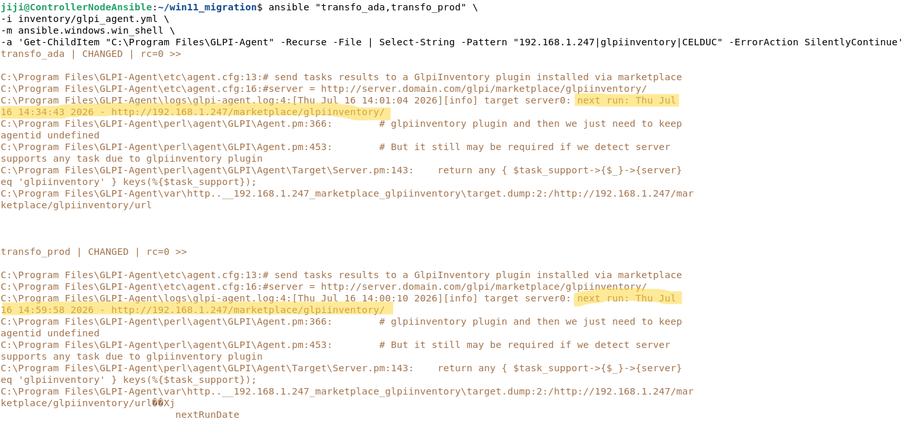

L'installation de l'agent ne signifie donc pas forcément que l'ordinateur apparaît instantanément dans GLPI.

Le poste doit :

1. avoir GLPI Agent installé ;
2. avoir le service démarré ;
3. posséder une configuration correcte ;
4. pouvoir joindre le serveur GLPI ;
5. exécuter une tâche d'inventaire.

---

# 🧠 Architecture complète du projet

Le projet complet peut être résumé ainsi :

```text
                         ACTIVE DIRECTORY
                                │
                                │
                    ┌───────────┴───────────┐
                    │                       │
                   DNS                     GPO
                    │                       │
                    │              ┌────────┴────────┐
                    │              │                 │
                    │          WinRM activé      Firewall
                    │              │                 │
                    └──────────────┴─────────────────┘
                                   │
                                   │
                         TCP 5985 / WinRM
                                   │
                                   ▼
                     ┌────────────────────────┐
                     │ Controller Node Debian │
                     │                        │
                     │ Ansible                │
                     │ Inventory              │
                     │ Playbooks              │
                     └────────────┬───────────┘
                                  │
                                  │
                                  ▼
                        ┌──────────────────┐
                        │  Postes Windows  │
                        │                  │
                        │  GLPI Agent      │
                        └────────┬─────────┘
                                 │
                                 │ Inventaire
                                 ▼
                         ┌────────────────┐
                         │  Serveur GLPI  │
                         │                │
                         │ GLPI Inventory │
                         └────────────────┘
```

---

# 📈 Évolutions possibles

Cette architecture peut être étendue à d'autres opérations d'administration.

Exemples :

```text
Déploiement de logiciels
        +
Désinstallation de logiciels
        +
Modification de configurations
        +
Gestion des services Windows
        +
Exécution de scripts PowerShell
        +
Déploiement de correctifs
        +
Migration Windows 10 → Windows 11
```

Le Controller Node devient ainsi une véritable plateforme d'administration automatisée :

```text
                 Controller Node
                       │
        ┌──────────────┼──────────────┐
        │              │              │
        ▼              ▼              ▼
   GLPI Agent     Windows 11      Scripts
   Deployment     Migration       PowerShell
```

L'infrastructure Ansible peut donc évoluer progressivement en fonction des besoins du parc informatique.

---

# 🏁 Conclusion

Ce projet démontre la mise en œuvre d'une chaîne complète d'administration automatisée :

```text
Active Directory
        ↓
GPO
        ↓
DNS
        ↓
WinRM
        ↓
Ansible
        ↓
Déploiement automatisé
        ↓
GLPI Agent
        ↓
Inventaire centralisé
        ↓
GLPI
```

L'installation de GLPI Agent n'est plus réalisée manuellement poste par poste.

Le déploiement peut désormais être :

* centralisé ;
* automatisé ;
* vérifiable ;
* reproductible ;
* progressif ;
* adapté à un parc important.

La solution permet également de conserver une vision centralisée du parc informatique grâce à GLPI, tout en utilisant Ansible comme moteur d'automatisation.

Ce projet constitue une base évolutive pour l'administration automatisée d'un environnement Windows intégré à Active Directory.

---

## 🧰 Technologies utilisées

| Technologie      | Rôle                                    |
| ---------------- | --------------------------------------- |
| Debian           | Controller Node                         |
| Ansible          | Automatisation                          |
| WinRM            | Administration distante Windows         |
| Active Directory | Authentification et gestion du domaine  |
| GPO              | Configuration automatique des postes    |
| DNS              | Résolution des noms des machines        |
| Windows          | Systèmes cibles                         |
| GLPI Agent       | Collecte d'inventaire                   |
| GLPI Inventory   | Réception et traitement des inventaires |
| GitHub           | Versionnement et documentation          |

